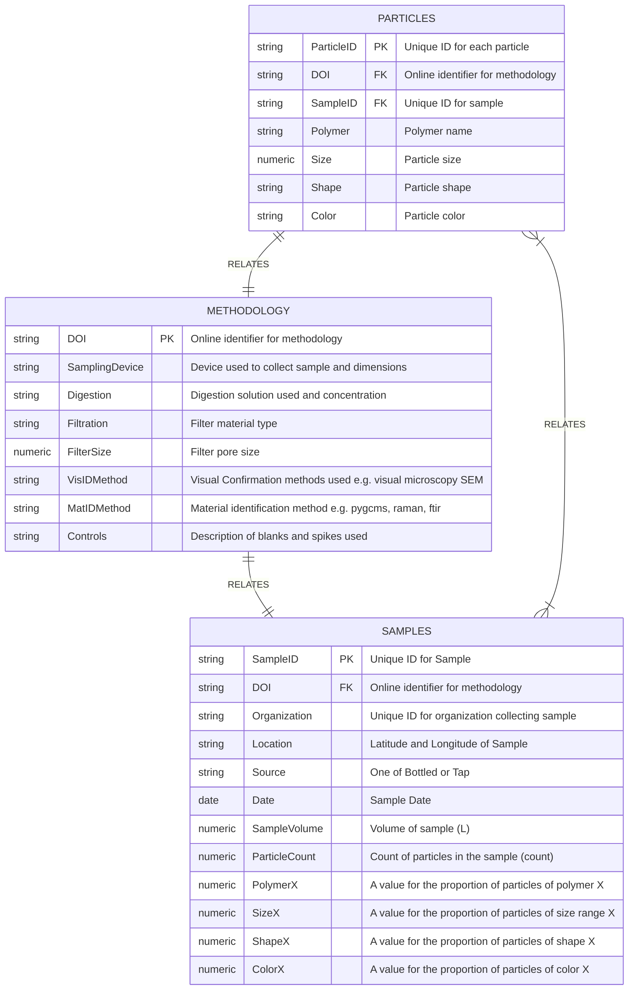
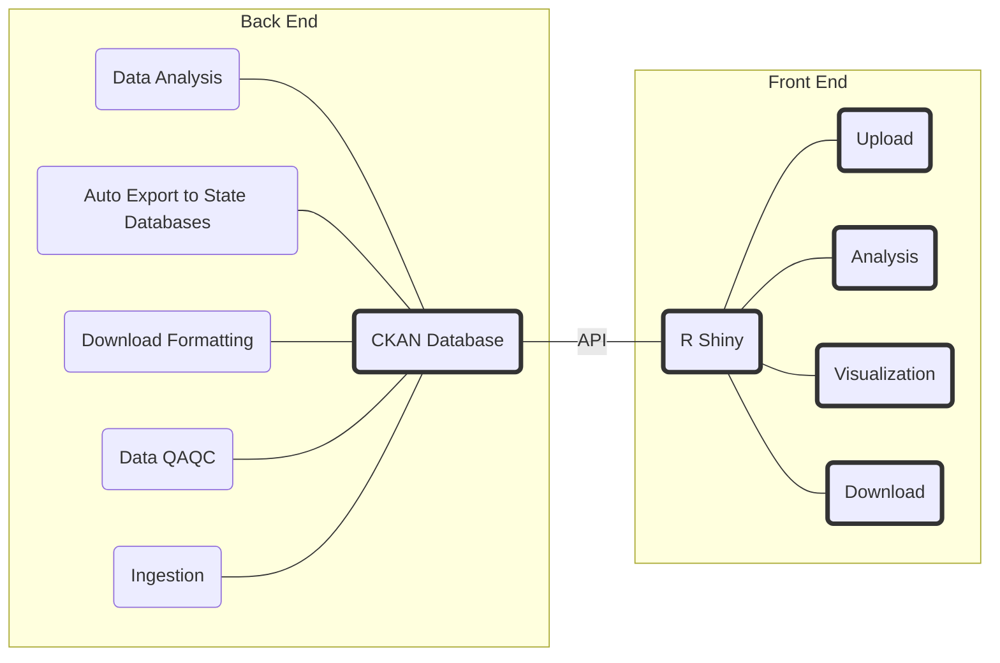
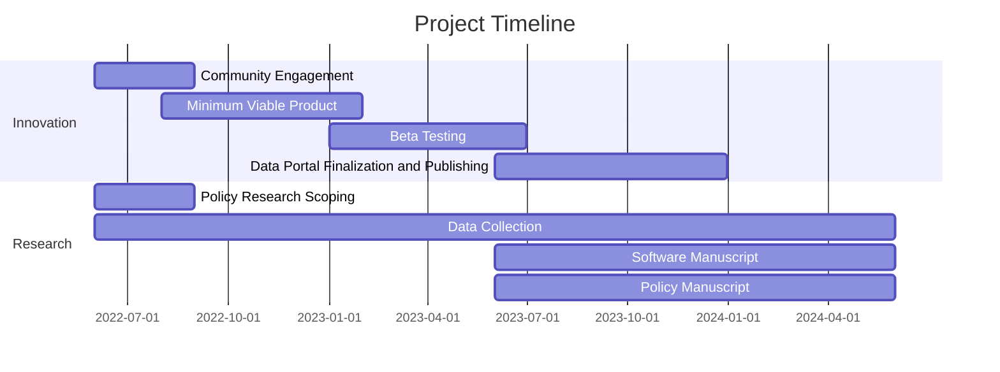

# Microplastics Data Portal
[](https://github.com/tterb/atomic-design-ui/blob/master/LICENSEs)
[](https://twitter.com/ThePlastiverse)
[](https://twitter.com/MoorePlasticRes) [](https://gitter.im/Microplastic_Data_Portal/community?utm_source=badge&utm_medium=badge&utm_campaign=pr-badge&utm_content=badge)

We are innovating what government open data can be by creating an open source data portal where all aspects of data ingestion, analysis, visualization, and sharing are transparent and collaboratable by the open source community. This project is a collaboration with [California Water Boards](https://www.waterboards.ca.gov/), [Moore Institute for Plastic Pollution Research](https://mooreplasticresearch.org/), [The Gray Lab @ UCR](https://www.thegraylab.org/), [San Francisco Estuary Institue](https://www.sfei.org/), [California 100](https://california100.org/), and the open source community at large. 

This data portal supports the implementation of Senate Bill No. 1422 which mandates sharing of microplastic data from drinking water, policy SAM 5160 which mandates that state data be open access, and policy SAM 4984 which mandates that software be open by default. Our vision is to use this project as a framework for future open software development by state agencies in the California. All engagement on this open repo will be the subject of future policy research on how government and open source communities can better collaborate on software development projects. 

## Connect
If you want to discuss anything with the community you can start a conversation on [Gitter](https://gitter.im/Microplastic_Data_Portal/community?utm_source=badge&utm_medium=badge&utm_campaign=pr-badge&utm_content=badge)

## Contributing
Contributions of all kinds are welcome!

Some ideas on [How to Contribute](https://opensource.guide/how-to-contribute/). 

Please adhere to this project's [Code of Conduct](https://www.contributor-covenant.org/version/2/1/code_of_conduct/).


## Installation
### Data
Download the .xlsx files we have created to begin developing the database schema and visualizations in [/data](https://github.com/Moore-Institute-4-Plastic-Pollution-Res/Microplastic_Data_Portal/tree/main/data). 
#### Proposed Schema for Database



### Software
Coming Soon
```bash
  ....
```
#### Proposed Framework for Software Development


## Policy Scoping
### Microplastic Policy
- 2018 Require developing methods for microplastics in drinking water [policy](https://leginfo.legislature.ca.gov/faces/billTextClient.xhtml?bill_id=201720180SB1422)
    -  https://www.waterboards.ca.gov/drinking_water/certlic/drinkingwater/documents/microplastics/mcrplstcs_ir.pdf
### Open Data Policy
- 2019 Establishes Open Data Portal for Whole State [policy](https://cdt.ca.gov/wp-content/uploads/2018/05/TL-18-02-OSCodeReuse_2018-0419.pdf) 
    - https://data.ca.gov/
    - https://fastdemocracy.com/bill-search/ca/20192020/bills/CAB00017185/
    - https://handbook.data.ca.gov/introduction/
### Open Source Policy
- 2010 Open Source is Allowed [policy](https://codecagov-playbook.readthedocs.io/en/latest/policy/#california-department-of-technology-letters)
- 2018 Open Source is Strongly Encouraged Unless Security Risk [policy](https://cdt.ca.gov/wp-content/uploads/2018/05/TL-18-02-OSCodeReuse_2018-0419.pdf)
    - https://code.ca.gov/
    - https://codecagov-playbook.readthedocs.io/en/latest/policy
    - https://alpha.ca.gov/
    - https://digital.ca.gov/blog/posts/working-in-the-open-on-the-california-design-system/
    - https://github.com/cagov/design-system
    - https://github.com/cagov
    - https://github.com/CAWaterBoardDataCenter
    - https://medium.com/code-california/how-civic-engagement-is-unlocking-californias-dmv-web-services-e71339879bf0


## Helpful Resources
* [California Microplastics Policy](https://leginfo.legislature.ca.gov/faces/billTextClient.xhtml?bill_id=201720180SB1422)
* [Califonia Open Source Policy](https://codecagov-playbook.readthedocs.io/en/latest/policy/)
* [California Open Data Policy](https://data.ca.gov/pages/california-open-data-policy)
* [Success Story Cal DMV](https://medium.com/code-california/how-civic-engagement-is-unlocking-californias-dmv-web-services-e71339879bf0)
* [California Open Source Code](code.ca.gov)
* [Overview of Government Open Source Software](https://www.newamerica.org/digital-impact-governance-initiative/reports/building-and-reusing-open-source-tools-government/section-one-an-overview-of-open-source/)
* [Government on Github](https://government.github.com/)
* [Open Source Institute](https://opensi.net/)
* [Best Practices for Government Open Source](https://playbook.cio.gov/)
* [CKAN Data Portal Framework](https://github.com/ckan/ckan)
* [HUBKIT Data Portal Framework](https://github.com/internetofwater/HubKit)

## Roadmap


### Community Engagement (June 1, 2022 - August 31, 2022)
* [ ] Engage with open source community
  * [x] Water Data Challenge
  * [ ] Presentation at Code for America Groups
* [ ] Stakeholder Meetings
  * [x] Presentation to Trash Monitoring Workgroup
  * [x] Presentation at SoCal SETAC
  * [x] Presentation at SoCal Academy of Sciences
  * [x] Presentation to Water Data Science Symposium
  * [ ] Meetings with drinking water regulators
  * [ ] Meetings with drinking water facilities
  * [ ] Meetings with environmental justice organizations
  * [x] Meetings with open source policy creators
  * [x] Meetings with government coders and database managers

### Policy Research Scoping (June 1, 2022 - August 31, 2022)
* [ ] Meetings with drinking water regulators
* [ ] Meetings with drinking water facilities
* [ ] Meetings with environmental justice organizations
* [ ] Meetings with open source policy creators
* [x] Meetings with government coders and database managers

### Data Collection (June 1, 2022 - June 1, 2024)
* [ ] Github Data
* [ ] Presentation and Workshop Notes
* [ ] Media Feedback
* [ ] Security Reports in Logs

### Minimum Viable Product Creation (August 1, 2022 - Jan 31, 2023)
* [x] Innitial Dataset Development 
* [ ] Web Application Development

### Beta Testing of Portal (January 1, 2023 - June 30, 2023)
* [ ] Meetings with Trash Monitoring Workgroup
* [ ] Meetings with Water Data Science Symposium
* [ ] Meetings with drinking water regulators
* [ ] Meetings with drinking water facilities
* [ ] Meetings with environmental justice organizations
* [ ] Meetings with open source policy creators
* [ ] Meetings with government coders and database managers

### Data Portal Finalization and Publishing (June 1, 2023 - December 31, 2023)
* [ ] Integration of beta testers feedback
* [ ] Handoff project to Waterboard staff for long term management

### Software Manuscript Drafting and Publication (June 1, 2023 - June 1, 2024)
* [ ] Identify coauthors on manuscript
* [ ] Outline Manuscript and Share with Coauthors
* [ ] First Draft of Manuscript and Share with Coauthors
* [ ] Final Draft of Manuscript and share with Coauthors

### Policy Manuscript Drafting and Publication (June 1, 2023 - June 1, 2024)
* [ ] Identify coauthors on manuscript
* [ ] Outline Manuscript and Share with Coauthors
* [ ] First Draft of Manuscript and Share with Coauthors
* [ ] Final Draft of Manuscript and share with Coauthors
