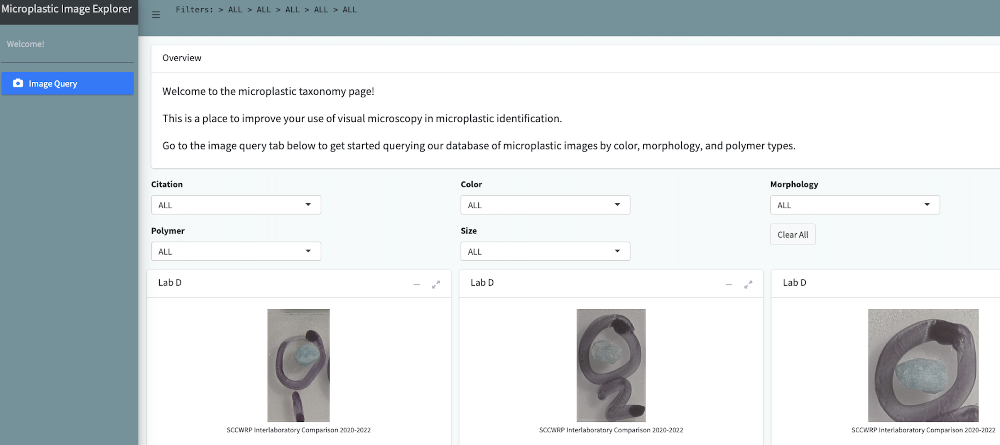

# Microplastics Data Portal
[](https://www.linkedin.com/company/moore-institute/about/)

[](https://CRAN.R-project.org/package=One4All) [](https://openanalysis.org)


We are innovating what government open data can be by creating an open source data portal where all aspects of data ingestion, analysis, visualization, and sharing are transparent and collaboratable by the open source community. This project is a collaboration with [California Water Boards](https://www.waterboards.ca.gov/), [Moore Institute for Plastic Pollution Research](https://mooreplasticresearch.org/), [The Gray Lab @ UCR](https://www.thegraylab.org/), [San Francisco Estuary Institue](https://www.sfei.org/), [California 100](https://california100.org/), [Possibility Lab](https://possibilitylab.berkeley.edu/) and the open source community at large.

This data portal supports the implementation of Senate Bill No. 1422 which mandates sharing of microplastic data from drinking water, policy SAM 5160 which mandates that state data be open access, and policy SAM 4984 which mandates that software be open by default. Our vision is to use this project as a framework for future open software development by state agencies in the California. All engagement on this open repo will be the subject of future policy research on how government and open source communities can better collaborate on software development projects.

## Connect
If you want to discuss anything with the developers, you can email wincowger@gmail.com

## Contributing
Contributions of all kinds are welcome!

- Some ideas on [How to Contribute](https://opensource.guide/how-to-contribute/).
- Please adhere to this project's [Code of Conduct](https://www.contributor-covenant.org/version/2/1/code_of_conduct/).

## Installation

### Data Validator
Data validation is essential before sharing data widely. We have created the data validator package [](https://CRAN.R-project.org/package=One4All) and app [](https://openanalysis.org/one4all).


If using the R Package:

```r
  install.package("One4All")
  library(One4All)
```

If using the web app:
- Go to [openanalysis.org/one4all](openanalysis.org/one4all).
- The code for the app is in [/code/validator](https://github.com/Moore-Institute-4-Plastic-Pollution-Res/Microplastic_Data_Portal/tree/main/code/validator)

### Data Visualization
Once you have data, you may want to analyze it, microplastic data has some unique ways to interpret it so we made a tool that can take all the data from the validator app and make use of it. 
The code for the app is in [/code/data_visualization](https://github.com/Moore-Institute-4-Plastic-Pollution-Res/Microplastic_Data_Portal/tree/main/code/data_visualization)
- To get started with the tool, go to [openanalysis.org/microplastic_analysis](openanalysis.org/microplastic_analysis). 

### Microplastic Image Explorer
Microplastic data is unique because it includes unstructured data, like images, which can be difficult to query. This is why we created the image explorer. 
The code for the app is in [/code/microplastic_image_explorer](https://github.com/Moore-Institute-4-Plastic-Pollution-Res/Microplastic_Data_Portal/tree/main/code/microplastic_image_explorer)
- To get started with the tool, go to [openanalysis.org/image_explorer](openanalysis.org/image_explorer). 



## Data
Looking for data? Download the files supporting the apps [/data](https://github.com/Moore-Institute-4-Plastic-Pollution-Res/Microplastic_Data_Portal/tree/main/data).

## Helpful Resources
* [California Microplastics Policy](https://leginfo.legislature.ca.gov/faces/billTextClient.xhtml?bill_id=201720180SB1422)
* [California Open Data Portal Sharing](https://data.ca.gov/pages/open-data-publisher-guide-contents)
* [Califonia Open Source Policy](https://codecagov-playbook.readthedocs.io/en/latest/policy/)
* [California Open Data Policy](https://data.ca.gov/pages/california-open-data-policy)
* [Success Story Cal DMV](https://medium.com/code-california/how-civic-engagement-is-unlocking-californias-dmv-web-services-e71339879bf0)
* [California Open Source Code](code.ca.gov)
* [Overview of Government Open Source Software](https://www.newamerica.org/digital-impact-governance-initiative/reports/building-and-reusing-open-source-tools-government/section-one-an-overview-of-open-source/)
* [Government on Github](https://government.github.com/)
* [Open Source Institute](https://opensi.net/)
* [Best Practices for Government Open Source](https://playbook.cio.gov/)
* [CKAN Data Portal Framework](https://github.com/ckan/ckan)
* [HUBKIT Data Portal Framework](https://github.com/internetofwater/HubKit)

### Microplastic Policy
- 2018 Require developing methods for microplastics in drinking water [policy](https://leginfo.legislature.ca.gov/faces/billTextClient.xhtml?bill_id=201720180SB1422)
    -  https://www.waterboards.ca.gov/drinking_water/certlic/drinkingwater/documents/microplastics/mcrplstcs_ir.pdf
### Open Data Policy
- 2019 Establishes Open Data Portal for Whole State [policy](https://cdt.ca.gov/wp-content/uploads/2018/05/TL-18-02-OSCodeReuse_2018-0419.pdf)
    - https://data.ca.gov/
    - https://fastdemocracy.com/bill-search/ca/20192020/bills/CAB00017185/
    - https://handbook.data.ca.gov/introduction/
    - https://www.govops.ca.gov/caldata/
### Open Source Policy
- 2010 Open Source is Allowed [policy](https://codecagov-playbook.readthedocs.io/en/latest/policy/#california-department-of-technology-letters)
- 2018 Open Source is Strongly Encouraged Unless Security Risk [policy](https://cdt.ca.gov/wp-content/uploads/2018/05/TL-18-02-OSCodeReuse_2018-0419.pdf)
    - https://code.ca.gov/
    - https://go.code.ca.gov/
    - https://github.com/CA-CODE-Works/codecagov
    - https://codecagov-playbook.readthedocs.io/en/latest/policy
    - https://alpha.ca.gov/
    - https://digital.ca.gov/blog/posts/working-in-the-open-on-the-california-design-system/
    - https://github.com/cagov/design-system
    - https://github.com/cagov
    - https://github.com/CAWaterBoardDataCenter
    - https://medium.com/code-california/how-civic-engagement-is-unlocking-californias-dmv-web-services-e71339879bf0

### Meeting Videos
We have meetings every two weeks at 3PM California Time on Thursday for anyone interested in being involved. Contact wincowger@gmail.com to get added to the virtual meeting invite.

- [Check in: December 1, 2023](https://drive.google.com/file/d/1QrPvvz-06GijKPW6ixVTjT4t8X6XrmzF/view)
- [Check in: November 12, 2023](https://drive.google.com/file/d/1GmUN5Mx0r_H1TODwR219uf0gNTp8nLef/view)
- [Check in: September 29, 2023](https://drive.google.com/file/d/1kj006UATuv7SXVARcBe4GHB4bjY9RdqX/view)
- [Check in: September 1, 2023](https://drive.google.com/file/d/1dpEbbgaVEhN36PVYUEXXPurDPXjF3SWl/view?usp=sharing)
- [Check in: July 7, 2023](https://drive.google.com/file/d/1BWo07hLgZwRXID3fhsFkc2nXJYD74V53/view?usp=sharing)
- [Check in: April 14, 2023](https://drive.google.com/file/d/1nxZmmghq-f22k3v_q1ZupUEGOBQqVL-n/view?usp=drivesdk)
- [Check in: March 3, 2023](https://drive.google.com/file/d/1J1M6JrM9JOXCwYDq7tl_1PEg5OtqFsUq/view?usp=sharing)
- [Check in: February 3, 2023](https://drive.google.com/file/d/14ofOmJ59_SPuySvWltITe5iy-0mb0x7V/view?usp=sharing)
- [Check in: January 20, 2023](https://drive.google.com/file/d/135xeiMmsis7Ya0WY5j44zpQNqMicUqiW/view?usp=sharing)
- [3 Month Update: January 6, 2023](https://drive.google.com/file/d/15o4KYY_YAMX31JN5AKH9afxHSOFH9N9D/view?usp=sharing)
- [Upcoming conference practice and app updates: October 28, 2022](https://drive.google.com/file/d/1Go_Vwl1bhNezcOBgfivsruRF1YT8VYjf/view?usp=sharing)
- [Bugs in validation app and schema updates: October 14, 2022](https://drive.google.com/file/d/1UpCYxKfu1n45WKt6BQfNy43CYImdXGZL/view?usp=share_link)
- [Overview of project status: September 28, 2022](https://drive.google.com/file/d/1tL33tC0d3oa1RsiVt7ylnbo1Z_VdRhC3/view?usp=sharing)
- [Update on Validation and Wikidata: August 18 2022](https://drive.google.com/file/d/1QH2WDoJ3k1GW4wSMebObGS-R53kBfyIj/view?usp=sharing)
- [Github Demo: July 21 2022](https://drive.google.com/file/d/1wlJwcfsrGVNbPxqRq67vcWxlshbJ32xk/view?usp=sharing)
