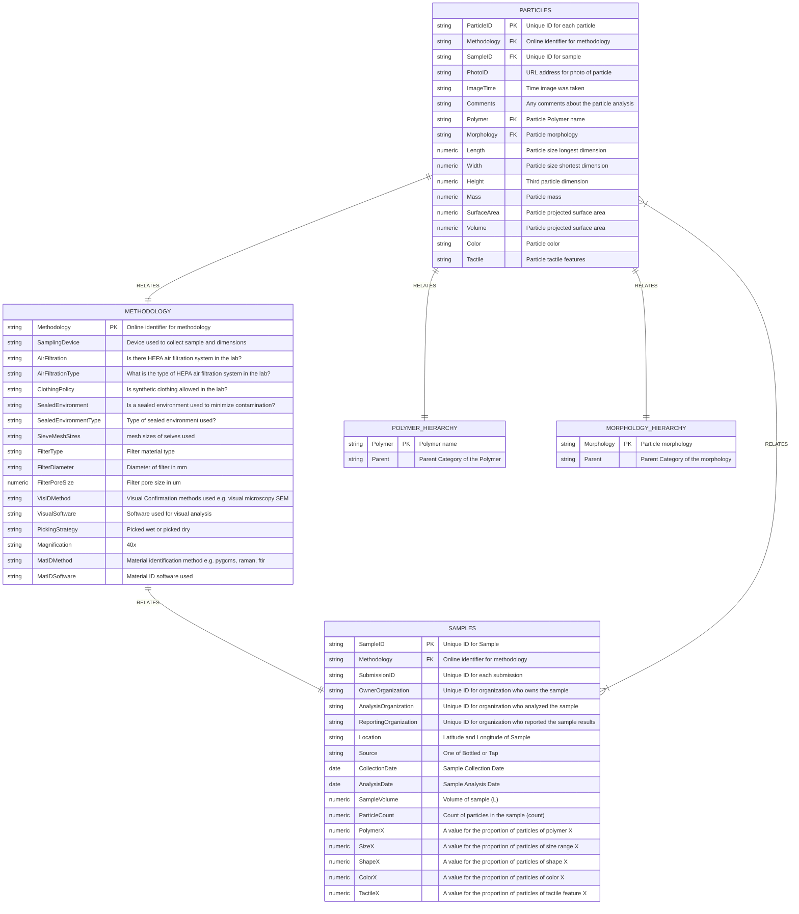

# Microplastics Data Portal
[](https://github.com/tterb/atomic-design-ui/blob/master/LICENSEs)
[](https://twitter.com/ThePlastiverse)
[](https://twitter.com/MoorePlasticRes)
[](https://gitter.im/Microplastic_Data_Portal/community?utm_source=badge&utm_medium=badge&utm_campaign=pr-badge&utm_content=badge)

We are innovating what government open data can be by creating an open source data portal where all aspects of data ingestion, analysis, visualization, and sharing are transparent and collaboratable by the open source community. This project is a collaboration with [California Water Boards](https://www.waterboards.ca.gov/), [Moore Institute for Plastic Pollution Research](https://mooreplasticresearch.org/), [The Gray Lab @ UCR](https://www.thegraylab.org/), [San Francisco Estuary Institue](https://www.sfei.org/), [California 100](https://california100.org/), [Possibility Lab](https://possibilitylab.berkeley.edu/) and the open source community at large. 

This data portal supports the implementation of Senate Bill No. 1422 which mandates sharing of microplastic data from drinking water, policy SAM 5160 which mandates that state data be open access, and policy SAM 4984 which mandates that software be open by default. Our vision is to use this project as a framework for future open software development by state agencies in the California. All engagement on this open repo will be the subject of future policy research on how government and open source communities can better collaborate on software development projects. 

## Connect
If you want to discuss anything with the community you can start a conversation on [Gitter](https://gitter.im/Microplastic_Data_Portal/community?utm_source=badge&utm_medium=badge&utm_campaign=pr-badge&utm_content=badge)

## Contributing
Contributions of all kinds are welcome!

We have meetings every two weeks at 3PM California Time on Thursday for anyone interested in being involved. Contact wincowger@gmail.com to get added to the virtual meeting invite. 

Some ideas on [How to Contribute](https://opensource.guide/how-to-contribute/). 

Please adhere to this project's [Code of Conduct](https://www.contributor-covenant.org/version/2/1/code_of_conduct/).

### Meeting Videos
- [Github Demo: July 21 2022](https://drive.google.com/file/d/1wlJwcfsrGVNbPxqRq67vcWxlshbJ32xk/view?usp=sharing)
- [Update on Validation and Wikidata: August 18 2022](https://drive.google.com/file/d/1QH2WDoJ3k1GW4wSMebObGS-R53kBfyIj/view?usp=sharing)

## Installation
### Data
Download the .xlsx files we have created to begin developing the database schema and visualizations in [/data](https://github.com/Moore-Institute-4-Plastic-Pollution-Res/Microplastic_Data_Portal/tree/main/data). 
#### Proposed Schema for Database



#### Definitions for terms in manuscript database
##### Manuscripts
  - DOI <- DOI of manuscript being referenced
  - Sample_device_and_deployment_methods <- type and size of sample device used and how it was deployed
  - Digestion <- type of digestion used in preprocessing, if any
  - Filtration <- what type of filtration used
  - Filter_Size <- size(s) of filter(s)
  - Microplastic_Identification_Method <- type(s) of identification used, e.g. visual, fluorescent, SEM (scanning electron microscopy), light microscopy
  - Spectral_Analysis <- type of spectral analysis used in study, if any, e.g. GC/MS, FTIR, Raman
  - Controls <- type of controls used, if applicable
  
##### Samples
  - DOI <- DOI of manuscript being referenced
  - Sample_ID <- unique key for sample being referenced
  - Subsample_ID <- unique key for subsample being referenced, if applicable
  - Location <- most precise sata possible for location where sample was collected
  - Source <- source of water in sample, e.g. tap water, bottled water, etc
  - Date <- date sample was collected
  - Concentration <- concentration of microplastics in sample
  - Concentration_Units <- units used in corresponding concentration
  - Polymers <- if particles arent listed individually, list all polymers found and percentages if applicable
  - Size <- if particles arent listed individually, list all size ranges and percentages if applicable
  - Morphology <- if particles arent listed individually, list all shapes found and percentages if applicable
  - Color <- if particles arent listed individually, list all colors found and percentages if applicable

### Knowledge graph representation


### Software
Coming Soon
```bash
  ....
```
#### Proposed Framework for Software Development


## Policy Scoping
### Microplastic Policy
- 2018 Require developing methods for microplastics in drinking water [policy](https://leginfo.legislature.ca.gov/faces/billTextClient.xhtml?bill_id=201720180SB1422)
    -  https://www.waterboards.ca.gov/drinking_water/certlic/drinkingwater/documents/microplastics/mcrplstcs_ir.pdf
### Open Data Policy
- 2019 Establishes Open Data Portal for Whole State [policy](https://cdt.ca.gov/wp-content/uploads/2018/05/TL-18-02-OSCodeReuse_2018-0419.pdf) 
    - https://data.ca.gov/
    - https://fastdemocracy.com/bill-search/ca/20192020/bills/CAB00017185/
    - https://handbook.data.ca.gov/introduction/
    - https://www.govops.ca.gov/caldata/
### Open Source Policy
- 2010 Open Source is Allowed [policy](https://codecagov-playbook.readthedocs.io/en/latest/policy/#california-department-of-technology-letters)
- 2018 Open Source is Strongly Encouraged Unless Security Risk [policy](https://cdt.ca.gov/wp-content/uploads/2018/05/TL-18-02-OSCodeReuse_2018-0419.pdf)
    - https://code.ca.gov/
    - https://go.code.ca.gov/
    - https://github.com/CA-CODE-Works/codecagov
    - https://codecagov-playbook.readthedocs.io/en/latest/policy
    - https://alpha.ca.gov/
    - https://digital.ca.gov/blog/posts/working-in-the-open-on-the-california-design-system/
    - https://github.com/cagov/design-system
    - https://github.com/cagov
    - https://github.com/CAWaterBoardDataCenter
    - https://medium.com/code-california/how-civic-engagement-is-unlocking-californias-dmv-web-services-e71339879bf0


## Roadmap


### Community Engagement (June 1, 2022 - August 31, 2022)
* [ ] Engage with open source community
  * [x] Water Data Challenge, [Started Meetup](https://github.com/Moore-Institute-4-Plastic-Pollution-Res/Microplastic_Data_Portal#meeting-videos)
  * [ ] Presentation at Code for America Groups (waiting until after beta version)
* [x] Stakeholder Meetings
  * [x] Presentation to Trash Monitoring Workgroup
  * [x] Presentation at SoCal SETAC
  * [x] Presentation at SoCal Academy of Sciences
  * [x] Presentation to Water Data Science Symposium
  * [x] Meetings with drinking water regulators
  * [x] Meetings with drinking water facilities
  * [x] Meetings with environmental justice organizations
  * [x] Meetings with open source policy creators
  * [x] Meetings with government coders and database managers

### Policy Research Scoping (June 1, 2022 - August 31, 2022)
* [x] Meetings with drinking water regulators
* [x] Meetings with drinking water facilities
* [x] Meetings with environmental justice organizations
* [x] Meetings with open source policy creators
* [x] Meetings with government coders and database managers

### Data Collection (June 1, 2022 - June 1, 2024)
* [x] [Github Data](https://github.com/Moore-Institute-4-Plastic-Pollution-Res/Microplastic_Data_Portal)
* [x] Presentation and Workshop Notes
* [x] Media Feedback 
	* [x] Made it into [policy handbook](https://www.waterboards.ca.gov/drinking_water/certlic/drinkingwater/docs/2022/mp-hndbk.pdf).  
		* [ ] Searching for related press releases relevant to the data portal. 
* [x] [Security Reports in Logs](https://docs.github.com/github/administering-a-repository/configuration-options-for-dependency-updates)
	* [ ] Customize tooling. 

### Minimum Viable Product Creation (August 1, 2022 - Jan 31, 2023)
* [x] [Innitial Dataset Development](https://github.com/Moore-Institute-4-Plastic-Pollution-Res/Microplastic_Data_Portal/tree/main/data)
* [ ] Web Application Development
	* [x] [Validation Upload User Interface](https://github.com/Moore-Institute-4-Plastic-Pollution-Res/Microplastic_Data_Portal/tree/main/code/validator)
    		* [ ] Standardize data format for uploads. (Leah is helping)
    		* [ ] Standardize data validation rules for upload. (Leah is helping with this)
    	* [x] Data Visualization analysis download
    		* [x] Richard made [this](https://github.com/Moore-Institute-4-Plastic-Pollution-Res/Microplastic_Data_Portal/blob/main/code/data_visualization.R) 
    			* [ ] Turn into a web application for data vis from ckan. 
 			* [ ] Pull down and visualize data from manuscripts.  
 		* [ ] Image Explorer
			* [x] Website online [microplastics image explorer](https://wincowger.shinyapps.io/microplastic_image_explorer/)
			* [x] Coauthor collaboration started with ~10 other researchers.
			* [ ] Publication (Laura working on)
		* [ ] Download formatting setup from CKAN
			* [ ] Public CKAN interface. 
	* [ ] Database
		* [x] API keys, got keys to [this](https://data.ca.gov/)
		* [ ] Schema definitions
			* [x] Definition created for manuscript data
   		* [ ] Integrate back end for upload
			* [x] Connection made
			* [ ] Add data from manuscripts to data.ca.gov. 
			* [ ] Add api keys so only certain users with permissions can upload. 
		* [ ] Integrate back end for download
			* [ ] Standardize data from manuscripts. 
		* [ ] Taxonomy
			* [x] Hannah made rough draft of the taxonomies. 
			* [ ] Integrate into data base queries
			* [ ] Integrate into wikidata. 
    * [ ] Link all tools together in one application? (not sure if necessary, likely different endpoints for different services, maybe one for data analysis / download and one for upload)

### Policy  (August 1, 2022 - June 31, 2023)
* [ ] [Waterboard Github](https://github.com/CAWaterBoardDataCenter) Collaboration FAQ
* [ ] [California Open Data Portal](https://data.ca.gov/) Integration Notes and Framework
* [ ] Open Source Portal Policy Brief [similar too](https://handbook.data.ca.gov/) and [based on](https://codecagov-playbook.readthedocs.io/en/latest/policy/) 
* [ ] Get Waterboard Repo on code.ca.gov

### Beta Testing of Portal (January 1, 2023 - June 30, 2023)
* [ ] Meetings with Trash Monitoring Workgroup
* [ ] Meetings with Water Data Science Symposium
* [ ] Meetings with drinking water regulators
* [ ] Meetings with drinking water facilities
* [ ] Meetings with environmental justice organizations
* [ ] Meetings with open source policy creators
* [ ] Meetings with government coders and database managers

### Data Portal Finalization and Publishing (June 1, 2023 - December 31, 2023)
* [ ] Integration of beta testers feedback
* [ ] Handoff project to Waterboard staff for long term management
* [ ] [Wikidata integration](https://github.com/Moore-Institute-4-Plastic-Pollution-Res/Microplastic_Data_Portal#knowledge-graph-representation)


### Software Manuscript Drafting and Publication (June 1, 2023 - June 1, 2024)
* [ ] Identify coauthors on manuscript
* [ ] Outline Manuscript and Share with Coauthors
* [ ] First Draft of Manuscript and Share with Coauthors
* [ ] Final Draft of Manuscript and share with Coauthors

### Policy Manuscript Drafting and Publication (June 1, 2023 - June 1, 2024)
* [ ] Identify coauthors on manuscript
* [ ] Outline Manuscript and Share with Coauthors
* [ ] First Draft of Manuscript and Share with Coauthors
* [ ] Final Draft of Manuscript and share with Coauthors

## Helpful Resources
* [California Microplastics Policy](https://leginfo.legislature.ca.gov/faces/billTextClient.xhtml?bill_id=201720180SB1422)
* [California Open Data Portal Sharing](https://data.ca.gov/pages/open-data-publisher-guide-contents)
* [Califonia Open Source Policy](https://codecagov-playbook.readthedocs.io/en/latest/policy/)
* [California Open Data Policy](https://data.ca.gov/pages/california-open-data-policy)
* [Success Story Cal DMV](https://medium.com/code-california/how-civic-engagement-is-unlocking-californias-dmv-web-services-e71339879bf0)
* [California Open Source Code](code.ca.gov)
* [Overview of Government Open Source Software](https://www.newamerica.org/digital-impact-governance-initiative/reports/building-and-reusing-open-source-tools-government/section-one-an-overview-of-open-source/)
* [Government on Github](https://government.github.com/)
* [Open Source Institute](https://opensi.net/)
* [Best Practices for Government Open Source](https://playbook.cio.gov/)
* [CKAN Data Portal Framework](https://github.com/ckan/ckan)
* [HUBKIT Data Portal Framework](https://github.com/internetofwater/HubKit)
