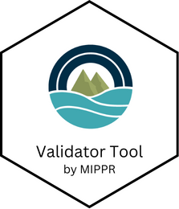

# Validator Tool <a href="https://moore-institute-4-plastic-pollution-res.github.io/One4All/"></a>

[](https://CRAN.R-project.org/package=One4All) [](https://openanalysis.org/one4all)

# Description

Welcome to the Data Validator webpage. This tool was designed to enhance data validation and management processes by employing a set of functions that read a set of rules from a 'CSV' or 'Excel' file and apply them to a dataset.

Funded by the National Renewable Energy Laboratory and Possibility Lab, maintained by the Moore Institute for Plastic Pollution Research.

# Installation

-   Install from CRAN:

``` r
  install.package("One4All")
  library(One4All)
```

-   or use the web app: [openanalysis.org/one4all/](https://openanalysis.org/one4all/)

-   The code for the app is in [/code/validator](https://github.com/Moore-Institute-4-Plastic-Pollution-Res/Microplastic_Data_Portal/tree/main/code/validator)

# Additional Information

-   A tutorial video is available [here](https://www.youtube.com/embed/LMpf5-K_tYQ)
-   Access the pkgdown and vignettes [here](https://moore-institute-4-plastic-pollution-res.github.io/One4All/)
