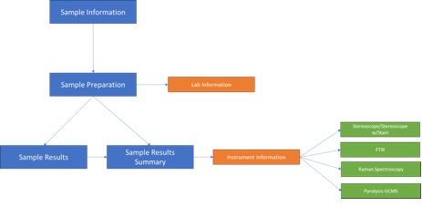
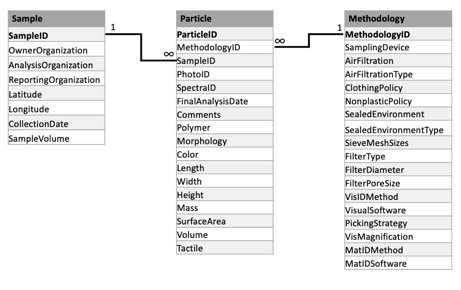

<html xmlns:v="urn:schemas-microsoft-com:vml"
xmlns:o="urn:schemas-microsoft-com:office:office"
xmlns:w="urn:schemas-microsoft-com:office:word"
xmlns:m="http://schemas.microsoft.com/office/2004/12/omml"
xmlns="http://www.w3.org/TR/REC-html40">

<head>
<meta http-equiv=Content-Type content="text/html; charset=unicode">
<meta name=ProgId content=Word.Document>
<meta name=Generator content="Microsoft Word 15">
<meta name=Originator content="Microsoft Word 15">
<link rel=File-List
href="Test_Microplastics_DataManagementPlan_January2023.fld/filelist.xml">
<link rel=Edit-Time-Data
href="Test_Microplastics_DataManagementPlan_January2023.fld/editdata.mso">
<!--[if !mso]>

<![endif]-->
<link rel=themeData
href="Test_Microplastics_DataManagementPlan_January2023.fld/themedata.thmx">
<link rel=colorSchemeMapping
href="Test_Microplastics_DataManagementPlan_January2023.fld/colorschememapping.xml">
<!--[if gte mso 9]><xml>
 <w:WordDocument>
  <w:Zoom>170</w:Zoom>
  <w:SpellingState>Clean</w:SpellingState>
  <w:GrammarState>Clean</w:GrammarState>
  <w:TrackMoves>false</w:TrackMoves>
  <w:TrackFormatting/>
  <w:ValidateAgainstSchemas/>
  <w:SaveIfXMLInvalid>false</w:SaveIfXMLInvalid>
  <w:IgnoreMixedContent>false</w:IgnoreMixedContent>
  <w:AlwaysShowPlaceholderText>false</w:AlwaysShowPlaceholderText>
  <w:DoNotPromoteQF/>
  <w:LidThemeOther>EN-US</w:LidThemeOther>
  <w:LidThemeAsian>X-NONE</w:LidThemeAsian>
  <w:LidThemeComplexScript>X-NONE</w:LidThemeComplexScript>
  <w:Compatibility>
   <w:BreakWrappedTables/>
   <w:SplitPgBreakAndParaMark/>
  </w:Compatibility>
  <w:BrowserLevel>MicrosoftInternetExplorer4</w:BrowserLevel>
  <m:mathPr>
   <m:mathFont m:val="Cambria Math"/>
   <m:brkBin m:val="before"/>
   <m:brkBinSub m:val="&#45;-"/>
   <m:smallFrac m:val="off"/>
   <m:dispDef/>
   <m:lMargin m:val="0"/>
   <m:rMargin m:val="0"/>
   <m:defJc m:val="centerGroup"/>
   <m:wrapIndent m:val="1440"/>
   <m:intLim m:val="subSup"/>
   <m:naryLim m:val="undOvr"/>
  </m:mathPr></w:WordDocument>
</xml><![endif]--><!--[if gte mso 9]><xml>
 <w:LatentStyles DefLockedState="false" DefUnhideWhenUsed="false"
  DefSemiHidden="false" DefQFormat="false" DefPriority="99"
  LatentStyleCount="376">
  <w:LsdException Locked="false" Priority="0" QFormat="true" Name="Normal"/>
  <w:LsdException Locked="false" Priority="9" QFormat="true" Name="heading 1"/>
  <w:LsdException Locked="false" Priority="9" QFormat="true" Name="heading 2"/>
  <w:LsdException Locked="false" Priority="9" QFormat="true" Name="heading 3"/>
  <w:LsdException Locked="false" Priority="9" SemiHidden="true"
   UnhideWhenUsed="true" QFormat="true" Name="heading 4"/>
  <w:LsdException Locked="false" Priority="9" SemiHidden="true"
   UnhideWhenUsed="true" QFormat="true" Name="heading 5"/>
  <w:LsdException Locked="false" Priority="9" SemiHidden="true"
   UnhideWhenUsed="true" QFormat="true" Name="heading 6"/>
  <w:LsdException Locked="false" Priority="9" SemiHidden="true"
   UnhideWhenUsed="true" QFormat="true" Name="heading 7"/>
  <w:LsdException Locked="false" Priority="9" SemiHidden="true"
   UnhideWhenUsed="true" QFormat="true" Name="heading 8"/>
  <w:LsdException Locked="false" Priority="9" SemiHidden="true"
   UnhideWhenUsed="true" QFormat="true" Name="heading 9"/>
  <w:LsdException Locked="false" SemiHidden="true" UnhideWhenUsed="true"
   Name="index 1"/>
  <w:LsdException Locked="false" SemiHidden="true" UnhideWhenUsed="true"
   Name="index 2"/>
  <w:LsdException Locked="false" SemiHidden="true" UnhideWhenUsed="true"
   Name="index 3"/>
  <w:LsdException Locked="false" SemiHidden="true" UnhideWhenUsed="true"
   Name="index 4"/>
  <w:LsdException Locked="false" SemiHidden="true" UnhideWhenUsed="true"
   Name="index 5"/>
  <w:LsdException Locked="false" SemiHidden="true" UnhideWhenUsed="true"
   Name="index 6"/>
  <w:LsdException Locked="false" SemiHidden="true" UnhideWhenUsed="true"
   Name="index 7"/>
  <w:LsdException Locked="false" SemiHidden="true" UnhideWhenUsed="true"
   Name="index 8"/>
  <w:LsdException Locked="false" SemiHidden="true" UnhideWhenUsed="true"
   Name="index 9"/>
  <w:LsdException Locked="false" Priority="39" SemiHidden="true"
   UnhideWhenUsed="true" Name="toc 1"/>
  <w:LsdException Locked="false" Priority="39" SemiHidden="true"
   UnhideWhenUsed="true" Name="toc 2"/>
  <w:LsdException Locked="false" Priority="39" SemiHidden="true"
   UnhideWhenUsed="true" Name="toc 3"/>
  <w:LsdException Locked="false" Priority="39" SemiHidden="true"
   UnhideWhenUsed="true" Name="toc 4"/>
  <w:LsdException Locked="false" Priority="39" SemiHidden="true"
   UnhideWhenUsed="true" Name="toc 5"/>
  <w:LsdException Locked="false" Priority="39" SemiHidden="true"
   UnhideWhenUsed="true" Name="toc 6"/>
  <w:LsdException Locked="false" Priority="39" SemiHidden="true"
   UnhideWhenUsed="true" Name="toc 7"/>
  <w:LsdException Locked="false" Priority="39" SemiHidden="true"
   UnhideWhenUsed="true" Name="toc 8"/>
  <w:LsdException Locked="false" Priority="39" SemiHidden="true"
   UnhideWhenUsed="true" Name="toc 9"/>
  <w:LsdException Locked="false" SemiHidden="true" UnhideWhenUsed="true"
   Name="Normal Indent"/>
  <w:LsdException Locked="false" SemiHidden="true" UnhideWhenUsed="true"
   Name="footnote text"/>
  <w:LsdException Locked="false" SemiHidden="true" UnhideWhenUsed="true"
   Name="annotation text"/>
  <w:LsdException Locked="false" SemiHidden="true" UnhideWhenUsed="true"
   Name="header"/>
  <w:LsdException Locked="false" SemiHidden="true" UnhideWhenUsed="true"
   Name="footer"/>
  <w:LsdException Locked="false" SemiHidden="true" UnhideWhenUsed="true"
   Name="index heading"/>
  <w:LsdException Locked="false" Priority="35" SemiHidden="true"
   UnhideWhenUsed="true" QFormat="true" Name="caption"/>
  <w:LsdException Locked="false" SemiHidden="true" UnhideWhenUsed="true"
   Name="table of figures"/>
  <w:LsdException Locked="false" SemiHidden="true" UnhideWhenUsed="true"
   Name="envelope address"/>
  <w:LsdException Locked="false" SemiHidden="true" UnhideWhenUsed="true"
   Name="envelope return"/>
  <w:LsdException Locked="false" SemiHidden="true" UnhideWhenUsed="true"
   Name="footnote reference"/>
  <w:LsdException Locked="false" SemiHidden="true" UnhideWhenUsed="true"
   Name="annotation reference"/>
  <w:LsdException Locked="false" SemiHidden="true" UnhideWhenUsed="true"
   Name="line number"/>
  <w:LsdException Locked="false" SemiHidden="true" UnhideWhenUsed="true"
   Name="page number"/>
  <w:LsdException Locked="false" SemiHidden="true" UnhideWhenUsed="true"
   Name="endnote reference"/>
  <w:LsdException Locked="false" SemiHidden="true" UnhideWhenUsed="true"
   Name="endnote text"/>
  <w:LsdException Locked="false" SemiHidden="true" UnhideWhenUsed="true"
   Name="table of authorities"/>
  <w:LsdException Locked="false" SemiHidden="true" UnhideWhenUsed="true"
   Name="macro"/>
  <w:LsdException Locked="false" SemiHidden="true" UnhideWhenUsed="true"
   Name="toa heading"/>
  <w:LsdException Locked="false" SemiHidden="true" UnhideWhenUsed="true"
   Name="List"/>
  <w:LsdException Locked="false" SemiHidden="true" UnhideWhenUsed="true"
   Name="List Bullet"/>
  <w:LsdException Locked="false" SemiHidden="true" UnhideWhenUsed="true"
   Name="List Number"/>
  <w:LsdException Locked="false" SemiHidden="true" UnhideWhenUsed="true"
   Name="List 2"/>
  <w:LsdException Locked="false" SemiHidden="true" UnhideWhenUsed="true"
   Name="List 3"/>
  <w:LsdException Locked="false" SemiHidden="true" UnhideWhenUsed="true"
   Name="List 4"/>
  <w:LsdException Locked="false" SemiHidden="true" UnhideWhenUsed="true"
   Name="List 5"/>
  <w:LsdException Locked="false" SemiHidden="true" UnhideWhenUsed="true"
   Name="List Bullet 2"/>
  <w:LsdException Locked="false" SemiHidden="true" UnhideWhenUsed="true"
   Name="List Bullet 3"/>
  <w:LsdException Locked="false" SemiHidden="true" UnhideWhenUsed="true"
   Name="List Bullet 4"/>
  <w:LsdException Locked="false" SemiHidden="true" UnhideWhenUsed="true"
   Name="List Bullet 5"/>
  <w:LsdException Locked="false" SemiHidden="true" UnhideWhenUsed="true"
   Name="List Number 2"/>
  <w:LsdException Locked="false" SemiHidden="true" UnhideWhenUsed="true"
   Name="List Number 3"/>
  <w:LsdException Locked="false" SemiHidden="true" UnhideWhenUsed="true"
   Name="List Number 4"/>
  <w:LsdException Locked="false" SemiHidden="true" UnhideWhenUsed="true"
   Name="List Number 5"/>
  <w:LsdException Locked="false" Priority="10" QFormat="true" Name="Title"/>
  <w:LsdException Locked="false" SemiHidden="true" UnhideWhenUsed="true"
   Name="Closing"/>
  <w:LsdException Locked="false" SemiHidden="true" UnhideWhenUsed="true"
   Name="Signature"/>
  <w:LsdException Locked="false" Priority="1" SemiHidden="true"
   UnhideWhenUsed="true" Name="Default Paragraph Font"/>
  <w:LsdException Locked="false" SemiHidden="true" UnhideWhenUsed="true"
   Name="Body Text"/>
  <w:LsdException Locked="false" SemiHidden="true" UnhideWhenUsed="true"
   Name="Body Text Indent"/>
  <w:LsdException Locked="false" SemiHidden="true" UnhideWhenUsed="true"
   Name="List Continue"/>
  <w:LsdException Locked="false" SemiHidden="true" UnhideWhenUsed="true"
   Name="List Continue 2"/>
  <w:LsdException Locked="false" SemiHidden="true" UnhideWhenUsed="true"
   Name="List Continue 3"/>
  <w:LsdException Locked="false" SemiHidden="true" UnhideWhenUsed="true"
   Name="List Continue 4"/>
  <w:LsdException Locked="false" SemiHidden="true" UnhideWhenUsed="true"
   Name="List Continue 5"/>
  <w:LsdException Locked="false" SemiHidden="true" UnhideWhenUsed="true"
   Name="Message Header"/>
  <w:LsdException Locked="false" Priority="11" QFormat="true" Name="Subtitle"/>
  <w:LsdException Locked="false" SemiHidden="true" UnhideWhenUsed="true"
   Name="Salutation"/>
  <w:LsdException Locked="false" SemiHidden="true" UnhideWhenUsed="true"
   Name="Date"/>
  <w:LsdException Locked="false" SemiHidden="true" UnhideWhenUsed="true"
   Name="Body Text First Indent"/>
  <w:LsdException Locked="false" SemiHidden="true" UnhideWhenUsed="true"
   Name="Body Text First Indent 2"/>
  <w:LsdException Locked="false" SemiHidden="true" UnhideWhenUsed="true"
   Name="Note Heading"/>
  <w:LsdException Locked="false" SemiHidden="true" UnhideWhenUsed="true"
   Name="Body Text 2"/>
  <w:LsdException Locked="false" SemiHidden="true" UnhideWhenUsed="true"
   Name="Body Text 3"/>
  <w:LsdException Locked="false" SemiHidden="true" UnhideWhenUsed="true"
   Name="Body Text Indent 2"/>
  <w:LsdException Locked="false" SemiHidden="true" UnhideWhenUsed="true"
   Name="Body Text Indent 3"/>
  <w:LsdException Locked="false" SemiHidden="true" UnhideWhenUsed="true"
   Name="Block Text"/>
  <w:LsdException Locked="false" SemiHidden="true" UnhideWhenUsed="true"
   Name="Hyperlink"/>
  <w:LsdException Locked="false" SemiHidden="true" UnhideWhenUsed="true"
   Name="FollowedHyperlink"/>
  <w:LsdException Locked="false" Priority="22" QFormat="true" Name="Strong"/>
  <w:LsdException Locked="false" Priority="20" QFormat="true" Name="Emphasis"/>
  <w:LsdException Locked="false" SemiHidden="true" UnhideWhenUsed="true"
   Name="Document Map"/>
  <w:LsdException Locked="false" SemiHidden="true" UnhideWhenUsed="true"
   Name="Plain Text"/>
  <w:LsdException Locked="false" SemiHidden="true" UnhideWhenUsed="true"
   Name="E-mail Signature"/>
  <w:LsdException Locked="false" SemiHidden="true" UnhideWhenUsed="true"
   Name="HTML Top of Form"/>
  <w:LsdException Locked="false" SemiHidden="true" UnhideWhenUsed="true"
   Name="HTML Bottom of Form"/>
  <w:LsdException Locked="false" SemiHidden="true" UnhideWhenUsed="true"
   Name="Normal (Web)"/>
  <w:LsdException Locked="false" SemiHidden="true" UnhideWhenUsed="true"
   Name="HTML Acronym"/>
  <w:LsdException Locked="false" SemiHidden="true" UnhideWhenUsed="true"
   Name="HTML Address"/>
  <w:LsdException Locked="false" SemiHidden="true" UnhideWhenUsed="true"
   Name="HTML Cite"/>
  <w:LsdException Locked="false" SemiHidden="true" UnhideWhenUsed="true"
   Name="HTML Code"/>
  <w:LsdException Locked="false" SemiHidden="true" UnhideWhenUsed="true"
   Name="HTML Definition"/>
  <w:LsdException Locked="false" SemiHidden="true" UnhideWhenUsed="true"
   Name="HTML Keyboard"/>
  <w:LsdException Locked="false" SemiHidden="true" UnhideWhenUsed="true"
   Name="HTML Preformatted"/>
  <w:LsdException Locked="false" SemiHidden="true" UnhideWhenUsed="true"
   Name="HTML Sample"/>
  <w:LsdException Locked="false" SemiHidden="true" UnhideWhenUsed="true"
   Name="HTML Typewriter"/>
  <w:LsdException Locked="false" SemiHidden="true" UnhideWhenUsed="true"
   Name="HTML Variable"/>
  <w:LsdException Locked="false" SemiHidden="true" UnhideWhenUsed="true"
   Name="Normal Table"/>
  <w:LsdException Locked="false" SemiHidden="true" UnhideWhenUsed="true"
   Name="annotation subject"/>
  <w:LsdException Locked="false" SemiHidden="true" UnhideWhenUsed="true"
   Name="No List"/>
  <w:LsdException Locked="false" SemiHidden="true" UnhideWhenUsed="true"
   Name="Outline List 1"/>
  <w:LsdException Locked="false" SemiHidden="true" UnhideWhenUsed="true"
   Name="Outline List 2"/>
  <w:LsdException Locked="false" SemiHidden="true" UnhideWhenUsed="true"
   Name="Outline List 3"/>
  <w:LsdException Locked="false" SemiHidden="true" UnhideWhenUsed="true"
   Name="Table Simple 1"/>
  <w:LsdException Locked="false" SemiHidden="true" UnhideWhenUsed="true"
   Name="Table Simple 2"/>
  <w:LsdException Locked="false" SemiHidden="true" UnhideWhenUsed="true"
   Name="Table Simple 3"/>
  <w:LsdException Locked="false" SemiHidden="true" UnhideWhenUsed="true"
   Name="Table Classic 1"/>
  <w:LsdException Locked="false" SemiHidden="true" UnhideWhenUsed="true"
   Name="Table Classic 2"/>
  <w:LsdException Locked="false" SemiHidden="true" UnhideWhenUsed="true"
   Name="Table Classic 3"/>
  <w:LsdException Locked="false" SemiHidden="true" UnhideWhenUsed="true"
   Name="Table Classic 4"/>
  <w:LsdException Locked="false" SemiHidden="true" UnhideWhenUsed="true"
   Name="Table Colorful 1"/>
  <w:LsdException Locked="false" SemiHidden="true" UnhideWhenUsed="true"
   Name="Table Colorful 2"/>
  <w:LsdException Locked="false" SemiHidden="true" UnhideWhenUsed="true"
   Name="Table Colorful 3"/>
  <w:LsdException Locked="false" SemiHidden="true" UnhideWhenUsed="true"
   Name="Table Columns 1"/>
  <w:LsdException Locked="false" SemiHidden="true" UnhideWhenUsed="true"
   Name="Table Columns 2"/>
  <w:LsdException Locked="false" SemiHidden="true" UnhideWhenUsed="true"
   Name="Table Columns 3"/>
  <w:LsdException Locked="false" SemiHidden="true" UnhideWhenUsed="true"
   Name="Table Columns 4"/>
  <w:LsdException Locked="false" SemiHidden="true" UnhideWhenUsed="true"
   Name="Table Columns 5"/>
  <w:LsdException Locked="false" SemiHidden="true" UnhideWhenUsed="true"
   Name="Table Grid 1"/>
  <w:LsdException Locked="false" SemiHidden="true" UnhideWhenUsed="true"
   Name="Table Grid 2"/>
  <w:LsdException Locked="false" SemiHidden="true" UnhideWhenUsed="true"
   Name="Table Grid 3"/>
  <w:LsdException Locked="false" SemiHidden="true" UnhideWhenUsed="true"
   Name="Table Grid 4"/>
  <w:LsdException Locked="false" SemiHidden="true" UnhideWhenUsed="true"
   Name="Table Grid 5"/>
  <w:LsdException Locked="false" SemiHidden="true" UnhideWhenUsed="true"
   Name="Table Grid 6"/>
  <w:LsdException Locked="false" SemiHidden="true" UnhideWhenUsed="true"
   Name="Table Grid 7"/>
  <w:LsdException Locked="false" SemiHidden="true" UnhideWhenUsed="true"
   Name="Table Grid 8"/>
  <w:LsdException Locked="false" SemiHidden="true" UnhideWhenUsed="true"
   Name="Table List 1"/>
  <w:LsdException Locked="false" SemiHidden="true" UnhideWhenUsed="true"
   Name="Table List 2"/>
  <w:LsdException Locked="false" SemiHidden="true" UnhideWhenUsed="true"
   Name="Table List 3"/>
  <w:LsdException Locked="false" SemiHidden="true" UnhideWhenUsed="true"
   Name="Table List 4"/>
  <w:LsdException Locked="false" SemiHidden="true" UnhideWhenUsed="true"
   Name="Table List 5"/>
  <w:LsdException Locked="false" SemiHidden="true" UnhideWhenUsed="true"
   Name="Table List 6"/>
  <w:LsdException Locked="false" SemiHidden="true" UnhideWhenUsed="true"
   Name="Table List 7"/>
  <w:LsdException Locked="false" SemiHidden="true" UnhideWhenUsed="true"
   Name="Table List 8"/>
  <w:LsdException Locked="false" SemiHidden="true" UnhideWhenUsed="true"
   Name="Table 3D effects 1"/>
  <w:LsdException Locked="false" SemiHidden="true" UnhideWhenUsed="true"
   Name="Table 3D effects 2"/>
  <w:LsdException Locked="false" SemiHidden="true" UnhideWhenUsed="true"
   Name="Table 3D effects 3"/>
  <w:LsdException Locked="false" SemiHidden="true" UnhideWhenUsed="true"
   Name="Table Contemporary"/>
  <w:LsdException Locked="false" SemiHidden="true" UnhideWhenUsed="true"
   Name="Table Elegant"/>
  <w:LsdException Locked="false" SemiHidden="true" UnhideWhenUsed="true"
   Name="Table Professional"/>
  <w:LsdException Locked="false" SemiHidden="true" UnhideWhenUsed="true"
   Name="Table Subtle 1"/>
  <w:LsdException Locked="false" SemiHidden="true" UnhideWhenUsed="true"
   Name="Table Subtle 2"/>
  <w:LsdException Locked="false" SemiHidden="true" UnhideWhenUsed="true"
   Name="Table Web 1"/>
  <w:LsdException Locked="false" SemiHidden="true" UnhideWhenUsed="true"
   Name="Table Web 2"/>
  <w:LsdException Locked="false" SemiHidden="true" UnhideWhenUsed="true"
   Name="Table Web 3"/>
  <w:LsdException Locked="false" SemiHidden="true" UnhideWhenUsed="true"
   Name="Balloon Text"/>
  <w:LsdException Locked="false" Priority="39" Name="Table Grid"/>
  <w:LsdException Locked="false" SemiHidden="true" UnhideWhenUsed="true"
   Name="Table Theme"/>
  <w:LsdException Locked="false" SemiHidden="true" Name="Placeholder Text"/>
  <w:LsdException Locked="false" Priority="1" QFormat="true" Name="No Spacing"/>
  <w:LsdException Locked="false" Priority="60" Name="Light Shading"/>
  <w:LsdException Locked="false" Priority="61" Name="Light List"/>
  <w:LsdException Locked="false" Priority="62" Name="Light Grid"/>
  <w:LsdException Locked="false" Priority="63" Name="Medium Shading 1"/>
  <w:LsdException Locked="false" Priority="64" Name="Medium Shading 2"/>
  <w:LsdException Locked="false" Priority="65" Name="Medium List 1"/>
  <w:LsdException Locked="false" Priority="66" Name="Medium List 2"/>
  <w:LsdException Locked="false" Priority="67" Name="Medium Grid 1"/>
  <w:LsdException Locked="false" Priority="68" Name="Medium Grid 2"/>
  <w:LsdException Locked="false" Priority="69" Name="Medium Grid 3"/>
  <w:LsdException Locked="false" Priority="70" Name="Dark List"/>
  <w:LsdException Locked="false" Priority="71" Name="Colorful Shading"/>
  <w:LsdException Locked="false" Priority="72" Name="Colorful List"/>
  <w:LsdException Locked="false" Priority="73" Name="Colorful Grid"/>
  <w:LsdException Locked="false" Priority="60" Name="Light Shading Accent 1"/>
  <w:LsdException Locked="false" Priority="61" Name="Light List Accent 1"/>
  <w:LsdException Locked="false" Priority="62" Name="Light Grid Accent 1"/>
  <w:LsdException Locked="false" Priority="63" Name="Medium Shading 1 Accent 1"/>
  <w:LsdException Locked="false" Priority="64" Name="Medium Shading 2 Accent 1"/>
  <w:LsdException Locked="false" Priority="65" Name="Medium List 1 Accent 1"/>
  <w:LsdException Locked="false" SemiHidden="true" Name="Revision"/>
  <w:LsdException Locked="false" Priority="34" QFormat="true"
   Name="List Paragraph"/>
  <w:LsdException Locked="false" Priority="29" QFormat="true" Name="Quote"/>
  <w:LsdException Locked="false" Priority="30" QFormat="true"
   Name="Intense Quote"/>
  <w:LsdException Locked="false" Priority="66" Name="Medium List 2 Accent 1"/>
  <w:LsdException Locked="false" Priority="67" Name="Medium Grid 1 Accent 1"/>
  <w:LsdException Locked="false" Priority="68" Name="Medium Grid 2 Accent 1"/>
  <w:LsdException Locked="false" Priority="69" Name="Medium Grid 3 Accent 1"/>
  <w:LsdException Locked="false" Priority="70" Name="Dark List Accent 1"/>
  <w:LsdException Locked="false" Priority="71" Name="Colorful Shading Accent 1"/>
  <w:LsdException Locked="false" Priority="72" Name="Colorful List Accent 1"/>
  <w:LsdException Locked="false" Priority="73" Name="Colorful Grid Accent 1"/>
  <w:LsdException Locked="false" Priority="60" Name="Light Shading Accent 2"/>
  <w:LsdException Locked="false" Priority="61" Name="Light List Accent 2"/>
  <w:LsdException Locked="false" Priority="62" Name="Light Grid Accent 2"/>
  <w:LsdException Locked="false" Priority="63" Name="Medium Shading 1 Accent 2"/>
  <w:LsdException Locked="false" Priority="64" Name="Medium Shading 2 Accent 2"/>
  <w:LsdException Locked="false" Priority="65" Name="Medium List 1 Accent 2"/>
  <w:LsdException Locked="false" Priority="66" Name="Medium List 2 Accent 2"/>
  <w:LsdException Locked="false" Priority="67" Name="Medium Grid 1 Accent 2"/>
  <w:LsdException Locked="false" Priority="68" Name="Medium Grid 2 Accent 2"/>
  <w:LsdException Locked="false" Priority="69" Name="Medium Grid 3 Accent 2"/>
  <w:LsdException Locked="false" Priority="70" Name="Dark List Accent 2"/>
  <w:LsdException Locked="false" Priority="71" Name="Colorful Shading Accent 2"/>
  <w:LsdException Locked="false" Priority="72" Name="Colorful List Accent 2"/>
  <w:LsdException Locked="false" Priority="73" Name="Colorful Grid Accent 2"/>
  <w:LsdException Locked="false" Priority="60" Name="Light Shading Accent 3"/>
  <w:LsdException Locked="false" Priority="61" Name="Light List Accent 3"/>
  <w:LsdException Locked="false" Priority="62" Name="Light Grid Accent 3"/>
  <w:LsdException Locked="false" Priority="63" Name="Medium Shading 1 Accent 3"/>
  <w:LsdException Locked="false" Priority="64" Name="Medium Shading 2 Accent 3"/>
  <w:LsdException Locked="false" Priority="65" Name="Medium List 1 Accent 3"/>
  <w:LsdException Locked="false" Priority="66" Name="Medium List 2 Accent 3"/>
  <w:LsdException Locked="false" Priority="67" Name="Medium Grid 1 Accent 3"/>
  <w:LsdException Locked="false" Priority="68" Name="Medium Grid 2 Accent 3"/>
  <w:LsdException Locked="false" Priority="69" Name="Medium Grid 3 Accent 3"/>
  <w:LsdException Locked="false" Priority="70" Name="Dark List Accent 3"/>
  <w:LsdException Locked="false" Priority="71" Name="Colorful Shading Accent 3"/>
  <w:LsdException Locked="false" Priority="72" Name="Colorful List Accent 3"/>
  <w:LsdException Locked="false" Priority="73" Name="Colorful Grid Accent 3"/>
  <w:LsdException Locked="false" Priority="60" Name="Light Shading Accent 4"/>
  <w:LsdException Locked="false" Priority="61" Name="Light List Accent 4"/>
  <w:LsdException Locked="false" Priority="62" Name="Light Grid Accent 4"/>
  <w:LsdException Locked="false" Priority="63" Name="Medium Shading 1 Accent 4"/>
  <w:LsdException Locked="false" Priority="64" Name="Medium Shading 2 Accent 4"/>
  <w:LsdException Locked="false" Priority="65" Name="Medium List 1 Accent 4"/>
  <w:LsdException Locked="false" Priority="66" Name="Medium List 2 Accent 4"/>
  <w:LsdException Locked="false" Priority="67" Name="Medium Grid 1 Accent 4"/>
  <w:LsdException Locked="false" Priority="68" Name="Medium Grid 2 Accent 4"/>
  <w:LsdException Locked="false" Priority="69" Name="Medium Grid 3 Accent 4"/>
  <w:LsdException Locked="false" Priority="70" Name="Dark List Accent 4"/>
  <w:LsdException Locked="false" Priority="71" Name="Colorful Shading Accent 4"/>
  <w:LsdException Locked="false" Priority="72" Name="Colorful List Accent 4"/>
  <w:LsdException Locked="false" Priority="73" Name="Colorful Grid Accent 4"/>
  <w:LsdException Locked="false" Priority="60" Name="Light Shading Accent 5"/>
  <w:LsdException Locked="false" Priority="61" Name="Light List Accent 5"/>
  <w:LsdException Locked="false" Priority="62" Name="Light Grid Accent 5"/>
  <w:LsdException Locked="false" Priority="63" Name="Medium Shading 1 Accent 5"/>
  <w:LsdException Locked="false" Priority="64" Name="Medium Shading 2 Accent 5"/>
  <w:LsdException Locked="false" Priority="65" Name="Medium List 1 Accent 5"/>
  <w:LsdException Locked="false" Priority="66" Name="Medium List 2 Accent 5"/>
  <w:LsdException Locked="false" Priority="67" Name="Medium Grid 1 Accent 5"/>
  <w:LsdException Locked="false" Priority="68" Name="Medium Grid 2 Accent 5"/>
  <w:LsdException Locked="false" Priority="69" Name="Medium Grid 3 Accent 5"/>
  <w:LsdException Locked="false" Priority="70" Name="Dark List Accent 5"/>
  <w:LsdException Locked="false" Priority="71" Name="Colorful Shading Accent 5"/>
  <w:LsdException Locked="false" Priority="72" Name="Colorful List Accent 5"/>
  <w:LsdException Locked="false" Priority="73" Name="Colorful Grid Accent 5"/>
  <w:LsdException Locked="false" Priority="60" Name="Light Shading Accent 6"/>
  <w:LsdException Locked="false" Priority="61" Name="Light List Accent 6"/>
  <w:LsdException Locked="false" Priority="62" Name="Light Grid Accent 6"/>
  <w:LsdException Locked="false" Priority="63" Name="Medium Shading 1 Accent 6"/>
  <w:LsdException Locked="false" Priority="64" Name="Medium Shading 2 Accent 6"/>
  <w:LsdException Locked="false" Priority="65" Name="Medium List 1 Accent 6"/>
  <w:LsdException Locked="false" Priority="66" Name="Medium List 2 Accent 6"/>
  <w:LsdException Locked="false" Priority="67" Name="Medium Grid 1 Accent 6"/>
  <w:LsdException Locked="false" Priority="68" Name="Medium Grid 2 Accent 6"/>
  <w:LsdException Locked="false" Priority="69" Name="Medium Grid 3 Accent 6"/>
  <w:LsdException Locked="false" Priority="70" Name="Dark List Accent 6"/>
  <w:LsdException Locked="false" Priority="71" Name="Colorful Shading Accent 6"/>
  <w:LsdException Locked="false" Priority="72" Name="Colorful List Accent 6"/>
  <w:LsdException Locked="false" Priority="73" Name="Colorful Grid Accent 6"/>
  <w:LsdException Locked="false" Priority="19" QFormat="true"
   Name="Subtle Emphasis"/>
  <w:LsdException Locked="false" Priority="21" QFormat="true"
   Name="Intense Emphasis"/>
  <w:LsdException Locked="false" Priority="31" QFormat="true"
   Name="Subtle Reference"/>
  <w:LsdException Locked="false" Priority="32" QFormat="true"
   Name="Intense Reference"/>
  <w:LsdException Locked="false" Priority="33" QFormat="true" Name="Book Title"/>
  <w:LsdException Locked="false" Priority="37" SemiHidden="true"
   UnhideWhenUsed="true" Name="Bibliography"/>
  <w:LsdException Locked="false" Priority="39" SemiHidden="true"
   UnhideWhenUsed="true" QFormat="true" Name="TOC Heading"/>
  <w:LsdException Locked="false" Priority="41" Name="Plain Table 1"/>
  <w:LsdException Locked="false" Priority="42" Name="Plain Table 2"/>
  <w:LsdException Locked="false" Priority="43" Name="Plain Table 3"/>
  <w:LsdException Locked="false" Priority="44" Name="Plain Table 4"/>
  <w:LsdException Locked="false" Priority="45" Name="Plain Table 5"/>
  <w:LsdException Locked="false" Priority="40" Name="Grid Table Light"/>
  <w:LsdException Locked="false" Priority="46" Name="Grid Table 1 Light"/>
  <w:LsdException Locked="false" Priority="47" Name="Grid Table 2"/>
  <w:LsdException Locked="false" Priority="48" Name="Grid Table 3"/>
  <w:LsdException Locked="false" Priority="49" Name="Grid Table 4"/>
  <w:LsdException Locked="false" Priority="50" Name="Grid Table 5 Dark"/>
  <w:LsdException Locked="false" Priority="51" Name="Grid Table 6 Colorful"/>
  <w:LsdException Locked="false" Priority="52" Name="Grid Table 7 Colorful"/>
  <w:LsdException Locked="false" Priority="46"
   Name="Grid Table 1 Light Accent 1"/>
  <w:LsdException Locked="false" Priority="47" Name="Grid Table 2 Accent 1"/>
  <w:LsdException Locked="false" Priority="48" Name="Grid Table 3 Accent 1"/>
  <w:LsdException Locked="false" Priority="49" Name="Grid Table 4 Accent 1"/>
  <w:LsdException Locked="false" Priority="50" Name="Grid Table 5 Dark Accent 1"/>
  <w:LsdException Locked="false" Priority="51"
   Name="Grid Table 6 Colorful Accent 1"/>
  <w:LsdException Locked="false" Priority="52"
   Name="Grid Table 7 Colorful Accent 1"/>
  <w:LsdException Locked="false" Priority="46"
   Name="Grid Table 1 Light Accent 2"/>
  <w:LsdException Locked="false" Priority="47" Name="Grid Table 2 Accent 2"/>
  <w:LsdException Locked="false" Priority="48" Name="Grid Table 3 Accent 2"/>
  <w:LsdException Locked="false" Priority="49" Name="Grid Table 4 Accent 2"/>
  <w:LsdException Locked="false" Priority="50" Name="Grid Table 5 Dark Accent 2"/>
  <w:LsdException Locked="false" Priority="51"
   Name="Grid Table 6 Colorful Accent 2"/>
  <w:LsdException Locked="false" Priority="52"
   Name="Grid Table 7 Colorful Accent 2"/>
  <w:LsdException Locked="false" Priority="46"
   Name="Grid Table 1 Light Accent 3"/>
  <w:LsdException Locked="false" Priority="47" Name="Grid Table 2 Accent 3"/>
  <w:LsdException Locked="false" Priority="48" Name="Grid Table 3 Accent 3"/>
  <w:LsdException Locked="false" Priority="49" Name="Grid Table 4 Accent 3"/>
  <w:LsdException Locked="false" Priority="50" Name="Grid Table 5 Dark Accent 3"/>
  <w:LsdException Locked="false" Priority="51"
   Name="Grid Table 6 Colorful Accent 3"/>
  <w:LsdException Locked="false" Priority="52"
   Name="Grid Table 7 Colorful Accent 3"/>
  <w:LsdException Locked="false" Priority="46"
   Name="Grid Table 1 Light Accent 4"/>
  <w:LsdException Locked="false" Priority="47" Name="Grid Table 2 Accent 4"/>
  <w:LsdException Locked="false" Priority="48" Name="Grid Table 3 Accent 4"/>
  <w:LsdException Locked="false" Priority="49" Name="Grid Table 4 Accent 4"/>
  <w:LsdException Locked="false" Priority="50" Name="Grid Table 5 Dark Accent 4"/>
  <w:LsdException Locked="false" Priority="51"
   Name="Grid Table 6 Colorful Accent 4"/>
  <w:LsdException Locked="false" Priority="52"
   Name="Grid Table 7 Colorful Accent 4"/>
  <w:LsdException Locked="false" Priority="46"
   Name="Grid Table 1 Light Accent 5"/>
  <w:LsdException Locked="false" Priority="47" Name="Grid Table 2 Accent 5"/>
  <w:LsdException Locked="false" Priority="48" Name="Grid Table 3 Accent 5"/>
  <w:LsdException Locked="false" Priority="49" Name="Grid Table 4 Accent 5"/>
  <w:LsdException Locked="false" Priority="50" Name="Grid Table 5 Dark Accent 5"/>
  <w:LsdException Locked="false" Priority="51"
   Name="Grid Table 6 Colorful Accent 5"/>
  <w:LsdException Locked="false" Priority="52"
   Name="Grid Table 7 Colorful Accent 5"/>
  <w:LsdException Locked="false" Priority="46"
   Name="Grid Table 1 Light Accent 6"/>
  <w:LsdException Locked="false" Priority="47" Name="Grid Table 2 Accent 6"/>
  <w:LsdException Locked="false" Priority="48" Name="Grid Table 3 Accent 6"/>
  <w:LsdException Locked="false" Priority="49" Name="Grid Table 4 Accent 6"/>
  <w:LsdException Locked="false" Priority="50" Name="Grid Table 5 Dark Accent 6"/>
  <w:LsdException Locked="false" Priority="51"
   Name="Grid Table 6 Colorful Accent 6"/>
  <w:LsdException Locked="false" Priority="52"
   Name="Grid Table 7 Colorful Accent 6"/>
  <w:LsdException Locked="false" Priority="46" Name="List Table 1 Light"/>
  <w:LsdException Locked="false" Priority="47" Name="List Table 2"/>
  <w:LsdException Locked="false" Priority="48" Name="List Table 3"/>
  <w:LsdException Locked="false" Priority="49" Name="List Table 4"/>
  <w:LsdException Locked="false" Priority="50" Name="List Table 5 Dark"/>
  <w:LsdException Locked="false" Priority="51" Name="List Table 6 Colorful"/>
  <w:LsdException Locked="false" Priority="52" Name="List Table 7 Colorful"/>
  <w:LsdException Locked="false" Priority="46"
   Name="List Table 1 Light Accent 1"/>
  <w:LsdException Locked="false" Priority="47" Name="List Table 2 Accent 1"/>
  <w:LsdException Locked="false" Priority="48" Name="List Table 3 Accent 1"/>
  <w:LsdException Locked="false" Priority="49" Name="List Table 4 Accent 1"/>
  <w:LsdException Locked="false" Priority="50" Name="List Table 5 Dark Accent 1"/>
  <w:LsdException Locked="false" Priority="51"
   Name="List Table 6 Colorful Accent 1"/>
  <w:LsdException Locked="false" Priority="52"
   Name="List Table 7 Colorful Accent 1"/>
  <w:LsdException Locked="false" Priority="46"
   Name="List Table 1 Light Accent 2"/>
  <w:LsdException Locked="false" Priority="47" Name="List Table 2 Accent 2"/>
  <w:LsdException Locked="false" Priority="48" Name="List Table 3 Accent 2"/>
  <w:LsdException Locked="false" Priority="49" Name="List Table 4 Accent 2"/>
  <w:LsdException Locked="false" Priority="50" Name="List Table 5 Dark Accent 2"/>
  <w:LsdException Locked="false" Priority="51"
   Name="List Table 6 Colorful Accent 2"/>
  <w:LsdException Locked="false" Priority="52"
   Name="List Table 7 Colorful Accent 2"/>
  <w:LsdException Locked="false" Priority="46"
   Name="List Table 1 Light Accent 3"/>
  <w:LsdException Locked="false" Priority="47" Name="List Table 2 Accent 3"/>
  <w:LsdException Locked="false" Priority="48" Name="List Table 3 Accent 3"/>
  <w:LsdException Locked="false" Priority="49" Name="List Table 4 Accent 3"/>
  <w:LsdException Locked="false" Priority="50" Name="List Table 5 Dark Accent 3"/>
  <w:LsdException Locked="false" Priority="51"
   Name="List Table 6 Colorful Accent 3"/>
  <w:LsdException Locked="false" Priority="52"
   Name="List Table 7 Colorful Accent 3"/>
  <w:LsdException Locked="false" Priority="46"
   Name="List Table 1 Light Accent 4"/>
  <w:LsdException Locked="false" Priority="47" Name="List Table 2 Accent 4"/>
  <w:LsdException Locked="false" Priority="48" Name="List Table 3 Accent 4"/>
  <w:LsdException Locked="false" Priority="49" Name="List Table 4 Accent 4"/>
  <w:LsdException Locked="false" Priority="50" Name="List Table 5 Dark Accent 4"/>
  <w:LsdException Locked="false" Priority="51"
   Name="List Table 6 Colorful Accent 4"/>
  <w:LsdException Locked="false" Priority="52"
   Name="List Table 7 Colorful Accent 4"/>
  <w:LsdException Locked="false" Priority="46"
   Name="List Table 1 Light Accent 5"/>
  <w:LsdException Locked="false" Priority="47" Name="List Table 2 Accent 5"/>
  <w:LsdException Locked="false" Priority="48" Name="List Table 3 Accent 5"/>
  <w:LsdException Locked="false" Priority="49" Name="List Table 4 Accent 5"/>
  <w:LsdException Locked="false" Priority="50" Name="List Table 5 Dark Accent 5"/>
  <w:LsdException Locked="false" Priority="51"
   Name="List Table 6 Colorful Accent 5"/>
  <w:LsdException Locked="false" Priority="52"
   Name="List Table 7 Colorful Accent 5"/>
  <w:LsdException Locked="false" Priority="46"
   Name="List Table 1 Light Accent 6"/>
  <w:LsdException Locked="false" Priority="47" Name="List Table 2 Accent 6"/>
  <w:LsdException Locked="false" Priority="48" Name="List Table 3 Accent 6"/>
  <w:LsdException Locked="false" Priority="49" Name="List Table 4 Accent 6"/>
  <w:LsdException Locked="false" Priority="50" Name="List Table 5 Dark Accent 6"/>
  <w:LsdException Locked="false" Priority="51"
   Name="List Table 6 Colorful Accent 6"/>
  <w:LsdException Locked="false" Priority="52"
   Name="List Table 7 Colorful Accent 6"/>
  <w:LsdException Locked="false" SemiHidden="true" UnhideWhenUsed="true"
   Name="Mention"/>
  <w:LsdException Locked="false" SemiHidden="true" UnhideWhenUsed="true"
   Name="Smart Hyperlink"/>
  <w:LsdException Locked="false" SemiHidden="true" UnhideWhenUsed="true"
   Name="Hashtag"/>
  <w:LsdException Locked="false" SemiHidden="true" UnhideWhenUsed="true"
   Name="Unresolved Mention"/>
  <w:LsdException Locked="false" SemiHidden="true" UnhideWhenUsed="true"
   Name="Smart Link"/>
 </w:LatentStyles>
</xml><![endif]-->

<!--[if gte mso 10]>

<![endif]-->
</head>

<body lang=EN-US link="#0563C1" vlink="#954F72" style='tab-interval:.5in;
word-wrap:break-word'>

<b>Instructions for Preparing Your Data</b><o:p></o:p>

<b>Contents</b><o:p></o:p>

<a
href="#_heading=h.gjdgxs">INTRODUCTION</a>&nbsp;&nbsp;&nbsp;&nbsp;&nbsp;&nbsp;&nbsp;&nbsp;&nbsp;&nbsp;&nbsp;&nbsp;&nbsp;&nbsp;&nbsp;&nbsp;&nbsp;&nbsp;&nbsp;&nbsp;&nbsp;&nbsp;&nbsp;&nbsp;&nbsp;&nbsp;&nbsp;&nbsp;&nbsp;&nbsp;&nbsp;&nbsp;&nbsp;&nbsp;&nbsp;&nbsp;&nbsp;&nbsp;&nbsp;&nbsp;&nbsp;&nbsp;&nbsp;&nbsp;&nbsp;&nbsp;&nbsp;&nbsp;&nbsp;&nbsp;&nbsp;&nbsp;&nbsp;&nbsp;&nbsp;&nbsp;&nbsp;&nbsp;&nbsp;&nbsp;&nbsp;&nbsp;&nbsp;&nbsp;&nbsp;&nbsp;&nbsp;&nbsp;&nbsp;&nbsp;&nbsp;&nbsp;&nbsp;&nbsp;&nbsp;&nbsp;&nbsp;&nbsp;&nbsp;&nbsp;&nbsp;&nbsp;&nbsp;&nbsp;&nbsp;&nbsp;&nbsp;&nbsp;&nbsp;&nbsp;&nbsp;&nbsp;&nbsp;&nbsp;&nbsp;&nbsp;&nbsp;&nbsp;&nbsp;&nbsp;&nbsp;&nbsp;&nbsp;&nbsp;&nbsp;&nbsp;&nbsp;&nbsp;&nbsp;&nbsp;&nbsp;&nbsp;&nbsp;&nbsp;&nbsp;&nbsp;&nbsp;&nbsp;&nbsp;&nbsp;&nbsp;&nbsp;&nbsp;&nbsp;&nbsp;
<o:p></o:p>

<a
href="#_heading=h.30j0zll">SAMPLE TABLE</a>&nbsp;&nbsp;&nbsp;&nbsp;&nbsp;&nbsp;&nbsp;&nbsp;&nbsp;&nbsp;&nbsp;&nbsp;&nbsp;&nbsp;&nbsp;&nbsp;&nbsp;&nbsp;&nbsp;&nbsp;&nbsp;&nbsp;&nbsp;&nbsp;&nbsp;&nbsp;&nbsp;&nbsp;&nbsp;&nbsp;&nbsp;&nbsp;&nbsp;&nbsp;&nbsp;&nbsp;&nbsp;&nbsp;&nbsp;&nbsp;&nbsp;&nbsp;&nbsp;&nbsp;&nbsp;&nbsp;&nbsp;&nbsp;&nbsp;&nbsp;&nbsp;&nbsp;&nbsp;&nbsp;&nbsp;&nbsp;&nbsp;&nbsp;&nbsp;&nbsp;&nbsp;&nbsp;&nbsp;&nbsp;&nbsp;&nbsp;&nbsp;&nbsp;&nbsp;&nbsp;&nbsp;&nbsp;&nbsp;&nbsp;&nbsp;&nbsp;&nbsp;&nbsp;&nbsp;&nbsp;&nbsp;&nbsp;&nbsp;&nbsp;&nbsp;&nbsp;&nbsp;&nbsp;&nbsp;&nbsp;&nbsp;&nbsp;&nbsp;&nbsp;&nbsp;&nbsp;&nbsp;&nbsp;&nbsp;&nbsp;&nbsp;&nbsp;&nbsp;&nbsp;&nbsp;&nbsp;&nbsp;&nbsp;&nbsp;&nbsp;&nbsp;&nbsp;&nbsp;&nbsp;&nbsp;&nbsp;&nbsp;&nbsp;&nbsp;&nbsp;&nbsp;&nbsp;&nbsp;&nbsp;&nbsp;
<o:p></o:p>

<a
href="#_heading=h.bngnx33i4coc">SAMPLE FILE VALIDATION CHECKS</a><b>&nbsp;&nbsp;&nbsp;&nbsp;&nbsp;&nbsp;&nbsp;&nbsp;&nbsp;&nbsp;&nbsp;&nbsp;&nbsp;&nbsp;&nbsp;&nbsp;&nbsp;&nbsp;&nbsp;&nbsp;&nbsp;&nbsp;&nbsp;&nbsp;&nbsp;&nbsp;&nbsp;&nbsp;&nbsp;&nbsp;&nbsp;&nbsp;&nbsp;&nbsp;&nbsp;&nbsp;&nbsp;&nbsp;&nbsp;&nbsp;&nbsp;&nbsp;&nbsp;&nbsp;&nbsp;&nbsp;&nbsp;&nbsp;&nbsp;&nbsp;&nbsp;&nbsp;&nbsp;&nbsp;&nbsp;&nbsp;&nbsp;&nbsp;&nbsp;&nbsp;&nbsp;&nbsp;&nbsp;&nbsp;&nbsp;&nbsp;&nbsp;&nbsp;&nbsp;&nbsp;&nbsp;&nbsp;&nbsp;&nbsp;&nbsp;&nbsp;&nbsp;&nbsp;&nbsp;&nbsp;&nbsp;&nbsp;&nbsp;&nbsp;&nbsp;&nbsp;&nbsp;&nbsp;&nbsp;&nbsp;&nbsp;&nbsp;&nbsp;&nbsp;&nbsp;&nbsp;&nbsp;&nbsp;&nbsp;&nbsp;&nbsp;&nbsp;
</b><o:p></o:p>

<a
href="#_heading=h.w1o8zdxmo1if">METHODOLOGY TABLE</a><o:p></o:p>

<a
href="#_heading=h.tyjcwt">METHODOLOGY FILE VALIDATION CHECKS</a>&nbsp;&nbsp;&nbsp;&nbsp;&nbsp;&nbsp;&nbsp;&nbsp;&nbsp;&nbsp;&nbsp;&nbsp;&nbsp;&nbsp;&nbsp;&nbsp;&nbsp;&nbsp;&nbsp;&nbsp;&nbsp;&nbsp;&nbsp;&nbsp;&nbsp;&nbsp;&nbsp;&nbsp;&nbsp;&nbsp;&nbsp;&nbsp;&nbsp;&nbsp;&nbsp;&nbsp;&nbsp;&nbsp;&nbsp;&nbsp;&nbsp;&nbsp;&nbsp;&nbsp;&nbsp;&nbsp;&nbsp;&nbsp;&nbsp;&nbsp;&nbsp;&nbsp;&nbsp;&nbsp;&nbsp;&nbsp;&nbsp;&nbsp;&nbsp;&nbsp;&nbsp;&nbsp;&nbsp;&nbsp;&nbsp;&nbsp;&nbsp;&nbsp;&nbsp;&nbsp;&nbsp;&nbsp;&nbsp;&nbsp;&nbsp;&nbsp;
<o:p></o:p>

<a
href="#_heading=h.3dy6vkm">PARTICLE TABLE STRUCTURE</a>&nbsp;&nbsp;&nbsp;&nbsp;&nbsp;&nbsp;&nbsp;&nbsp;&nbsp;&nbsp;&nbsp;&nbsp;&nbsp;&nbsp;&nbsp;&nbsp;&nbsp;&nbsp;&nbsp;&nbsp;&nbsp;&nbsp;&nbsp;&nbsp;&nbsp;&nbsp;&nbsp;&nbsp;&nbsp;&nbsp;&nbsp;&nbsp;&nbsp;&nbsp;&nbsp;&nbsp;&nbsp;&nbsp;&nbsp;&nbsp;&nbsp;&nbsp;&nbsp;&nbsp;&nbsp;&nbsp;&nbsp;&nbsp;&nbsp;&nbsp;&nbsp;&nbsp;&nbsp;&nbsp;&nbsp;&nbsp;&nbsp;&nbsp;&nbsp;&nbsp;&nbsp;&nbsp;&nbsp;&nbsp;&nbsp;&nbsp;&nbsp;&nbsp;&nbsp;&nbsp;&nbsp;&nbsp;&nbsp;&nbsp;&nbsp;&nbsp;&nbsp;&nbsp;&nbsp;&nbsp;&nbsp;&nbsp;&nbsp;&nbsp;&nbsp;&nbsp;&nbsp;&nbsp;&nbsp;&nbsp;&nbsp;&nbsp;&nbsp;&nbsp;&nbsp;&nbsp;&nbsp;&nbsp;&nbsp;
<o:p></o:p>

<a
href="#_heading=h.1t3h5sf">PARTICLE FILE VALIDATION CHECKS</a>&nbsp;&nbsp;&nbsp;&nbsp;&nbsp;&nbsp;&nbsp;&nbsp;&nbsp;&nbsp;&nbsp;&nbsp;&nbsp;&nbsp;&nbsp;&nbsp;&nbsp;&nbsp;&nbsp;&nbsp;&nbsp;&nbsp;&nbsp;&nbsp;&nbsp;&nbsp;&nbsp;&nbsp;&nbsp;&nbsp;&nbsp;&nbsp;&nbsp;&nbsp;&nbsp;&nbsp;&nbsp;&nbsp;&nbsp;&nbsp;&nbsp;&nbsp;&nbsp;&nbsp;&nbsp;&nbsp;&nbsp;&nbsp;&nbsp;&nbsp;&nbsp;&nbsp;&nbsp;&nbsp;&nbsp;&nbsp;&nbsp;&nbsp;&nbsp;&nbsp;&nbsp;&nbsp;&nbsp;&nbsp;&nbsp;&nbsp;&nbsp;&nbsp;&nbsp;&nbsp;&nbsp;&nbsp;&nbsp;&nbsp;&nbsp;&nbsp;&nbsp;&nbsp;&nbsp;&nbsp;&nbsp;&nbsp;&nbsp;&nbsp;&nbsp;<o:p></o:p>

<a href="#_heading=h.jthhqxtazywj">DATA
LIBRARIES</a><b>&nbsp;&nbsp;&nbsp;&nbsp;&nbsp;&nbsp;&nbsp;&nbsp;&nbsp;&nbsp;&nbsp;&nbsp;&nbsp;&nbsp;&nbsp;&nbsp;&nbsp;&nbsp;&nbsp;&nbsp;&nbsp;&nbsp;&nbsp;&nbsp;&nbsp;&nbsp;&nbsp;&nbsp;&nbsp;&nbsp;&nbsp;&nbsp;&nbsp;&nbsp;&nbsp;&nbsp;&nbsp;&nbsp;&nbsp;&nbsp;&nbsp;&nbsp;&nbsp;&nbsp;&nbsp;&nbsp;&nbsp;&nbsp;&nbsp;&nbsp;&nbsp;&nbsp;&nbsp;&nbsp;&nbsp;&nbsp;&nbsp;&nbsp;&nbsp;&nbsp;&nbsp;&nbsp;&nbsp;&nbsp;&nbsp;&nbsp;&nbsp;&nbsp;&nbsp;&nbsp;&nbsp;&nbsp;&nbsp;&nbsp;&nbsp;&nbsp;&nbsp;&nbsp;&nbsp;&nbsp;&nbsp;&nbsp;&nbsp;&nbsp;&nbsp;&nbsp;&nbsp;&nbsp;&nbsp;&nbsp;&nbsp;&nbsp;&nbsp;&nbsp;&nbsp;&nbsp;&nbsp;&nbsp;&nbsp;&nbsp;&nbsp;&nbsp;&nbsp;&nbsp;&nbsp;&nbsp;&nbsp;&nbsp;&nbsp;&nbsp;&nbsp;&nbsp;&nbsp;&nbsp;&nbsp;&nbsp;&nbsp;&nbsp;&nbsp;&nbsp;&nbsp;&nbsp;&nbsp;&nbsp;&nbsp;&nbsp;</b><o:p></o:p>

<a
href="Test_Microplastics_DataManagementPlan_January2023.fld/MicroplasticsDataInstructions_0123.pdf">
DOWNLOAD PDF OF THE INSTRUCTIONS</a><b style='mso-bidi-font-weight:normal'><o:p></o:p></b>

 

<b>&nbsp;</b><o:p></o:p>

<h1>INTRODUCTION<o:p></o:p></h1>

&nbsp;<o:p></o:p>

Data reporting is often an arduous and difficult task;
however, ensuring consistent and clean data when many data collectors are
involved is necessary. This section describes the data tables necessary to
produce understandable and easily analyzed data. The information in this report
on what data is best to collect is based on a recent paper entitled “Reporting
requirements to increase the reproducibility and comparability of research on
microplastics” by Cowger et. al (in press). While it may seem complex, it is
can be broken down into simple tables. There are three main data tables and six
additional metadata tables (Figure 1). The three main tables include
information directly related to the sample, with the Sample Results table
containing the main results relative to the amount, shape
and type of microplastics contained within each sample. The Lab Information,
Instrument Information and related instrument type tables include metadata on
how procedures were done in the lab to prepare and extract the microplastics
from various matrices, as well as how the instruments were used to analyze the
microplastics samples. Recording this information is extremely important to
determine what factors may alter the results from a given sample. <o:p></o:p>

<o:p></o:p>

<b>Figure 1. Simplistic diagram of microplastic
data tables and flow.</b><o:p></o:p>

&nbsp;<o:p></o:p>

Data will be entered into the different tables through a
Microsoft Excel template workbook. The sheets within the workbook will include
the table names and necessary fields to fill in within each table (Figure 2).
The plan is to have all project participants submit their data through a
web-based data system that will check the data for form and consistency. This
section of the study plan is meant to provide guidance on how to enter the
data, show the relationships between the tables, and define each field and the
values that go into them.<o:p></o:p>

&nbsp;<o:p></o:p>

<o:p></o:p>

<b>Figure 2. Entity relationship diagram showing
microplastic data tables and structures.</b><o:p></o:p>

&nbsp;<o:p></o:p>

Each required table has its own
section below with a description of the purpose of each table as well as a
table of the field names, types, sizes, and a definition. The order of the
tables is 1) Sample, 2) Particle, and 3) Methodology.<o:p></o:p>

<i>&nbsp;</i><o:p></o:p>

<i>SUBMISSION GUIDELINES </i><o:p></o:p>

<h3 style='margin-top:0in'>&nbsp;<o:p></o:p></h3>

The file must be a comma separated
file (*.csv) and can be named at the discretion of the user.<o:p></o:p>

A website will be created by XXXX for data submission.
Users will drag and drop their file over the website and the file will be
checked for errors. Errors include those associated with required fields that
are not populated, fields that include the wrong data type, and values within
the fields that do not match the list of allowed values. More information on
data submission will be posted as the date nears for data submission.<o:p></o:p>

<i>DATA RECORDING GUIDELINES</i><o:p></o:p>

Data will be entered into tables as described below. Each
data table is outlined in a table that consists of field names, data types,
data sizes, descriptions of the field names, and whether the field is required.
In addition, lookup lists are provided in the Appendix for fields that have set
values to ensure consistency.&nbsp; While some fields are not required you are
encouraged to populate all that you are able to in order to
provide any information that might influence the results.<o:p></o:p>

Field names are required to match the lists below for
each table. The type represents the data type need in the field, which includes
Text (field can be up to 255 characters), Integer (whole number), Decimal
(continuous number), Date/Time (for dates and/or times) and Yes/No. The
required field is filled in with Yes, No or Conditional. Conditionally required
fields are dependent on how other fields are filled out (e.g.
if one field is a yes, another field may be required to fill out to describe
the yes answer). Size is relative to the number of characters needed for
answers for a given field. Typically, text fields are limited to a maximum of
255, but smaller limits are preferred if the choices for a given field can be
smaller in size. Comments fields are usually 255 characters, but it is
recommended that comments be as brief and to the point as possible and also relate directly to information necessary to the
record. A brief description is provided for each field to help the data
provider determine the values to put into each filed. Where possible,
constrained lookup lists are provided in the appendix. These lookup lists
provide consistency in values and ensure proper spelling, etc.<o:p></o:p>

<h1 style='margin:0in'>DATA SUBMISSION TOOL<o:p></o:p></h1>

&nbsp;<o:p></o:p>

<h1 style='margin:0in'>SAMPLE TABLE<o:p></o:p></h1>

The purpose of this table is to document information
regarding the lab receiving the samples. Information on the types of samples,
when they were received and who received them will be collected. This table can
be connected to the Particle table via the SampleID
field. <o:p></o:p>

<b>PRIMARY KEY</b>: To ensure each record is unique
within the data set the following fields will be used as a primary key: <o:p></o:p>

●&nbsp;&nbsp;&nbsp;&nbsp; SampleID<o:p></o:p>

<b>&nbsp;</b><o:p></o:p>

<b>Sample table structure (primary key field is indicated with bold text).</b><o:p></o:p>

<table class=MsoNormalTable border=0 cellspacing=0 cellpadding=0 width=631
 style='width:473.25pt;border-collapse:collapse;mso-yfti-tbllook:1184;
 mso-padding-alt:0in 0in 0in 0in'>
 <tr style='mso-yfti-irow:0;mso-yfti-firstrow:yes;height:18.85pt'>
  <td width=162 valign=top style='width:121.25pt;border:solid windowtext 1.0pt;
  background:#BFBFBF;padding:0in 5.4pt 0in 5.4pt;height:18.85pt'>
  
<b><i>FIELD NAME</i></b><o:p></o:p>

  </td>
  <td width=83 valign=top style='width:62.3pt;border:solid windowtext 1.0pt;
  border-left:none;background:#BFBFBF;padding:0in 5.4pt 0in 5.4pt;height:18.85pt'>
  
<b><i>TYPE</i></b><o:p></o:p>

  </td>
  <td width=97 valign=top style='width:72.7pt;border:solid windowtext 1.0pt;
  border-left:none;background:#BFBFBF;padding:0in 5.4pt 0in 5.4pt;height:18.85pt'>
  
<b><i>REQUIRED</i></b><o:p></o:p>

  </td>
  <td width=54 valign=top style='width:40.5pt;border:solid windowtext 1.0pt;
  border-left:none;background:#BFBFBF;padding:0in 5.4pt 0in 5.4pt;height:18.85pt'>
  
<b><i>SIZE</i></b><o:p></o:p>

  </td>
  <td width=236 valign=top style='width:176.85pt;border:solid windowtext 1.0pt;
  border-left:none;background:#BFBFBF;padding:0in 5.4pt 0in 5.4pt;height:18.85pt'>
  
<b><i>DESCRIPTION</i></b><o:p></o:p>

  </td>
 </tr>
 <tr style='mso-yfti-irow:1;height:34.6pt'>
  <td width=162 valign=top style='width:121.25pt;border:solid windowtext 1.0pt;
  border-top:none;background:white;padding:0in 5.4pt 0in 5.4pt;height:34.6pt'>
  
<b>SampleID</b><o:p></o:p>

  </td>
  <td width=83 valign=top style='width:62.3pt;border-top:none;border-left:none;
  border-bottom:solid windowtext 1.0pt;border-right:solid windowtext 1.0pt;
  background:white;padding:0in 5.4pt 0in 5.4pt;height:34.6pt'>
  
Text<o:p></o:p>

  </td>
  <td width=97 valign=top style='width:72.7pt;border-top:none;border-left:none;
  border-bottom:solid windowtext 1.0pt;border-right:solid windowtext 1.0pt;
  background:white;padding:0in 5.4pt 0in 5.4pt;height:34.6pt'>
  
Yes<o:p></o:p>

  </td>
  <td width=54 valign=top style='width:40.5pt;border-top:none;border-left:none;
  border-bottom:solid windowtext 1.0pt;border-right:solid windowtext 1.0pt;
  background:white;padding:0in 5.4pt 0in 5.4pt;height:34.6pt'>
  
25<o:p></o:p>

  </td>
  <td width=236 valign=top style='width:176.85pt;border-top:none;border-left:
  none;border-bottom:solid windowtext 1.0pt;border-right:solid windowtext 1.0pt;
  background:white;padding:0in 5.4pt 0in 5.4pt;height:34.6pt'>
  
The ID assigned to the sample by the lab performing the analysis.<o:p></o:p>

  </td>
 </tr>
 <tr style='mso-yfti-irow:2;height:21.15pt'>
  <td width=162 valign=top style='width:121.25pt;border:solid #666666 1.0pt;
  border-top:none;background:#BFBFBF;padding:0in 5.4pt 0in 5.4pt;height:21.15pt'>
  
OwnerOrganization<o:p></o:p>

  </td>
  <td width=83 valign=top style='width:62.3pt;border-top:none;border-left:none;
  border-bottom:solid #666666 1.0pt;border-right:solid #666666 1.0pt;
  background:#BFBFBF;padding:0in 5.4pt 0in 5.4pt;height:21.15pt'>
  
Text<o:p></o:p>

  </td>
  <td width=97 valign=top style='width:72.7pt;border-top:none;border-left:none;
  border-bottom:solid #666666 1.0pt;border-right:solid #666666 1.0pt;
  background:#BFBFBF;padding:0in 5.4pt 0in 5.4pt;height:21.15pt'>
  
Yes<o:p></o:p>

  </td>
  <td width=54 valign=top style='width:40.5pt;border-top:none;border-left:none;
  border-bottom:solid #666666 1.0pt;border-right:solid #666666 1.0pt;
  background:#BFBFBF;padding:0in 5.4pt 0in 5.4pt;height:21.15pt'>
  
25<o:p></o:p>

  </td>
  <td width=236 valign=top style='width:176.85pt;border-top:none;border-left:
  none;border-bottom:solid #666666 1.0pt;border-right:solid #666666 1.0pt;
  background:#BFBFBF;padding:0in 5.4pt 0in 5.4pt;height:21.15pt'>
  
Organization that owns the data.<o:p></o:p>

  </td>
 </tr>
 <tr style='mso-yfti-irow:3;height:.05in'>
  <td width=162 valign=top style='width:121.25pt;border:solid #666666 1.0pt;
  border-top:none;background:white;padding:0in 5.4pt 0in 5.4pt;height:.05in'>
  
AnalysisOrganization<o:p></o:p>

  </td>
  <td width=83 valign=top style='width:62.3pt;border-top:none;border-left:none;
  border-bottom:solid #666666 1.0pt;border-right:solid #666666 1.0pt;
  background:white;padding:0in 5.4pt 0in 5.4pt;height:.05in'>
  
Text<o:p></o:p>

  </td>
  <td width=97 valign=top style='width:72.7pt;border-top:none;border-left:none;
  border-bottom:solid #666666 1.0pt;border-right:solid #666666 1.0pt;
  background:white;padding:0in 5.4pt 0in 5.4pt;height:.05in'>
  
Yes<o:p></o:p>

  </td>
  <td width=54 valign=top style='width:40.5pt;border-top:none;border-left:none;
  border-bottom:solid #666666 1.0pt;border-right:solid #666666 1.0pt;
  background:white;padding:0in 5.4pt 0in 5.4pt;height:.05in'>
  
25<o:p></o:p>

  </td>
  <td width=236 valign=top style='width:176.85pt;border-top:none;border-left:
  none;border-bottom:solid #666666 1.0pt;border-right:solid #666666 1.0pt;
  background:white;padding:0in 5.4pt 0in 5.4pt;height:.05in'>
  
Organization that analyzed the sample.<o:p></o:p>

  </td>
 </tr>
 <tr style='mso-yfti-irow:4;height:24.0pt'>
  <td width=162 valign=top style='width:121.25pt;border:solid #666666 1.0pt;
  border-top:none;background:#BFBFBF;padding:0in 5.4pt 0in 5.4pt;height:24.0pt'>
  
ReportingOrganization<o:p></o:p>

  </td>
  <td width=83 valign=top style='width:62.3pt;border-top:none;border-left:none;
  border-bottom:solid #666666 1.0pt;border-right:solid #666666 1.0pt;
  background:#BFBFBF;padding:0in 5.4pt 0in 5.4pt;height:24.0pt'>
  
Text<o:p></o:p>

  </td>
  <td width=97 valign=top style='width:72.7pt;border-top:none;border-left:none;
  border-bottom:solid #666666 1.0pt;border-right:solid #666666 1.0pt;
  background:#BFBFBF;padding:0in 5.4pt 0in 5.4pt;height:24.0pt'>
  
Yes<o:p></o:p>

  </td>
  <td width=54 valign=top style='width:40.5pt;border-top:none;border-left:none;
  border-bottom:solid #666666 1.0pt;border-right:solid #666666 1.0pt;
  background:#BFBFBF;padding:0in 5.4pt 0in 5.4pt;height:24.0pt'>
  
25<o:p></o:p>

  </td>
  <td width=236 valign=top style='width:176.85pt;border-top:none;border-left:
  none;border-bottom:solid #666666 1.0pt;border-right:solid #666666 1.0pt;
  background:#BFBFBF;padding:0in 5.4pt 0in 5.4pt;height:24.0pt'>
  
Organization reporting the data.<o:p></o:p>

  </td>
 </tr>
 <tr style='mso-yfti-irow:5;height:28.5pt'>
  <td width=162 valign=top style='width:121.25pt;border:solid #666666 1.0pt;
  border-top:none;background:white;padding:0in 5.4pt 0in 5.4pt;height:28.5pt'>
  
Latitude<o:p></o:p>

  </td>
  <td width=83 valign=top style='width:62.3pt;border-top:none;border-left:none;
  border-bottom:solid #666666 1.0pt;border-right:solid #666666 1.0pt;
  background:white;padding:0in 5.4pt 0in 5.4pt;height:28.5pt'>
  
Decimal<o:p></o:p>

  </td>
  <td width=97 valign=top style='width:72.7pt;border-top:none;border-left:none;
  border-bottom:solid #666666 1.0pt;border-right:solid #666666 1.0pt;
  background:white;padding:0in 5.4pt 0in 5.4pt;height:28.5pt'>
  
No<o:p></o:p>

  </td>
  <td width=54 valign=top style='width:40.5pt;border-top:none;border-left:none;
  border-bottom:solid #666666 1.0pt;border-right:solid #666666 1.0pt;
  background:white;padding:0in 5.4pt 0in 5.4pt;height:28.5pt'>
  
&nbsp;<o:p></o:p>

  </td>
  <td width=236 valign=top style='width:176.85pt;border-top:none;border-left:
  none;border-bottom:solid #666666 1.0pt;border-right:solid #666666 1.0pt;
  background:white;padding:0in 5.4pt 0in 5.4pt;height:28.5pt'>
  
&nbsp;<o:p></o:p>

  </td>
 </tr>
 <tr style='mso-yfti-irow:6;height:24.75pt'>
  <td width=162 valign=top style='width:121.25pt;border:solid #666666 1.0pt;
  border-top:none;background:#BFBFBF;padding:0in 5.4pt 0in 5.4pt;height:24.75pt'>
  
Longitude<o:p></o:p>

  </td>
  <td width=83 valign=top style='width:62.3pt;border-top:none;border-left:none;
  border-bottom:solid #666666 1.0pt;border-right:solid #666666 1.0pt;
  background:#BFBFBF;padding:0in 5.4pt 0in 5.4pt;height:24.75pt'>
  
Decimal<o:p></o:p>

  </td>
  <td width=97 valign=top style='width:72.7pt;border-top:none;border-left:none;
  border-bottom:solid #666666 1.0pt;border-right:solid #666666 1.0pt;
  background:#BFBFBF;padding:0in 5.4pt 0in 5.4pt;height:24.75pt'>
  
No<o:p></o:p>

  </td>
  <td width=54 valign=top style='width:40.5pt;border-top:none;border-left:none;
  border-bottom:solid #666666 1.0pt;border-right:solid #666666 1.0pt;
  background:#BFBFBF;padding:0in 5.4pt 0in 5.4pt;height:24.75pt'>
  
&nbsp;<o:p></o:p>

  </td>
  <td width=236 valign=top style='width:176.85pt;border-top:none;border-left:
  none;border-bottom:solid #666666 1.0pt;border-right:solid #666666 1.0pt;
  background:#BFBFBF;padding:0in 5.4pt 0in 5.4pt;height:24.75pt'>
  
&nbsp;<o:p></o:p>

  </td>
 </tr>
 <tr style='mso-yfti-irow:7;height:25.5pt'>
  <td width=162 valign=top style='width:121.25pt;border:solid #666666 1.0pt;
  border-top:none;background:white;padding:0in 5.4pt 0in 5.4pt;height:25.5pt'>
  
CollectionDate<o:p></o:p>

  </td>
  <td width=83 valign=top style='width:62.3pt;border-top:none;border-left:none;
  border-bottom:solid #666666 1.0pt;border-right:solid #666666 1.0pt;
  background:white;padding:0in 5.4pt 0in 5.4pt;height:25.5pt'>
  
Date<o:p></o:p>

  </td>
  <td width=97 valign=top style='width:72.7pt;border-top:none;border-left:none;
  border-bottom:solid #666666 1.0pt;border-right:solid #666666 1.0pt;
  background:white;padding:0in 5.4pt 0in 5.4pt;height:25.5pt'>
  
Yes<o:p></o:p>

  </td>
  <td width=54 valign=top style='width:40.5pt;border-top:none;border-left:none;
  border-bottom:solid #666666 1.0pt;border-right:solid #666666 1.0pt;
  background:white;padding:0in 5.4pt 0in 5.4pt;height:25.5pt'>
  
&nbsp;<o:p></o:p>

  </td>
  <td width=236 valign=top style='width:176.85pt;border-top:none;border-left:
  none;border-bottom:solid #666666 1.0pt;border-right:solid #666666 1.0pt;
  background:white;padding:0in 5.4pt 0in 5.4pt;height:25.5pt'>
  
The date the sample was collected.<o:p></o:p>

  </td>
 </tr>
 <tr style='mso-yfti-irow:8;height:27.0pt'>
  <td width=162 valign=top style='width:121.25pt;border:solid #666666 1.0pt;
  border-top:none;background:#BFBFBF;padding:0in 5.4pt 0in 5.4pt;height:27.0pt'>
  
SampleVolume<o:p></o:p>

  </td>
  <td width=83 valign=top style='width:62.3pt;border-top:none;border-left:none;
  border-bottom:solid #666666 1.0pt;border-right:solid #666666 1.0pt;
  background:#BFBFBF;padding:0in 5.4pt 0in 5.4pt;height:27.0pt'>
  
Date<o:p></o:p>

  </td>
  <td width=97 valign=top style='width:72.7pt;border-top:none;border-left:none;
  border-bottom:solid #666666 1.0pt;border-right:solid #666666 1.0pt;
  background:#BFBFBF;padding:0in 5.4pt 0in 5.4pt;height:27.0pt'>
  
Yes<o:p></o:p>

  </td>
  <td width=54 valign=top style='width:40.5pt;border-top:none;border-left:none;
  border-bottom:solid #666666 1.0pt;border-right:solid #666666 1.0pt;
  background:#BFBFBF;padding:0in 5.4pt 0in 5.4pt;height:27.0pt'>
  
&nbsp;<o:p></o:p>

  </td>
  <td width=236 valign=top style='width:176.85pt;border-top:none;border-left:
  none;border-bottom:solid #666666 1.0pt;border-right:solid #666666 1.0pt;
  background:#BFBFBF;padding:0in 5.4pt 0in 5.4pt;height:27.0pt'>
  
&nbsp;<o:p></o:p>

  </td>
 </tr>
 <tr style='mso-yfti-irow:9;mso-yfti-lastrow:yes;height:27.75pt'>
  <td width=162 valign=top style='width:121.25pt;border:solid #666666 1.0pt;
  border-top:none;background:white;padding:0in 5.4pt 0in 5.4pt;height:27.75pt'>
  
Comments<o:p></o:p>

  </td>
  <td width=83 valign=top style='width:62.3pt;border-top:none;border-left:none;
  border-bottom:solid #666666 1.0pt;border-right:solid #666666 1.0pt;
  background:white;padding:0in 5.4pt 0in 5.4pt;height:27.75pt'>
  
Text<o:p></o:p>

  
<b>&nbsp;</b><o:p></o:p>

  </td>
  <td width=97 valign=top style='width:72.7pt;border-top:none;border-left:none;
  border-bottom:solid #666666 1.0pt;border-right:solid #666666 1.0pt;
  background:white;padding:0in 5.4pt 0in 5.4pt;height:27.75pt'>
  
N<o:p></o:p>

  </td>
  <td width=54 valign=top style='width:40.5pt;border-top:none;border-left:none;
  border-bottom:solid #666666 1.0pt;border-right:solid #666666 1.0pt;
  background:white;padding:0in 5.4pt 0in 5.4pt;height:27.75pt'>
  
255<o:p></o:p>

  </td>
  <td width=236 valign=top style='width:176.85pt;border-top:none;border-left:
  none;border-bottom:solid #666666 1.0pt;border-right:solid #666666 1.0pt;
  background:white;padding:0in 5.4pt 0in 5.4pt;height:27.75pt'>
  
Additional remarks relative to taking
  and/or receiving the sample.<o:p></o:p>

  </td>
 </tr>
</table>

&nbsp;<o:p></o:p>

&nbsp;<o:p></o:p>

<h1 style='margin-bottom:0in'>SAMPLE FILE VALIDATION CHECKS<o:p></o:p></h1>

The purpose of this table is to document everything
associated with sample preparation within the laboratory. This includes
homogenization, digestion and extraction procedures,
as well as any dyes used to stain microplastics. <o:p></o:p>

This table can be
connected to the Sample Receiving, Sample Results and Sample Results Summary
tables via a combination of the SampleID and LabID fields. <o:p></o:p>

<b>PRIMARY
KEY:</b> To ensure no duplicates within the data set the following fields will be
used as a primary key to create unique records: <o:p></o:p>

●&nbsp;&nbsp;&nbsp;&nbsp; SampleID<o:p></o:p>

●&nbsp;&nbsp;&nbsp;&nbsp; LabID<o:p></o:p>

<b>&nbsp;</b><o:p></o:p>

<b>Sample Preparation table structure (primary key fields are indicated with
bold text).</b><o:p></o:p>

<table class=MsoNormalTable border=0 cellspacing=0 cellpadding=0 width=590
 style='width:442.5pt;border-collapse:collapse;mso-yfti-tbllook:1184;
 mso-padding-alt:0in 0in 0in 0in'>
 <thead>
  <tr style='mso-yfti-irow:0;mso-yfti-firstrow:yes;height:28.5pt'>
   <td width=156 valign=top style='width:117.0pt;border:solid black 1.0pt;
   background:#BFBFBF;padding:0in 5.75pt 0in 5.75pt;height:28.5pt'>
   
<b><i>NAME</i></b><o:p></o:p>

   </td>
   <td width=91 valign=top style='width:68.25pt;border:solid black 1.0pt;
   border-left:none;background:#BFBFBF;padding:0in 5.75pt 0in 5.75pt;
   height:28.5pt'>
   
<b><i>VALID_EXAMPLE</i></b><o:p></o:p>

   </td>
   <td width=83 valign=top style='width:62.25pt;border:solid black 1.0pt;
   border-left:none;background:#BFBFBF;padding:0in 5.75pt 0in 5.75pt;
   height:28.5pt'>
   
<b><i>SEVERITY</i></b><o:p></o:p>

   </td>
   <td width=260 valign=top style='width:195.0pt;border:solid black 1.0pt;
   border-left:none;background:#BFBFBF;padding:0in 5.75pt 0in 5.75pt;
   height:28.5pt'>
   
<b><i>RULE</i></b><o:p></o:p>

   </td>
  </tr>
 </thead>
 <tr style='mso-yfti-irow:1;height:34.6pt'>
  <td width=156 valign=top style='width:117.0pt;border:solid black 1.0pt;
  border-top:none;background:white;padding:0in 5.75pt 0in 5.75pt;height:34.6pt'>
  
<b>SampleID</b><o:p></o:p>

  </td>
  <td width=91 valign=top style='width:68.25pt;border-top:none;border-left:
  none;border-bottom:solid black 1.0pt;border-right:solid black 1.0pt;
  background:white;padding:0in 5.75pt 0in 5.75pt;height:34.6pt'>
  
23jreh334<o:p></o:p>

  </td>
  <td width=83 valign=top style='width:62.25pt;border-top:none;border-left:
  none;border-bottom:solid black 1.0pt;border-right:solid black 1.0pt;
  background:white;padding:0in 5.75pt 0in 5.75pt;height:34.6pt'>
  
ERROR<o:p></o:p>

  </td>
  <td width=260 valign=top style='width:195.0pt;border-top:none;border-left:
  none;border-bottom:solid black 1.0pt;border-right:solid black 1.0pt;
  background:white;padding:0in 5.75pt 0in 5.75pt;height:34.6pt'>
  
SampleID must be unique and in the SampleID
  List.<o:p></o:p>

  </td>
 </tr>
 <tr style='mso-yfti-irow:2;height:21.15pt'>
  <td width=156 valign=top style='width:117.0pt;border:solid black 1.0pt;
  border-top:none;background:#D9D9D9;padding:0in 5.75pt 0in 5.75pt;height:21.15pt'>
  
OwnerOrganization<o:p></o:p>

  </td>
  <td width=91 valign=top style='width:68.25pt;border-top:none;border-left:
  none;border-bottom:solid black 1.0pt;border-right:solid black 1.0pt;
  background:#D9D9D9;padding:0in 5.75pt 0in 5.75pt;height:21.15pt'>
  
Moore Institute for Plastic Pollution
  Research<o:p></o:p>

  </td>
  <td width=83 valign=top style='width:62.25pt;border-top:none;border-left:
  none;border-bottom:solid black 1.0pt;border-right:solid black 1.0pt;
  background:#D9D9D9;padding:0in 5.75pt 0in 5.75pt;height:21.15pt'>
  
ERROR<o:p></o:p>

  </td>
  <td width=260 valign=top style='width:195.0pt;border-top:none;border-left:
  none;border-bottom:solid black 1.0pt;border-right:solid black 1.0pt;
  background:#D9D9D9;padding:0in 5.75pt 0in 5.75pt;height:21.15pt'>
  
OwnerOrganization must be in the OrganizationList.<o:p></o:p>

  </td>
 </tr>
 <tr style='mso-yfti-irow:3;height:21.15pt'>
  <td width=156 valign=top style='width:117.0pt;border:solid black 1.0pt;
  border-top:none;background:white;padding:0in 5.75pt 0in 5.75pt;height:21.15pt'>
  
AnalysisOrganization<o:p></o:p>

  </td>
  <td width=91 valign=top style='width:68.25pt;border-top:none;border-left:
  none;border-bottom:solid black 1.0pt;border-right:solid black 1.0pt;
  background:white;padding:0in 5.75pt 0in 5.75pt;height:21.15pt'>
  
Moore Institute for Plastic Pollution
  Research<o:p></o:p>

  </td>
  <td width=83 valign=top style='width:62.25pt;border-top:none;border-left:
  none;border-bottom:solid black 1.0pt;border-right:solid black 1.0pt;
  background:white;padding:0in 5.75pt 0in 5.75pt;height:21.15pt'>
  
ERROR<o:p></o:p>

  </td>
  <td width=260 valign=top style='width:195.0pt;border-top:none;border-left:
  none;border-bottom:solid black 1.0pt;border-right:solid black 1.0pt;
  background:white;padding:0in 5.75pt 0in 5.75pt;height:21.15pt'>
  
AnalysisOrganization must be in the Organization List.<o:p></o:p>

  </td>
 </tr>
 <tr style='mso-yfti-irow:4;height:21.15pt'>
  <td width=156 valign=top style='width:117.0pt;border:solid black 1.0pt;
  border-top:none;background:#D9D9D9;padding:0in 5.75pt 0in 5.75pt;height:21.15pt'>
  
ReportingOrganization<o:p></o:p>

  </td>
  <td width=91 valign=top style='width:68.25pt;border-top:none;border-left:
  none;border-bottom:solid black 1.0pt;border-right:solid black 1.0pt;
  background:#D9D9D9;padding:0in 5.75pt 0in 5.75pt;height:21.15pt'>
  
Moore Institute for Plastic Pollution
  Research<o:p></o:p>

  </td>
  <td width=83 valign=top style='width:62.25pt;border-top:none;border-left:
  none;border-bottom:solid black 1.0pt;border-right:solid black 1.0pt;
  background:#D9D9D9;padding:0in 5.75pt 0in 5.75pt;height:21.15pt'>
  
ERROR<o:p></o:p>

  </td>
  <td width=260 valign=top style='width:195.0pt;border-top:none;border-left:
  none;border-bottom:solid black 1.0pt;border-right:solid black 1.0pt;
  background:#D9D9D9;padding:0in 5.75pt 0in 5.75pt;height:21.15pt'>
  
ReportingOrganization must be in the Organization List.<o:p></o:p>

  </td>
 </tr>
 <tr style='mso-yfti-irow:5;height:21.15pt'>
  <td width=156 style='width:117.0pt;border:solid black 1.0pt;border-top:none;
  background:white;padding:0in 5.75pt 0in 5.75pt;height:21.15pt'>
  
Latitude<o:p></o:p>

  </td>
  <td width=91 valign=top style='width:68.25pt;border-top:none;border-left:
  none;border-bottom:solid black 1.0pt;border-right:solid black 1.0pt;
  background:white;padding:0in 5.75pt 0in 5.75pt;height:21.15pt'>
  
33.746974<o:p></o:p>

  </td>
  <td width=83 valign=top style='width:62.25pt;border-top:none;border-left:
  none;border-bottom:solid black 1.0pt;border-right:solid black 1.0pt;
  background:white;padding:0in 5.75pt 0in 5.75pt;height:21.15pt'>
  
ERROR<o:p></o:p>

  </td>
  <td width=260 valign=top style='width:195.0pt;border-top:none;border-left:
  none;border-bottom:solid black 1.0pt;border-right:solid black 1.0pt;
  background:white;padding:0in 5.75pt 0in 5.75pt;height:21.15pt'>
  
&nbsp;<o:p></o:p>

  </td>
 </tr>
 <tr style='mso-yfti-irow:6;height:21.15pt'>
  <td width=156 style='width:117.0pt;border:solid black 1.0pt;border-top:none;
  background:#D9D9D9;padding:0in 5.75pt 0in 5.75pt;height:21.15pt'>
  
Longitude<o:p></o:p>

  </td>
  <td width=91 valign=top style='width:68.25pt;border-top:none;border-left:
  none;border-bottom:solid black 1.0pt;border-right:solid black 1.0pt;
  background:#D9D9D9;padding:0in 5.75pt 0in 5.75pt;height:21.15pt'>
  
-118.115372<o:p></o:p>

  </td>
  <td width=83 valign=top style='width:62.25pt;border-top:none;border-left:
  none;border-bottom:solid black 1.0pt;border-right:solid black 1.0pt;
  background:#D9D9D9;padding:0in 5.75pt 0in 5.75pt;height:21.15pt'>
  
ERROR<o:p></o:p>

  </td>
  <td width=260 valign=top style='width:195.0pt;border-top:none;border-left:
  none;border-bottom:solid black 1.0pt;border-right:solid black 1.0pt;
  background:#D9D9D9;padding:0in 5.75pt 0in 5.75pt;height:21.15pt'>
  
&nbsp;<o:p></o:p>

  </td>
 </tr>
 <tr style='mso-yfti-irow:7;height:21.15pt'>
  <td width=156 style='width:117.0pt;border:solid black 1.0pt;border-top:none;
  background:white;padding:0in 5.75pt 0in 5.75pt;height:21.15pt'>
  
CollectionDate<o:p></o:p>

  </td>
  <td width=91 valign=top style='width:68.25pt;border-top:none;border-left:
  none;border-bottom:solid black 1.0pt;border-right:solid black 1.0pt;
  background:white;padding:0in 5.75pt 0in 5.75pt;height:21.15pt'>
  
1/30/2023<o:p></o:p>

  </td>
  <td width=83 valign=top style='width:62.25pt;border-top:none;border-left:
  none;border-bottom:solid black 1.0pt;border-right:solid black 1.0pt;
  background:white;padding:0in 5.75pt 0in 5.75pt;height:21.15pt'>
  
ERROR<o:p></o:p>

  </td>
  <td width=260 valign=top style='width:195.0pt;border-top:none;border-left:
  none;border-bottom:solid black 1.0pt;border-right:solid black 1.0pt;
  background:white;padding:0in 5.75pt 0in 5.75pt;height:21.15pt'>
  
The method used to split the sample.<o:p></o:p>

  </td>
 </tr>
 <tr style='mso-yfti-irow:8;mso-yfti-lastrow:yes;height:21.15pt'>
  <td width=156 style='width:117.0pt;border:solid black 1.0pt;border-top:none;
  background:#D9D9D9;padding:0in 5.75pt 0in 5.75pt;height:21.15pt'>
  
SampleVolume<o:p></o:p>

  </td>
  <td width=91 valign=top style='width:68.25pt;border-top:none;border-left:
  none;border-bottom:solid black 1.0pt;border-right:solid black 1.0pt;
  background:#D9D9D9;padding:0in 5.75pt 0in 5.75pt;height:21.15pt'>
  
100<o:p></o:p>

  </td>
  <td width=83 valign=top style='width:62.25pt;border-top:none;border-left:
  none;border-bottom:solid black 1.0pt;border-right:solid black 1.0pt;
  background:#D9D9D9;padding:0in 5.75pt 0in 5.75pt;height:21.15pt'>
  
ERROR<o:p></o:p>

  </td>
  <td width=260 valign=top style='width:195.0pt;border-top:none;border-left:
  none;border-bottom:solid black 1.0pt;border-right:solid black 1.0pt;
  background:#D9D9D9;padding:0in 5.75pt 0in 5.75pt;height:21.15pt'>
  
&nbsp;<o:p></o:p>

  </td>
 </tr>
</table>

&nbsp;<o:p></o:p>

<h1>&nbsp;<o:p></o:p></h1>

<h1>METHODOLOGY TABLE<o:p></o:p></h1>

The purpose of this table is to document everything
associated with the sample results for microplastics that are counted by size
class but are not individually assessed for polymer type. Each record in this
table represents a given size class, color and morphology
category. <o:p></o:p>

This table can be
connected to the Sample Receiving, Sample Preparation and Sample Results
Summary tables via a combination of the SampleID and LabID fields. <o:p></o:p>

<b>PRIMARY
KEY:</b> To ensure no duplicates within the data set the following fields will be
used as a primary key to create unique records: <o:p></o:p>

●&nbsp;&nbsp;&nbsp;&nbsp; SampleID<o:p></o:p>

●&nbsp;&nbsp;&nbsp;&nbsp; LabID<o:p></o:p>

●&nbsp;&nbsp;&nbsp;&nbsp; SizeClass<o:p></o:p>

●&nbsp;&nbsp;&nbsp;&nbsp; Color<o:p></o:p>

●&nbsp;&nbsp;&nbsp;&nbsp; MorphologyCategory<o:p></o:p>

&nbsp;<o:p></o:p>

<b>Sample Results Binned table structure (primary key fields are indicated
with bold text).</b><o:p></o:p>

<table class=MsoNormalTable border=0 cellspacing=0 cellpadding=0 width=631
 style='width:473.25pt;border-collapse:collapse;mso-yfti-tbllook:1184;
 mso-padding-alt:0in 0in 0in 0in'>
 <thead>
  <tr style='mso-yfti-irow:0;mso-yfti-firstrow:yes;height:28.5pt'>
   <td width=138 valign=top style='width:103.25pt;border:solid black 1.0pt;
   background:#BFBFBF;padding:0in 5.75pt 0in 5.75pt;height:28.5pt'>
   
<b><i>FIELD NAME</i></b><o:p></o:p>

   </td>
   <td width=84 valign=top style='width:63.0pt;border:solid black 1.0pt;
   border-left:none;background:#BFBFBF;padding:0in 5.75pt 0in 5.75pt;
   height:28.5pt'>
   
<b><i>TYPE</i></b><o:p></o:p>

   </td>
   <td width=102 valign=top style='width:76.5pt;border:solid black 1.0pt;
   border-left:none;background:#BFBFBF;padding:0in 5.75pt 0in 5.75pt;
   height:28.5pt'>
   
<b><i>REQUIRED</i></b><o:p></o:p>

   </td>
   <td width=66 valign=top style='width:49.5pt;border:solid black 1.0pt;
   border-left:none;background:#BFBFBF;padding:0in 5.75pt 0in 5.75pt;
   height:28.5pt'>
   
<b><i>SIZE</i></b><o:p></o:p>

   </td>
   <td width=242 valign=top style='width:181.35pt;border:solid black 1.0pt;
   border-left:none;background:#BFBFBF;padding:0in 5.75pt 0in 5.75pt;
   height:28.5pt'>
   
<b><i>DESCRIPTION</i></b><o:p></o:p>

   </td>
  </tr>
 </thead>
 <tr style='mso-yfti-irow:1;height:34.6pt'>
  <td width=138 valign=top style='width:103.25pt;border:solid black 1.0pt;
  border-top:none;background:white;padding:0in 5.75pt 0in 5.75pt;height:34.6pt'>
  
<b>SampleID</b><o:p></o:p>

  </td>
  <td width=84 valign=top style='width:63.0pt;border-top:none;border-left:none;
  border-bottom:solid black 1.0pt;border-right:solid black 1.0pt;background:
  white;padding:0in 5.75pt 0in 5.75pt;height:34.6pt'>
  
Text<o:p></o:p>

  </td>
  <td width=102 valign=top style='width:76.5pt;border-top:none;border-left:
  none;border-bottom:solid black 1.0pt;border-right:solid black 1.0pt;
  background:white;padding:0in 5.75pt 0in 5.75pt;height:34.6pt'>
  
Yes<o:p></o:p>

  </td>
  <td width=66 valign=top style='width:49.5pt;border-top:none;border-left:none;
  border-bottom:solid black 1.0pt;border-right:solid black 1.0pt;background:
  white;padding:0in 5.75pt 0in 5.75pt;height:34.6pt'>
  
25<o:p></o:p>

  </td>
  <td width=242 valign=top style='width:181.35pt;border-top:none;border-left:
  none;border-bottom:solid black 1.0pt;border-right:solid black 1.0pt;
  background:white;padding:0in 5.75pt 0in 5.75pt;height:34.6pt'>
  
The ID assigned to the sample by the lab performing the
  analysis.<o:p></o:p>

  </td>
 </tr>
 <tr style='mso-yfti-irow:2;height:21.15pt'>
  <td width=138 valign=top style='width:103.25pt;border:solid black 1.0pt;
  border-top:none;background:#D9D9D9;padding:0in 5.75pt 0in 5.75pt;height:21.15pt'>
  
<b>LabID</b><o:p></o:p>

  </td>
  <td width=84 valign=top style='width:63.0pt;border-top:none;border-left:none;
  border-bottom:solid black 1.0pt;border-right:solid black 1.0pt;background:
  #D9D9D9;padding:0in 5.75pt 0in 5.75pt;height:21.15pt'>
  
Text<o:p></o:p>

  </td>
  <td width=102 valign=top style='width:76.5pt;border-top:none;border-left:
  none;border-bottom:solid black 1.0pt;border-right:solid black 1.0pt;
  background:#D9D9D9;padding:0in 5.75pt 0in 5.75pt;height:21.15pt'>
  
Yes<o:p></o:p>

  </td>
  <td width=66 valign=top style='width:49.5pt;border-top:none;border-left:none;
  border-bottom:solid black 1.0pt;border-right:solid black 1.0pt;background:
  #D9D9D9;padding:0in 5.75pt 0in 5.75pt;height:21.15pt'>
  
25<o:p></o:p>

  </td>
  <td width=242 valign=top style='width:181.35pt;border-top:none;border-left:
  none;border-bottom:solid black 1.0pt;border-right:solid black 1.0pt;
  background:#D9D9D9;padding:0in 5.75pt 0in 5.75pt;height:21.15pt'>
  
The ID assigned to the lab to identify them
  as the lab performing the analysis.<o:p></o:p>

  </td>
 </tr>
 <tr style='mso-yfti-irow:3;height:21.15pt'>
  <td width=138 valign=top style='width:103.25pt;border:solid black 1.0pt;
  border-top:none;background:white;padding:0in 5.75pt 0in 5.75pt;height:21.15pt'>
  
AnalysisDate<o:p></o:p>

  </td>
  <td width=84 valign=top style='width:63.0pt;border-top:none;border-left:none;
  border-bottom:solid black 1.0pt;border-right:solid black 1.0pt;background:
  white;padding:0in 5.75pt 0in 5.75pt;height:21.15pt'>
  
Date/Time<o:p></o:p>

  </td>
  <td width=102 valign=top style='width:76.5pt;border-top:none;border-left:
  none;border-bottom:solid black 1.0pt;border-right:solid black 1.0pt;
  background:white;padding:0in 5.75pt 0in 5.75pt;height:21.15pt'>
  
Yes<o:p></o:p>

  </td>
  <td width=66 valign=top style='width:49.5pt;border-top:none;border-left:none;
  border-bottom:solid black 1.0pt;border-right:solid black 1.0pt;background:
  white;padding:0in 5.75pt 0in 5.75pt;height:21.15pt'>
  
-<o:p></o:p>

  </td>
  <td width=242 valign=top style='width:181.35pt;border-top:none;border-left:
  none;border-bottom:solid black 1.0pt;border-right:solid black 1.0pt;
  background:white;padding:0in 5.75pt 0in 5.75pt;height:21.15pt'>
  
Date the sample was analyzed. MM/DD/YYYY<o:p></o:p>

  </td>
 </tr>
 <tr style='mso-yfti-irow:4;height:21.15pt'>
  <td width=138 valign=top style='width:103.25pt;border:solid black 1.0pt;
  border-top:none;background:#D9D9D9;padding:0in 5.75pt 0in 5.75pt;height:21.15pt'>
  
InstrumentID<o:p></o:p>

  </td>
  <td width=84 valign=top style='width:63.0pt;border-top:none;border-left:none;
  border-bottom:solid black 1.0pt;border-right:solid black 1.0pt;background:
  #D9D9D9;padding:0in 5.75pt 0in 5.75pt;height:21.15pt'>
  
Text<o:p></o:p>

  </td>
  <td width=102 valign=top style='width:76.5pt;border-top:none;border-left:
  none;border-bottom:solid black 1.0pt;border-right:solid black 1.0pt;
  background:#D9D9D9;padding:0in 5.75pt 0in 5.75pt;height:21.15pt'>
  
Yes<o:p></o:p>

  </td>
  <td width=66 valign=top style='width:49.5pt;border-top:none;border-left:none;
  border-bottom:solid black 1.0pt;border-right:solid black 1.0pt;background:
  #D9D9D9;padding:0in 5.75pt 0in 5.75pt;height:21.15pt'>
  
25<o:p></o:p>

  </td>
  <td width=242 valign=top style='width:181.35pt;border-top:none;border-left:
  none;border-bottom:solid black 1.0pt;border-right:solid black 1.0pt;
  background:#D9D9D9;padding:0in 5.75pt 0in 5.75pt;height:21.15pt'>
  
The ID assigned to the instrument by the
  lab performing the analysis.<o:p></o:p>

  </td>
 </tr>
 <tr style='mso-yfti-irow:5;height:21.15pt'>
  <td width=138 valign=top style='width:103.25pt;border:solid black 1.0pt;
  border-top:none;background:white;padding:0in 5.75pt 0in 5.75pt;height:21.15pt'>
  
<b>SizeClass</b><o:p></o:p>

  </td>
  <td width=84 valign=top style='width:63.0pt;border-top:none;border-left:none;
  border-bottom:solid black 1.0pt;border-right:solid black 1.0pt;background:
  white;padding:0in 5.75pt 0in 5.75pt;height:21.15pt'>
  
Text<o:p></o:p>

  </td>
  <td width=102 valign=top style='width:76.5pt;border-top:none;border-left:
  none;border-bottom:solid black 1.0pt;border-right:solid black 1.0pt;
  background:white;padding:0in 5.75pt 0in 5.75pt;height:21.15pt'>
  
Yes<o:p></o:p>

  </td>
  <td width=66 valign=top style='width:49.5pt;border-top:none;border-left:none;
  border-bottom:solid black 1.0pt;border-right:solid black 1.0pt;background:
  white;padding:0in 5.75pt 0in 5.75pt;height:21.15pt'>
  
25<o:p></o:p>

  </td>
  <td width=242 valign=top style='width:181.35pt;border-top:none;border-left:
  none;border-bottom:solid black 1.0pt;border-right:solid black 1.0pt;
  background:white;padding:0in 5.75pt 0in 5.75pt;height:21.15pt'>
  
Size Class the particles belong to (e.g. 1-20µm, 20-100µm, 100-300µm).<o:p></o:p>

  </td>
 </tr>
 <tr style='mso-yfti-irow:6;height:21.15pt'>
  <td width=138 valign=top style='width:103.25pt;border:solid black 1.0pt;
  border-top:none;background:#D9D9D9;padding:0in 5.75pt 0in 5.75pt;height:21.15pt'>
  
<b>Color</b><o:p></o:p>

  </td>
  <td width=84 valign=top style='width:63.0pt;border-top:none;border-left:none;
  border-bottom:solid black 1.0pt;border-right:solid black 1.0pt;background:
  #D9D9D9;padding:0in 5.75pt 0in 5.75pt;height:21.15pt'>
  
Text<o:p></o:p>

  </td>
  <td width=102 valign=top style='width:76.5pt;border-top:none;border-left:
  none;border-bottom:solid black 1.0pt;border-right:solid black 1.0pt;
  background:#D9D9D9;padding:0in 5.75pt 0in 5.75pt;height:21.15pt'>
  
Yes<o:p></o:p>

  </td>
  <td width=66 valign=top style='width:49.5pt;border-top:none;border-left:none;
  border-bottom:solid black 1.0pt;border-right:solid black 1.0pt;background:
  #D9D9D9;padding:0in 5.75pt 0in 5.75pt;height:21.15pt'>
  
25<o:p></o:p>

  </td>
  <td width=242 valign=top style='width:181.35pt;border-top:none;border-left:
  none;border-bottom:solid black 1.0pt;border-right:solid black 1.0pt;
  background:#D9D9D9;padding:0in 5.75pt 0in 5.75pt;height:21.15pt'>
  
The color of the microplastic particle (e.g. red, orange, yellow, green, blue, purple, pink,
  black, brown, or white).<o:p></o:p>

  </td>
 </tr>
 <tr style='mso-yfti-irow:7;height:21.15pt'>
  <td width=138 valign=top style='width:103.25pt;border:solid black 1.0pt;
  border-top:none;background:white;padding:0in 5.75pt 0in 5.75pt;height:21.15pt'>
  
<b>MorphologyCategory</b><o:p></o:p>

  </td>
  <td width=84 valign=top style='width:63.0pt;border-top:none;border-left:none;
  border-bottom:solid black 1.0pt;border-right:solid black 1.0pt;background:
  white;padding:0in 5.75pt 0in 5.75pt;height:21.15pt'>
  
Text<o:p></o:p>

  </td>
  <td width=102 valign=top style='width:76.5pt;border-top:none;border-left:
  none;border-bottom:solid black 1.0pt;border-right:solid black 1.0pt;
  background:white;padding:0in 5.75pt 0in 5.75pt;height:21.15pt'>
  
Yes<o:p></o:p>

  </td>
  <td width=66 valign=top style='width:49.5pt;border-top:none;border-left:none;
  border-bottom:solid black 1.0pt;border-right:solid black 1.0pt;background:
  white;padding:0in 5.75pt 0in 5.75pt;height:21.15pt'>
  
25<o:p></o:p>

  </td>
  <td width=242 valign=top style='width:181.35pt;border-top:none;border-left:
  none;border-bottom:solid black 1.0pt;border-right:solid black 1.0pt;
  background:white;padding:0in 5.75pt 0in 5.75pt;height:21.15pt'>
  
The shape of the particle (e.g. fragment, fiber, fiber bundle, sphere, foam, film,
  rubber, pellet).<o:p></o:p>

  </td>
 </tr>
 <tr style='mso-yfti-irow:8;height:21.15pt'>
  <td width=138 valign=top style='width:103.25pt;border:solid black 1.0pt;
  border-top:none;background:#D9D9D9;padding:0in 5.75pt 0in 5.75pt;height:21.15pt'>
  
Count<o:p></o:p>

  </td>
  <td width=84 valign=top style='width:63.0pt;border-top:none;border-left:none;
  border-bottom:solid black 1.0pt;border-right:solid black 1.0pt;background:
  #D9D9D9;padding:0in 5.75pt 0in 5.75pt;height:21.15pt'>
  
Integer<o:p></o:p>

  </td>
  <td width=102 valign=top style='width:76.5pt;border-top:none;border-left:
  none;border-bottom:solid black 1.0pt;border-right:solid black 1.0pt;
  background:#D9D9D9;padding:0in 5.75pt 0in 5.75pt;height:21.15pt'>
  
Yes<o:p></o:p>

  </td>
  <td width=66 valign=top style='width:49.5pt;border-top:none;border-left:none;
  border-bottom:solid black 1.0pt;border-right:solid black 1.0pt;background:
  #D9D9D9;padding:0in 5.75pt 0in 5.75pt;height:21.15pt'>
  
-<o:p></o:p>

  </td>
  <td width=242 valign=top style='width:181.35pt;border-top:none;border-left:
  none;border-bottom:solid black 1.0pt;border-right:solid black 1.0pt;
  background:#D9D9D9;padding:0in 5.75pt 0in 5.75pt;height:21.15pt'>
  
Number of particles counted in the size
  class listed above.<o:p></o:p>

  </td>
 </tr>
 <tr style='mso-yfti-irow:9;height:21.15pt'>
  <td width=138 valign=top style='width:103.25pt;border:solid black 1.0pt;
  border-top:none;background:white;padding:0in 5.75pt 0in 5.75pt;height:21.15pt'>
  
Mass(g)<o:p></o:p>

  </td>
  <td width=84 valign=top style='width:63.0pt;border-top:none;border-left:none;
  border-bottom:solid black 1.0pt;border-right:solid black 1.0pt;background:
  white;padding:0in 5.75pt 0in 5.75pt;height:21.15pt'>
  
Decimal<o:p></o:p>

  </td>
  <td width=102 valign=top style='width:76.5pt;border-top:none;border-left:
  none;border-bottom:solid black 1.0pt;border-right:solid black 1.0pt;
  background:white;padding:0in 5.75pt 0in 5.75pt;height:21.15pt'>
  
No<o:p></o:p>

  </td>
  <td width=66 valign=top style='width:49.5pt;border-top:none;border-left:none;
  border-bottom:solid black 1.0pt;border-right:solid black 1.0pt;background:
  white;padding:0in 5.75pt 0in 5.75pt;height:21.15pt'>
  
-<o:p></o:p>

  </td>
  <td width=242 valign=top style='width:181.35pt;border-top:none;border-left:
  none;border-bottom:solid black 1.0pt;border-right:solid black 1.0pt;
  background:white;padding:0in 5.75pt 0in 5.75pt;height:21.15pt'>
  
Mass of sample in grams.<o:p></o:p>

  </td>
 </tr>
 <tr style='mso-yfti-irow:10;height:21.15pt'>
  <td width=138 valign=top style='width:103.25pt;border:solid black 1.0pt;
  border-top:none;background:#D9D9D9;padding:0in 5.75pt 0in 5.75pt;height:21.15pt'>
  
PhotoID<o:p></o:p>

  </td>
  <td width=84 valign=top style='width:63.0pt;border-top:none;border-left:none;
  border-bottom:solid black 1.0pt;border-right:solid black 1.0pt;background:
  #D9D9D9;padding:0in 5.75pt 0in 5.75pt;height:21.15pt'>
  
Text<o:p></o:p>

  </td>
  <td width=102 valign=top style='width:76.5pt;border-top:none;border-left:
  none;border-bottom:solid black 1.0pt;border-right:solid black 1.0pt;
  background:#D9D9D9;padding:0in 5.75pt 0in 5.75pt;height:21.15pt'>
  
Yes<o:p></o:p>

  </td>
  <td width=66 valign=top style='width:49.5pt;border-top:none;border-left:none;
  border-bottom:solid black 1.0pt;border-right:solid black 1.0pt;background:
  #D9D9D9;padding:0in 5.75pt 0in 5.75pt;height:21.15pt'>
  
25<o:p></o:p>

  </td>
  <td width=242 valign=top style='width:181.35pt;border-top:none;border-left:
  none;border-bottom:solid black 1.0pt;border-right:solid black 1.0pt;
  background:#D9D9D9;padding:0in 5.75pt 0in 5.75pt;height:21.15pt'>
  
Unique identification assigned to a photo
  of the particle.<o:p></o:p>

  </td>
 </tr>
 <tr style='mso-yfti-irow:11;height:21.15pt'>
  <td width=138 valign=top style='width:103.25pt;border:solid black 1.0pt;
  border-top:none;background:white;padding:0in 5.75pt 0in 5.75pt;height:21.15pt'>
  
SampleType<o:p></o:p>

  </td>
  <td width=84 valign=top style='width:63.0pt;border-top:none;border-left:none;
  border-bottom:solid black 1.0pt;border-right:solid black 1.0pt;background:
  white;padding:0in 5.75pt 0in 5.75pt;height:21.15pt'>
  
Text<o:p></o:p>

  </td>
  <td width=102 valign=top style='width:76.5pt;border-top:none;border-left:
  none;border-bottom:solid black 1.0pt;border-right:solid black 1.0pt;
  background:white;padding:0in 5.75pt 0in 5.75pt;height:21.15pt'>
  
Yes<o:p></o:p>

  </td>
  <td width=66 valign=top style='width:49.5pt;border-top:none;border-left:none;
  border-bottom:solid black 1.0pt;border-right:solid black 1.0pt;background:
  white;padding:0in 5.75pt 0in 5.75pt;height:21.15pt'>
  
10<o:p></o:p>

  </td>
  <td width=242 valign=top style='width:181.35pt;border-top:none;border-left:
  none;border-bottom:solid black 1.0pt;border-right:solid black 1.0pt;
  background:white;padding:0in 5.75pt 0in 5.75pt;height:21.15pt'>
  
The type of sample this particle represents
  (e.g. Result or LabBlank).<o:p></o:p>

  </td>
 </tr>
 <tr style='mso-yfti-irow:12;mso-yfti-lastrow:yes;height:21.15pt'>
  <td width=138 valign=top style='width:103.25pt;border:solid black 1.0pt;
  border-top:none;background:#D9D9D9;padding:0in 5.75pt 0in 5.75pt;height:21.15pt'>
  
Comments<o:p></o:p>

  </td>
  <td width=84 valign=top style='width:63.0pt;border-top:none;border-left:none;
  border-bottom:solid black 1.0pt;border-right:solid black 1.0pt;background:
  #D9D9D9;padding:0in 5.75pt 0in 5.75pt;height:21.15pt'>
  
Text<o:p></o:p>

  </td>
  <td width=102 valign=top style='width:76.5pt;border-top:none;border-left:
  none;border-bottom:solid black 1.0pt;border-right:solid black 1.0pt;
  background:#D9D9D9;padding:0in 5.75pt 0in 5.75pt;height:21.15pt'>
  
No<o:p></o:p>

  </td>
  <td width=66 valign=top style='width:49.5pt;border-top:none;border-left:none;
  border-bottom:solid black 1.0pt;border-right:solid black 1.0pt;background:
  #D9D9D9;padding:0in 5.75pt 0in 5.75pt;height:21.15pt'>
  
255<o:p></o:p>

  </td>
  <td width=242 valign=top style='width:181.35pt;border-top:none;border-left:
  none;border-bottom:solid black 1.0pt;border-right:solid black 1.0pt;
  background:#D9D9D9;padding:0in 5.75pt 0in 5.75pt;height:21.15pt'>
  
Additional remarks relative to the sample
  preparation.<o:p></o:p>

  </td>
 </tr>
</table>

<h1>METHODOLOGY
FILE VALIDATION CHECKS<o:p></o:p></h1>

The purpose of this table is to document everything
associated with the sample results. Each record in this table represents an
individual particle and its associated characteristics of polymer type, shape, size and color. <o:p></o:p>

This table can be
connected to the Sample Receiving, Sample Preparation and Sample Results
Summary tables via a combination of the SampleID and LabID fields. <o:p></o:p>

<b>PRIMARY
KEY:</b> To ensure no duplicates within the data set the following fields will be
used as a primary key to create unique records: <o:p></o:p>

●&nbsp;&nbsp;&nbsp;&nbsp; SampleID<o:p></o:p>

●&nbsp;&nbsp;&nbsp;&nbsp; LabID<o:p></o:p>

●&nbsp;&nbsp;&nbsp;&nbsp; ParticleID<o:p></o:p>

<b>&nbsp;</b><o:p></o:p>

<b>Sample Results Subset table structure (primary key fields are indicated
with bold text).</b><o:p></o:p>

<table class=MsoNormalTable border=0 cellspacing=0 cellpadding=0 width=631
 style='width:473.25pt;border-collapse:collapse;mso-yfti-tbllook:1184;
 mso-padding-alt:0in 0in 0in 0in'>
 <thead>
  <tr style='mso-yfti-irow:0;mso-yfti-firstrow:yes;height:28.5pt'>
   <td width=138 valign=top style='width:103.25pt;border:solid black 1.0pt;
   background:#BFBFBF;padding:0in 5.75pt 0in 5.75pt;height:28.5pt'>
   
<b><i>FIELD NAME</i></b><o:p></o:p>

   </td>
   <td width=84 valign=top style='width:63.0pt;border:solid black 1.0pt;
   border-left:none;background:#BFBFBF;padding:0in 5.75pt 0in 5.75pt;
   height:28.5pt'>
   
<b><i>TYPE</i></b><o:p></o:p>

   </td>
   <td width=102 valign=top style='width:76.5pt;border:solid black 1.0pt;
   border-left:none;background:#BFBFBF;padding:0in 5.75pt 0in 5.75pt;
   height:28.5pt'>
   
<b><i>REQUIRED</i></b><o:p></o:p>

   </td>
   <td width=66 valign=top style='width:49.5pt;border:solid black 1.0pt;
   border-left:none;background:#BFBFBF;padding:0in 5.75pt 0in 5.75pt;
   height:28.5pt'>
   
<b><i>SIZE</i></b><o:p></o:p>

   </td>
   <td width=242 valign=top style='width:181.35pt;border:solid black 1.0pt;
   border-left:none;background:#BFBFBF;padding:0in 5.75pt 0in 5.75pt;
   height:28.5pt'>
   
<b><i>DESCRIPTION</i></b><o:p></o:p>

   </td>
  </tr>
 </thead>
 <tr style='mso-yfti-irow:1;height:34.6pt'>
  <td width=138 valign=top style='width:103.25pt;border:solid black 1.0pt;
  border-top:none;background:white;padding:0in 5.75pt 0in 5.75pt;height:34.6pt'>
  
<b>SampleID</b><o:p></o:p>

  </td>
  <td width=84 valign=top style='width:63.0pt;border-top:none;border-left:none;
  border-bottom:solid black 1.0pt;border-right:solid black 1.0pt;background:
  white;padding:0in 5.75pt 0in 5.75pt;height:34.6pt'>
  
Text<o:p></o:p>

  </td>
  <td width=102 valign=top style='width:76.5pt;border-top:none;border-left:
  none;border-bottom:solid black 1.0pt;border-right:solid black 1.0pt;
  background:white;padding:0in 5.75pt 0in 5.75pt;height:34.6pt'>
  
Yes<o:p></o:p>

  </td>
  <td width=66 valign=top style='width:49.5pt;border-top:none;border-left:none;
  border-bottom:solid black 1.0pt;border-right:solid black 1.0pt;background:
  white;padding:0in 5.75pt 0in 5.75pt;height:34.6pt'>
  
25<o:p></o:p>

  </td>
  <td width=242 valign=top style='width:181.35pt;border-top:none;border-left:
  none;border-bottom:solid black 1.0pt;border-right:solid black 1.0pt;
  background:white;padding:0in 5.75pt 0in 5.75pt;height:34.6pt'>
  
The ID assigned to the sample by the lab performing the
  analysis.<o:p></o:p>

  </td>
 </tr>
 <tr style='mso-yfti-irow:2;height:21.15pt'>
  <td width=138 valign=top style='width:103.25pt;border:solid black 1.0pt;
  border-top:none;background:#D9D9D9;padding:0in 5.75pt 0in 5.75pt;height:21.15pt'>
  
<b>LabID</b><o:p></o:p>

  </td>
  <td width=84 valign=top style='width:63.0pt;border-top:none;border-left:none;
  border-bottom:solid black 1.0pt;border-right:solid black 1.0pt;background:
  #D9D9D9;padding:0in 5.75pt 0in 5.75pt;height:21.15pt'>
  
Text<o:p></o:p>

  </td>
  <td width=102 valign=top style='width:76.5pt;border-top:none;border-left:
  none;border-bottom:solid black 1.0pt;border-right:solid black 1.0pt;
  background:#D9D9D9;padding:0in 5.75pt 0in 5.75pt;height:21.15pt'>
  
Yes<o:p></o:p>

  </td>
  <td width=66 valign=top style='width:49.5pt;border-top:none;border-left:none;
  border-bottom:solid black 1.0pt;border-right:solid black 1.0pt;background:
  #D9D9D9;padding:0in 5.75pt 0in 5.75pt;height:21.15pt'>
  
25<o:p></o:p>

  </td>
  <td width=242 valign=top style='width:181.35pt;border-top:none;border-left:
  none;border-bottom:solid black 1.0pt;border-right:solid black 1.0pt;
  background:#D9D9D9;padding:0in 5.75pt 0in 5.75pt;height:21.15pt'>
  
The ID assigned to the lab to identify them
  as the lab performing the analysis.<o:p></o:p>

  </td>
 </tr>
 <tr style='mso-yfti-irow:3;height:21.15pt'>
  <td width=138 valign=top style='width:103.25pt;border:solid black 1.0pt;
  border-top:none;background:white;padding:0in 5.75pt 0in 5.75pt;height:21.15pt'>
  
AnalysisDate<o:p></o:p>

  </td>
  <td width=84 valign=top style='width:63.0pt;border-top:none;border-left:none;
  border-bottom:solid black 1.0pt;border-right:solid black 1.0pt;background:
  white;padding:0in 5.75pt 0in 5.75pt;height:21.15pt'>
  
Date/Time<o:p></o:p>

  </td>
  <td width=102 valign=top style='width:76.5pt;border-top:none;border-left:
  none;border-bottom:solid black 1.0pt;border-right:solid black 1.0pt;
  background:white;padding:0in 5.75pt 0in 5.75pt;height:21.15pt'>
  
Yes<o:p></o:p>

  </td>
  <td width=66 valign=top style='width:49.5pt;border-top:none;border-left:none;
  border-bottom:solid black 1.0pt;border-right:solid black 1.0pt;background:
  white;padding:0in 5.75pt 0in 5.75pt;height:21.15pt'>
  
-<o:p></o:p>

  </td>
  <td width=242 valign=top style='width:181.35pt;border-top:none;border-left:
  none;border-bottom:solid black 1.0pt;border-right:solid black 1.0pt;
  background:white;padding:0in 5.75pt 0in 5.75pt;height:21.15pt'>
  
Date the sample was analyzed. MM/DD/YYYY<o:p></o:p>

  </td>
 </tr>
 <tr style='mso-yfti-irow:4;height:21.15pt'>
  <td width=138 valign=top style='width:103.25pt;border:solid black 1.0pt;
  border-top:none;background:#D9D9D9;padding:0in 5.75pt 0in 5.75pt;height:21.15pt'>
  
InstrumentID<o:p></o:p>

  </td>
  <td width=84 valign=top style='width:63.0pt;border-top:none;border-left:none;
  border-bottom:solid black 1.0pt;border-right:solid black 1.0pt;background:
  #D9D9D9;padding:0in 5.75pt 0in 5.75pt;height:21.15pt'>
  
Text<o:p></o:p>

  </td>
  <td width=102 valign=top style='width:76.5pt;border-top:none;border-left:
  none;border-bottom:solid black 1.0pt;border-right:solid black 1.0pt;
  background:#D9D9D9;padding:0in 5.75pt 0in 5.75pt;height:21.15pt'>
  
Yes<o:p></o:p>

  </td>
  <td width=66 valign=top style='width:49.5pt;border-top:none;border-left:none;
  border-bottom:solid black 1.0pt;border-right:solid black 1.0pt;background:
  #D9D9D9;padding:0in 5.75pt 0in 5.75pt;height:21.15pt'>
  
25<o:p></o:p>

  </td>
  <td width=242 valign=top style='width:181.35pt;border-top:none;border-left:
  none;border-bottom:solid black 1.0pt;border-right:solid black 1.0pt;
  background:#D9D9D9;padding:0in 5.75pt 0in 5.75pt;height:21.15pt'>
  
The ID assigned to the instrument by the
  lab performing the analysis.<o:p></o:p>

  </td>
 </tr>
 <tr style='mso-yfti-irow:5;height:21.15pt'>
  <td width=138 valign=top style='width:103.25pt;border:solid black 1.0pt;
  border-top:none;background:white;padding:0in 5.75pt 0in 5.75pt;height:21.15pt'>
  
<b>ParticleID</b><o:p></o:p>

  </td>
  <td width=84 valign=top style='width:63.0pt;border-top:none;border-left:none;
  border-bottom:solid black 1.0pt;border-right:solid black 1.0pt;background:
  white;padding:0in 5.75pt 0in 5.75pt;height:21.15pt'>
  
Text<o:p></o:p>

  </td>
  <td width=102 valign=top style='width:76.5pt;border-top:none;border-left:
  none;border-bottom:solid black 1.0pt;border-right:solid black 1.0pt;
  background:white;padding:0in 5.75pt 0in 5.75pt;height:21.15pt'>
  
Yes<o:p></o:p>

  </td>
  <td width=66 valign=top style='width:49.5pt;border-top:none;border-left:none;
  border-bottom:solid black 1.0pt;border-right:solid black 1.0pt;background:
  white;padding:0in 5.75pt 0in 5.75pt;height:21.15pt'>
  
25<o:p></o:p>

  </td>
  <td width=242 valign=top style='width:181.35pt;border-top:none;border-left:
  none;border-bottom:solid black 1.0pt;border-right:solid black 1.0pt;
  background:white;padding:0in 5.75pt 0in 5.75pt;height:21.15pt'>
  
The ID assigned to the particle by the lab
  performing the analysis.<o:p></o:p>

  </td>
 </tr>
 <tr style='mso-yfti-irow:6;height:21.15pt'>
  <td width=138 valign=top style='width:103.25pt;border:solid black 1.0pt;
  border-top:none;background:#D9D9D9;padding:0in 5.75pt 0in 5.75pt;height:21.15pt'>
  
MorphologyCategory<o:p></o:p>

  </td>
  <td width=84 valign=top style='width:63.0pt;border-top:none;border-left:none;
  border-bottom:solid black 1.0pt;border-right:solid black 1.0pt;background:
  #D9D9D9;padding:0in 5.75pt 0in 5.75pt;height:21.15pt'>
  
Text<o:p></o:p>

  </td>
  <td width=102 valign=top style='width:76.5pt;border-top:none;border-left:
  none;border-bottom:solid black 1.0pt;border-right:solid black 1.0pt;
  background:#D9D9D9;padding:0in 5.75pt 0in 5.75pt;height:21.15pt'>
  
Yes<o:p></o:p>

  </td>
  <td width=66 valign=top style='width:49.5pt;border-top:none;border-left:none;
  border-bottom:solid black 1.0pt;border-right:solid black 1.0pt;background:
  #D9D9D9;padding:0in 5.75pt 0in 5.75pt;height:21.15pt'>
  
25<o:p></o:p>

  </td>
  <td width=242 valign=top style='width:181.35pt;border-top:none;border-left:
  none;border-bottom:solid black 1.0pt;border-right:solid black 1.0pt;
  background:#D9D9D9;padding:0in 5.75pt 0in 5.75pt;height:21.15pt'>
  
The shape of the particle (e.g. fragment, fiber, fiber bundle, sphere, foam, film,
  rubber, pellet).<o:p></o:p>

  </td>
 </tr>
 <tr style='mso-yfti-irow:7;height:21.15pt'>
  <td width=138 valign=top style='width:103.25pt;border:solid black 1.0pt;
  border-top:none;background:white;padding:0in 5.75pt 0in 5.75pt;height:21.15pt'>
  
Color<o:p></o:p>

  </td>
  <td width=84 valign=top style='width:63.0pt;border-top:none;border-left:none;
  border-bottom:solid black 1.0pt;border-right:solid black 1.0pt;background:
  white;padding:0in 5.75pt 0in 5.75pt;height:21.15pt'>
  
Text<o:p></o:p>

  </td>
  <td width=102 valign=top style='width:76.5pt;border-top:none;border-left:
  none;border-bottom:solid black 1.0pt;border-right:solid black 1.0pt;
  background:white;padding:0in 5.75pt 0in 5.75pt;height:21.15pt'>
  
Yes<o:p></o:p>

  </td>
  <td width=66 valign=top style='width:49.5pt;border-top:none;border-left:none;
  border-bottom:solid black 1.0pt;border-right:solid black 1.0pt;background:
  white;padding:0in 5.75pt 0in 5.75pt;height:21.15pt'>
  
25<o:p></o:p>

  </td>
  <td width=242 valign=top style='width:181.35pt;border-top:none;border-left:
  none;border-bottom:solid black 1.0pt;border-right:solid black 1.0pt;
  background:white;padding:0in 5.75pt 0in 5.75pt;height:21.15pt'>
  
The color of the microplastic particle (e.g. red, orange, yellow, green, blue, purple, pink,
  black, brown, or white).<o:p></o:p>

  </td>
 </tr>
 <tr style='mso-yfti-irow:8;height:21.15pt'>
  <td width=138 valign=top style='width:103.25pt;border:solid black 1.0pt;
  border-top:none;background:#D9D9D9;padding:0in 5.75pt 0in 5.75pt;height:21.15pt'>
  
SizeClass<o:p></o:p>

  </td>
  <td width=84 valign=top style='width:63.0pt;border-top:none;border-left:none;
  border-bottom:solid black 1.0pt;border-right:solid black 1.0pt;background:
  #D9D9D9;padding:0in 5.75pt 0in 5.75pt;height:21.15pt'>
  
Text<o:p></o:p>

  </td>
  <td width=102 valign=top style='width:76.5pt;border-top:none;border-left:
  none;border-bottom:solid black 1.0pt;border-right:solid black 1.0pt;
  background:#D9D9D9;padding:0in 5.75pt 0in 5.75pt;height:21.15pt'>
  
Yes<o:p></o:p>

  </td>
  <td width=66 valign=top style='width:49.5pt;border-top:none;border-left:none;
  border-bottom:solid black 1.0pt;border-right:solid black 1.0pt;background:
  #D9D9D9;padding:0in 5.75pt 0in 5.75pt;height:21.15pt'>
  
25<o:p></o:p>

  </td>
  <td width=242 valign=top style='width:181.35pt;border-top:none;border-left:
  none;border-bottom:solid black 1.0pt;border-right:solid black 1.0pt;
  background:#D9D9D9;padding:0in 5.75pt 0in 5.75pt;height:21.15pt'>
  
Size Class the particles belong to (e.g. 1-20µm, 20-100µm, 100-300µm).<o:p></o:p>

  </td>
 </tr>
 <tr style='mso-yfti-irow:9;height:21.15pt'>
  <td width=138 valign=top style='width:103.25pt;border:solid black 1.0pt;
  border-top:none;background:white;padding:0in 5.75pt 0in 5.75pt;height:21.15pt'>
  
Length(mm)<o:p></o:p>

  </td>
  <td width=84 valign=top style='width:63.0pt;border-top:none;border-left:none;
  border-bottom:solid black 1.0pt;border-right:solid black 1.0pt;background:
  white;padding:0in 5.75pt 0in 5.75pt;height:21.15pt'>
  
Integer<o:p></o:p>

  </td>
  <td width=102 valign=top style='width:76.5pt;border-top:none;border-left:
  none;border-bottom:solid black 1.0pt;border-right:solid black 1.0pt;
  background:white;padding:0in 5.75pt 0in 5.75pt;height:21.15pt'>
  
Yes<o:p></o:p>

  </td>
  <td width=66 valign=top style='width:49.5pt;border-top:none;border-left:none;
  border-bottom:solid black 1.0pt;border-right:solid black 1.0pt;background:
  white;padding:0in 5.75pt 0in 5.75pt;height:21.15pt'>
  
-<o:p></o:p>

  </td>
  <td width=242 valign=top style='width:181.35pt;border-top:none;border-left:
  none;border-bottom:solid black 1.0pt;border-right:solid black 1.0pt;
  background:white;padding:0in 5.75pt 0in 5.75pt;height:21.15pt'>
  
Length of the particle along its longest
  axis in millimeters.<o:p></o:p>

  </td>
 </tr>
 <tr style='mso-yfti-irow:10;height:21.15pt'>
  <td width=138 valign=top style='width:103.25pt;border:solid black 1.0pt;
  border-top:none;background:#D9D9D9;padding:0in 5.75pt 0in 5.75pt;height:21.15pt'>
  
Width(mm)<o:p></o:p>

  </td>
  <td width=84 valign=top style='width:63.0pt;border-top:none;border-left:none;
  border-bottom:solid black 1.0pt;border-right:solid black 1.0pt;background:
  #D9D9D9;padding:0in 5.75pt 0in 5.75pt;height:21.15pt'>
  
Integer<o:p></o:p>

  </td>
  <td width=102 valign=top style='width:76.5pt;border-top:none;border-left:
  none;border-bottom:solid black 1.0pt;border-right:solid black 1.0pt;
  background:#D9D9D9;padding:0in 5.75pt 0in 5.75pt;height:21.15pt'>
  
Yes<o:p></o:p>

  </td>
  <td width=66 valign=top style='width:49.5pt;border-top:none;border-left:none;
  border-bottom:solid black 1.0pt;border-right:solid black 1.0pt;background:
  #D9D9D9;padding:0in 5.75pt 0in 5.75pt;height:21.15pt'>
  
-<o:p></o:p>

  </td>
  <td width=242 valign=top style='width:181.35pt;border-top:none;border-left:
  none;border-bottom:solid black 1.0pt;border-right:solid black 1.0pt;
  background:#D9D9D9;padding:0in 5.75pt 0in 5.75pt;height:21.15pt'>
  
Length of the particle along its shortest
  axis in millimeters.<o:p></o:p>

  </td>
 </tr>
 <tr style='mso-yfti-irow:11;height:21.15pt'>
  <td width=138 valign=top style='width:103.25pt;border:solid black 1.0pt;
  border-top:none;background:white;padding:0in 5.75pt 0in 5.75pt;height:21.15pt'>
  
PolymerType<o:p></o:p>

  </td>
  <td width=84 valign=top style='width:63.0pt;border-top:none;border-left:none;
  border-bottom:solid black 1.0pt;border-right:solid black 1.0pt;background:
  white;padding:0in 5.75pt 0in 5.75pt;height:21.15pt'>
  
Text<o:p></o:p>

  </td>
  <td width=102 valign=top style='width:76.5pt;border-top:none;border-left:
  none;border-bottom:solid black 1.0pt;border-right:solid black 1.0pt;
  background:white;padding:0in 5.75pt 0in 5.75pt;height:21.15pt'>
  
Yes, for FTIR, Raman and Py-GCMS<o:p></o:p>

  </td>
  <td width=66 valign=top style='width:49.5pt;border-top:none;border-left:none;
  border-bottom:solid black 1.0pt;border-right:solid black 1.0pt;background:
  white;padding:0in 5.75pt 0in 5.75pt;height:21.15pt'>
  
100<o:p></o:p>

  </td>
  <td width=242 valign=top style='width:181.35pt;border-top:none;border-left:
  none;border-bottom:solid black 1.0pt;border-right:solid black 1.0pt;
  background:white;padding:0in 5.75pt 0in 5.75pt;height:21.15pt'>
  
Polymer type as identified during machine
  analysis.<o:p></o:p>

  </td>
 </tr>
 <tr style='mso-yfti-irow:12;height:21.15pt'>
  <td width=138 valign=top style='width:103.25pt;border:solid black 1.0pt;
  border-top:none;background:#D9D9D9;padding:0in 5.75pt 0in 5.75pt;height:21.15pt'>
  
Mass(g)<o:p></o:p>

  </td>
  <td width=84 valign=top style='width:63.0pt;border-top:none;border-left:none;
  border-bottom:solid black 1.0pt;border-right:solid black 1.0pt;background:
  #D9D9D9;padding:0in 5.75pt 0in 5.75pt;height:21.15pt'>
  
Decimal<o:p></o:p>

  </td>
  <td width=102 valign=top style='width:76.5pt;border-top:none;border-left:
  none;border-bottom:solid black 1.0pt;border-right:solid black 1.0pt;
  background:#D9D9D9;padding:0in 5.75pt 0in 5.75pt;height:21.15pt'>
  
No<o:p></o:p>

  </td>
  <td width=66 valign=top style='width:49.5pt;border-top:none;border-left:none;
  border-bottom:solid black 1.0pt;border-right:solid black 1.0pt;background:
  #D9D9D9;padding:0in 5.75pt 0in 5.75pt;height:21.15pt'>
  
&nbsp;<o:p></o:p>

  </td>
  <td width=242 valign=top style='width:181.35pt;border-top:none;border-left:
  none;border-bottom:solid black 1.0pt;border-right:solid black 1.0pt;
  background:#D9D9D9;padding:0in 5.75pt 0in 5.75pt;height:21.15pt'>
  
Mass of particle in grams.<o:p></o:p>

  </td>
 </tr>
 <tr style='mso-yfti-irow:13;height:21.15pt'>
  <td width=138 valign=top style='width:103.25pt;border:solid black 1.0pt;
  border-top:none;background:white;padding:0in 5.75pt 0in 5.75pt;height:21.15pt'>
  
PhotoID<o:p></o:p>

  </td>
  <td width=84 valign=top style='width:63.0pt;border-top:none;border-left:none;
  border-bottom:solid black 1.0pt;border-right:solid black 1.0pt;background:
  white;padding:0in 5.75pt 0in 5.75pt;height:21.15pt'>
  
Text<o:p></o:p>

  </td>
  <td width=102 valign=top style='width:76.5pt;border-top:none;border-left:
  none;border-bottom:solid black 1.0pt;border-right:solid black 1.0pt;
  background:white;padding:0in 5.75pt 0in 5.75pt;height:21.15pt'>
  
Yes<o:p></o:p>

  </td>
  <td width=66 valign=top style='width:49.5pt;border-top:none;border-left:none;
  border-bottom:solid black 1.0pt;border-right:solid black 1.0pt;background:
  white;padding:0in 5.75pt 0in 5.75pt;height:21.15pt'>
  
25<o:p></o:p>

  </td>
  <td width=242 valign=top style='width:181.35pt;border-top:none;border-left:
  none;border-bottom:solid black 1.0pt;border-right:solid black 1.0pt;
  background:white;padding:0in 5.75pt 0in 5.75pt;height:21.15pt'>
  
Unique identification assigned to a photo
  of the particle.<o:p></o:p>

  </td>
 </tr>
 <tr style='mso-yfti-irow:14;height:21.15pt'>
  <td width=138 valign=top style='width:103.25pt;border:solid black 1.0pt;
  border-top:none;background:#D9D9D9;padding:0in 5.75pt 0in 5.75pt;height:21.15pt'>
  
SampleType<o:p></o:p>

  </td>
  <td width=84 valign=top style='width:63.0pt;border-top:none;border-left:none;
  border-bottom:solid black 1.0pt;border-right:solid black 1.0pt;background:
  #D9D9D9;padding:0in 5.75pt 0in 5.75pt;height:21.15pt'>
  
Text<o:p></o:p>

  </td>
  <td width=102 valign=top style='width:76.5pt;border-top:none;border-left:
  none;border-bottom:solid black 1.0pt;border-right:solid black 1.0pt;
  background:#D9D9D9;padding:0in 5.75pt 0in 5.75pt;height:21.15pt'>
  
Yes<o:p></o:p>

  </td>
  <td width=66 valign=top style='width:49.5pt;border-top:none;border-left:none;
  border-bottom:solid black 1.0pt;border-right:solid black 1.0pt;background:
  #D9D9D9;padding:0in 5.75pt 0in 5.75pt;height:21.15pt'>
  
10<o:p></o:p>

  </td>
  <td width=242 valign=top style='width:181.35pt;border-top:none;border-left:
  none;border-bottom:solid black 1.0pt;border-right:solid black 1.0pt;
  background:#D9D9D9;padding:0in 5.75pt 0in 5.75pt;height:21.15pt'>
  
The type of sample this particle represents
  (e.g. Result or LabBlank).<o:p></o:p>

  </td>
 </tr>
 <tr style='mso-yfti-irow:15;mso-yfti-lastrow:yes;height:21.15pt'>
  <td width=138 valign=top style='width:103.25pt;border:solid black 1.0pt;
  border-top:none;background:white;padding:0in 5.75pt 0in 5.75pt;height:21.15pt'>
  
Comments<o:p></o:p>

  </td>
  <td width=84 valign=top style='width:63.0pt;border-top:none;border-left:none;
  border-bottom:solid black 1.0pt;border-right:solid black 1.0pt;background:
  white;padding:0in 5.75pt 0in 5.75pt;height:21.15pt'>
  
Text<o:p></o:p>

  </td>
  <td width=102 valign=top style='width:76.5pt;border-top:none;border-left:
  none;border-bottom:solid black 1.0pt;border-right:solid black 1.0pt;
  background:white;padding:0in 5.75pt 0in 5.75pt;height:21.15pt'>
  
No<o:p></o:p>

  </td>
  <td width=66 valign=top style='width:49.5pt;border-top:none;border-left:none;
  border-bottom:solid black 1.0pt;border-right:solid black 1.0pt;background:
  white;padding:0in 5.75pt 0in 5.75pt;height:21.15pt'>
  
255<o:p></o:p>

  </td>
  <td width=242 valign=top style='width:181.35pt;border-top:none;border-left:
  none;border-bottom:solid black 1.0pt;border-right:solid black 1.0pt;
  background:white;padding:0in 5.75pt 0in 5.75pt;height:21.15pt'>
  
Additional remarks relative to the sample
  preparation.<o:p></o:p>

  </td>
 </tr>
</table>

<b>&nbsp;</b><o:p></o:p>

<h1>PARTICLE TABLE
STRUCTURE<o:p></o:p></h1>

The purpose of this table is to document everything
associated with the laboratory preparing the samples. Each record in this table
represents a given time frame and the laboratory conditions during that time
frame. The information in this table is meant to convey the measures taken to
lessen the risk of contamination to the samples. <o:p></o:p>

This table can be
connected to the Sample Preparation, Sample Results and Sample Results Summary
tables via a combination of the LabID and AnalysisDate fields. <o:p></o:p>

<b>PRIMARY
KEY:</b> To ensure no duplicates within the data set the following fields will be
used as a primary key to create unique records: <o:p></o:p>

●&nbsp;&nbsp;&nbsp;&nbsp; LabID<o:p></o:p>

●&nbsp;&nbsp;&nbsp;&nbsp; StartDate<o:p></o:p>

&nbsp;<o:p></o:p>

<b>Lab Information table structure (primary key fields are indicated with bold
text).</b><o:p></o:p>

<table class=MsoNormalTable border=0 cellspacing=0 cellpadding=0 width=637
 style='width:477.75pt;border-collapse:collapse;mso-yfti-tbllook:1184;
 mso-padding-alt:0in 0in 0in 0in'>
 <thead>
  <tr style='mso-yfti-irow:0;mso-yfti-firstrow:yes;height:28.5pt'>
   <td width=222 valign=top style='width:166.25pt;border:solid black 1.0pt;
   background:#BFBFBF;padding:0in 5.75pt 0in 5.75pt;height:28.5pt'>
   
<b><i>FIELD NAME</i></b><o:p></o:p>

   </td>
   <td width=66 valign=top style='width:49.5pt;border:solid black 1.0pt;
   border-left:none;background:#BFBFBF;padding:0in 5.75pt 0in 5.75pt;
   height:28.5pt'>
   
<b><i>TYPE</i></b><o:p></o:p>

   </td>
   <td width=96 valign=top style='width:1.0in;border:solid black 1.0pt;
   border-left:none;background:#BFBFBF;padding:0in 5.75pt 0in 5.75pt;
   height:28.5pt'>
   
<b><i>REQUIRED</i></b><o:p></o:p>

   </td>
   <td width=60 valign=top style='width:45.0pt;border:solid black 1.0pt;
   border-left:none;background:#BFBFBF;padding:0in 5.75pt 0in 5.75pt;
   height:28.5pt'>
   
<b><i>SIZE</i></b><o:p></o:p>

   </td>
   <td width=194 valign=top style='width:145.35pt;border:solid black 1.0pt;
   border-left:none;background:#BFBFBF;padding:0in 5.75pt 0in 5.75pt;
   height:28.5pt'>
   
<b><i>DESCRIPTION</i></b><o:p></o:p>

   </td>
  </tr>
 </thead>
 <tr style='mso-yfti-irow:1;height:34.6pt'>
  <td width=222 valign=top style='width:166.25pt;border:solid black 1.0pt;
  border-top:none;background:white;padding:0in 5.75pt 0in 5.75pt;height:34.6pt'>
  
<b>LabID</b><o:p></o:p>

  </td>
  <td width=66 valign=top style='width:49.5pt;border-top:none;border-left:none;
  border-bottom:solid black 1.0pt;border-right:solid black 1.0pt;background:
  white;padding:0in 5.75pt 0in 5.75pt;height:34.6pt'>
  
Text<o:p></o:p>

  </td>
  <td width=96 valign=top style='width:1.0in;border-top:none;border-left:none;
  border-bottom:solid black 1.0pt;border-right:solid black 1.0pt;background:
  white;padding:0in 5.75pt 0in 5.75pt;height:34.6pt'>
  
Yes<o:p></o:p>

  </td>
  <td width=60 valign=top style='width:45.0pt;border-top:none;border-left:none;
  border-bottom:solid black 1.0pt;border-right:solid black 1.0pt;background:
  white;padding:0in 5.75pt 0in 5.75pt;height:34.6pt'>
  
25<o:p></o:p>

  </td>
  <td width=194 valign=top style='width:145.35pt;border-top:none;border-left:
  none;border-bottom:solid black 1.0pt;border-right:solid black 1.0pt;
  background:white;padding:0in 5.75pt 0in 5.75pt;height:34.6pt'>
  
The ID assigned to the lab to identify them as the lab
  performing the analysis.<o:p></o:p>

  </td>
 </tr>
 <tr style='mso-yfti-irow:2;height:21.15pt'>
  <td width=222 valign=bottom style='width:166.25pt;border:solid black 1.0pt;
  border-top:none;background:#D9D9D9;padding:0in 5.75pt 0in 5.75pt;height:21.15pt'>
  
<b>StartDate</b><o:p></o:p>

  </td>
  <td width=66 valign=top style='width:49.5pt;border-top:none;border-left:none;
  border-bottom:solid black 1.0pt;border-right:solid black 1.0pt;background:
  #D9D9D9;padding:0in 5.75pt 0in 5.75pt;height:21.15pt'>
  
Date/<o:p></o:p>

  
Time<o:p></o:p>

  </td>
  <td width=96 valign=top style='width:1.0in;border-top:none;border-left:none;
  border-bottom:solid black 1.0pt;border-right:solid black 1.0pt;background:
  #D9D9D9;padding:0in 5.75pt 0in 5.75pt;height:21.15pt'>
  
Yes<o:p></o:p>

  </td>
  <td width=60 valign=top style='width:45.0pt;border-top:none;border-left:none;
  border-bottom:solid black 1.0pt;border-right:solid black 1.0pt;background:
  #D9D9D9;padding:0in 5.75pt 0in 5.75pt;height:21.15pt'>
  
&nbsp;<o:p></o:p>

  </td>
  <td width=194 valign=top style='width:145.35pt;border-top:none;border-left:
  none;border-bottom:solid black 1.0pt;border-right:solid black 1.0pt;
  background:#D9D9D9;padding:0in 5.75pt 0in 5.75pt;height:21.15pt'>
  
Beginning date the information for the lab
  holds true for. <o:p></o:p>

  </td>
 </tr>
 <tr style='mso-yfti-irow:3;height:21.15pt'>
  <td width=222 valign=bottom style='width:166.25pt;border:solid black 1.0pt;
  border-top:none;background:white;padding:0in 5.75pt 0in 5.75pt;height:21.15pt'>
  
EndDate<o:p></o:p>

  </td>
  <td width=66 valign=top style='width:49.5pt;border-top:none;border-left:none;
  border-bottom:solid black 1.0pt;border-right:solid black 1.0pt;background:
  white;padding:0in 5.75pt 0in 5.75pt;height:21.15pt'>
  
Date/<o:p></o:p>

  
Time<o:p></o:p>

  </td>
  <td width=96 valign=top style='width:1.0in;border-top:none;border-left:none;
  border-bottom:solid black 1.0pt;border-right:solid black 1.0pt;background:
  white;padding:0in 5.75pt 0in 5.75pt;height:21.15pt'>
  
Yes<o:p></o:p>

  </td>
  <td width=60 valign=top style='width:45.0pt;border-top:none;border-left:none;
  border-bottom:solid black 1.0pt;border-right:solid black 1.0pt;background:
  white;padding:0in 5.75pt 0in 5.75pt;height:21.15pt'>
  
&nbsp;<o:p></o:p>

  </td>
  <td width=194 valign=top style='width:145.35pt;border-top:none;border-left:
  none;border-bottom:solid black 1.0pt;border-right:solid black 1.0pt;
  background:white;padding:0in 5.75pt 0in 5.75pt;height:21.15pt'>
  
End date the information for the lab holds
  true for.<o:p></o:p>

  </td>
 </tr>
 <tr style='mso-yfti-irow:4;height:21.15pt'>
  <td width=222 valign=bottom style='width:166.25pt;border:solid black 1.0pt;
  border-top:none;background:#D9D9D9;padding:0in 5.75pt 0in 5.75pt;height:21.15pt'>
  
WaterType<o:p></o:p>

  </td>
  <td width=66 valign=top style='width:49.5pt;border-top:none;border-left:none;
  border-bottom:solid black 1.0pt;border-right:solid black 1.0pt;background:
  #D9D9D9;padding:0in 5.75pt 0in 5.75pt;height:21.15pt'>
  
Text<o:p></o:p>

  </td>
  <td width=96 valign=top style='width:1.0in;border-top:none;border-left:none;
  border-bottom:solid black 1.0pt;border-right:solid black 1.0pt;background:
  #D9D9D9;padding:0in 5.75pt 0in 5.75pt;height:21.15pt'>
  
Yes<o:p></o:p>

  </td>
  <td width=60 valign=top style='width:45.0pt;border-top:none;border-left:none;
  border-bottom:solid black 1.0pt;border-right:solid black 1.0pt;background:
  #D9D9D9;padding:0in 5.75pt 0in 5.75pt;height:21.15pt'>
  
25<o:p></o:p>

  </td>
  <td width=194 valign=top style='width:145.35pt;border-top:none;border-left:
  none;border-bottom:solid black 1.0pt;border-right:solid black 1.0pt;
  background:#D9D9D9;padding:0in 5.75pt 0in 5.75pt;height:21.15pt'>
  
Type of water used in the lab for rinsing
  and mixing (e.g. RO, DI).<o:p></o:p>

  </td>
 </tr>
 <tr style='mso-yfti-irow:5;height:21.15pt'>
  <td width=222 valign=bottom style='width:166.25pt;border:solid black 1.0pt;
  border-top:none;background:white;padding:0in 5.75pt 0in 5.75pt;height:21.15pt'>
  
AirFiltration<o:p></o:p>

  </td>
  <td width=66 valign=top style='width:49.5pt;border-top:none;border-left:none;
  border-bottom:solid black 1.0pt;border-right:solid black 1.0pt;background:
  white;padding:0in 5.75pt 0in 5.75pt;height:21.15pt'>
  
Yes/<o:p></o:p>

  
No<o:p></o:p>

  </td>
  <td width=96 valign=top style='width:1.0in;border-top:none;border-left:none;
  border-bottom:solid black 1.0pt;border-right:solid black 1.0pt;background:
  white;padding:0in 5.75pt 0in 5.75pt;height:21.15pt'>
  
No<o:p></o:p>

  </td>
  <td width=60 valign=top style='width:45.0pt;border-top:none;border-left:none;
  border-bottom:solid black 1.0pt;border-right:solid black 1.0pt;background:
  white;padding:0in 5.75pt 0in 5.75pt;height:21.15pt'>
  
3<o:p></o:p>

  </td>
  <td width=194 valign=top style='width:145.35pt;border-top:none;border-left:
  none;border-bottom:solid black 1.0pt;border-right:solid black 1.0pt;
  background:white;padding:0in 5.75pt 0in 5.75pt;height:21.15pt'>
  
Is there an air filtration system in the
  lab?<o:p></o:p>

  </td>
 </tr>
 <tr style='mso-yfti-irow:6;height:21.15pt'>
  <td width=222 valign=bottom style='width:166.25pt;border:solid black 1.0pt;
  border-top:none;background:#D9D9D9;padding:0in 5.75pt 0in 5.75pt;height:21.15pt'>
  
AirFiltrationType<o:p></o:p>

  </td>
  <td width=66 valign=top style='width:49.5pt;border-top:none;border-left:none;
  border-bottom:solid black 1.0pt;border-right:solid black 1.0pt;background:
  #D9D9D9;padding:0in 5.75pt 0in 5.75pt;height:21.15pt'>
  
Text<o:p></o:p>

  </td>
  <td width=96 valign=top style='width:1.0in;border-top:none;border-left:none;
  border-bottom:solid black 1.0pt;border-right:solid black 1.0pt;background:
  #D9D9D9;padding:0in 5.75pt 0in 5.75pt;height:21.15pt'>
  
Yes, if AirFiltration
  is Yes<o:p></o:p>

  </td>
  <td width=60 valign=top style='width:45.0pt;border-top:none;border-left:none;
  border-bottom:solid black 1.0pt;border-right:solid black 1.0pt;background:
  #D9D9D9;padding:0in 5.75pt 0in 5.75pt;height:21.15pt'>
  
100<o:p></o:p>

  </td>
  <td width=194 valign=top style='width:145.35pt;border-top:none;border-left:
  none;border-bottom:solid black 1.0pt;border-right:solid black 1.0pt;
  background:#D9D9D9;padding:0in 5.75pt 0in 5.75pt;height:21.15pt'>
  
Type of filtration used in the lab (e.g. Hepa filter). Required if AirFiltration is Yes.<o:p></o:p>

  </td>
 </tr>
 <tr style='mso-yfti-irow:7;height:21.15pt'>
  <td width=222 valign=bottom style='width:166.25pt;border:solid black 1.0pt;
  border-top:none;background:white;padding:0in 5.75pt 0in 5.75pt;height:21.15pt'>
  
SealedEnvironment<o:p></o:p>

  </td>
  <td width=66 valign=top style='width:49.5pt;border-top:none;border-left:none;
  border-bottom:solid black 1.0pt;border-right:solid black 1.0pt;background:
  white;padding:0in 5.75pt 0in 5.75pt;height:21.15pt'>
  
Yes/<o:p></o:p>

  
No<o:p></o:p>

  </td>
  <td width=96 valign=top style='width:1.0in;border-top:none;border-left:none;
  border-bottom:solid black 1.0pt;border-right:solid black 1.0pt;background:
  white;padding:0in 5.75pt 0in 5.75pt;height:21.15pt'>
  
No<o:p></o:p>

  </td>
  <td width=60 valign=top style='width:45.0pt;border-top:none;border-left:none;
  border-bottom:solid black 1.0pt;border-right:solid black 1.0pt;background:
  white;padding:0in 5.75pt 0in 5.75pt;height:21.15pt'>
  
3<o:p></o:p>

  </td>
  <td width=194 valign=top style='width:145.35pt;border-top:none;border-left:
  none;border-bottom:solid black 1.0pt;border-right:solid black 1.0pt;
  background:white;padding:0in 5.75pt 0in 5.75pt;height:21.15pt'>
  
Is a sealed environment being used to
  minimize contamination during sample preparation?<o:p></o:p>

  </td>
 </tr>
 <tr style='mso-yfti-irow:8;height:21.15pt'>
  <td width=222 valign=bottom style='width:166.25pt;border:solid black 1.0pt;
  border-top:none;background:#D9D9D9;padding:0in 5.75pt 0in 5.75pt;height:21.15pt'>
  
SealedEnvironmentType<o:p></o:p>

  </td>
  <td width=66 valign=top style='width:49.5pt;border-top:none;border-left:none;
  border-bottom:solid black 1.0pt;border-right:solid black 1.0pt;background:
  #D9D9D9;padding:0in 5.75pt 0in 5.75pt;height:21.15pt'>
  
Text<o:p></o:p>

  </td>
  <td width=96 valign=top style='width:1.0in;border-top:none;border-left:none;
  border-bottom:solid black 1.0pt;border-right:solid black 1.0pt;background:
  #D9D9D9;padding:0in 5.75pt 0in 5.75pt;height:21.15pt'>
  
Yes, if SealedEnvironment
  is Yes<o:p></o:p>

  </td>
  <td width=60 valign=top style='width:45.0pt;border-top:none;border-left:none;
  border-bottom:solid black 1.0pt;border-right:solid black 1.0pt;background:
  #D9D9D9;padding:0in 5.75pt 0in 5.75pt;height:21.15pt'>
  
100<o:p></o:p>

  </td>
  <td width=194 valign=top style='width:145.35pt;border-top:none;border-left:
  none;border-bottom:solid black 1.0pt;border-right:solid black 1.0pt;
  background:#D9D9D9;padding:0in 5.75pt 0in 5.75pt;height:21.15pt'>
  
Type of sealed environment (e.g. laminar flow cabinet). Required if SealedEnvironment is Yes.<o:p></o:p>

  </td>
 </tr>
 <tr style='mso-yfti-irow:9;height:21.15pt'>
  <td width=222 valign=bottom style='width:166.25pt;border:solid black 1.0pt;
  border-top:none;background:white;padding:0in 5.75pt 0in 5.75pt;height:21.15pt'>
  
ClothingPolicy<o:p></o:p>

  </td>
  <td width=66 valign=top style='width:49.5pt;border-top:none;border-left:none;
  border-bottom:solid black 1.0pt;border-right:solid black 1.0pt;background:
  white;padding:0in 5.75pt 0in 5.75pt;height:21.15pt'>
  
Yes/<o:p></o:p>

  
No<o:p></o:p>

  </td>
  <td width=96 valign=top style='width:1.0in;border-top:none;border-left:none;
  border-bottom:solid black 1.0pt;border-right:solid black 1.0pt;background:
  white;padding:0in 5.75pt 0in 5.75pt;height:21.15pt'>
  
No<o:p></o:p>

  </td>
  <td width=60 valign=top style='width:45.0pt;border-top:none;border-left:none;
  border-bottom:solid black 1.0pt;border-right:solid black 1.0pt;background:
  white;padding:0in 5.75pt 0in 5.75pt;height:21.15pt'>
  
3<o:p></o:p>

  </td>
  <td width=194 valign=top style='width:145.35pt;border-top:none;border-left:
  none;border-bottom:solid black 1.0pt;border-right:solid black 1.0pt;
  background:white;padding:0in 5.75pt 0in 5.75pt;height:21.15pt'>
  
Is there a clothing policy in place in the
  lab?<o:p></o:p>

  </td>
 </tr>
 <tr style='mso-yfti-irow:10;height:21.15pt'>
  <td width=222 valign=bottom style='width:166.25pt;border:solid black 1.0pt;
  border-top:none;background:#D9D9D9;padding:0in 5.75pt 0in 5.75pt;height:21.15pt'>
  
ClothingPolicyType<o:p></o:p>

  </td>
  <td width=66 valign=top style='width:49.5pt;border-top:none;border-left:none;
  border-bottom:solid black 1.0pt;border-right:solid black 1.0pt;background:
  #D9D9D9;padding:0in 5.75pt 0in 5.75pt;height:21.15pt'>
  
Text<o:p></o:p>

  </td>
  <td width=96 valign=top style='width:1.0in;border-top:none;border-left:none;
  border-bottom:solid black 1.0pt;border-right:solid black 1.0pt;background:
  #D9D9D9;padding:0in 5.75pt 0in 5.75pt;height:21.15pt'>
  
Yes, if ClothingPolicy
  is Yes<o:p></o:p>

  </td>
  <td width=60 valign=top style='width:45.0pt;border-top:none;border-left:none;
  border-bottom:solid black 1.0pt;border-right:solid black 1.0pt;background:
  #D9D9D9;padding:0in 5.75pt 0in 5.75pt;height:21.15pt'>
  
100<o:p></o:p>

  </td>
  <td width=194 valign=top style='width:145.35pt;border-top:none;border-left:
  none;border-bottom:solid black 1.0pt;border-right:solid black 1.0pt;
  background:#D9D9D9;padding:0in 5.75pt 0in 5.75pt;height:21.15pt'>
  
Type of clothing policy (e.g.
  cotton required). Required if ClothingPolicy is
  Yes.<o:p></o:p>

  </td>
 </tr>
 <tr style='mso-yfti-irow:11;height:21.15pt'>
  <td width=222 valign=bottom style='width:166.25pt;border:solid black 1.0pt;
  border-top:none;background:white;padding:0in 5.75pt 0in 5.75pt;height:21.15pt'>
  
FiltrationTechniqueforReagents<o:p></o:p>

  </td>
  <td width=66 valign=top style='width:49.5pt;border-top:none;border-left:none;
  border-bottom:solid black 1.0pt;border-right:solid black 1.0pt;background:
  white;padding:0in 5.75pt 0in 5.75pt;height:21.15pt'>
  
Text<o:p></o:p>

  </td>
  <td width=96 valign=top style='width:1.0in;border-top:none;border-left:none;
  border-bottom:solid black 1.0pt;border-right:solid black 1.0pt;background:
  white;padding:0in 5.75pt 0in 5.75pt;height:21.15pt'>
  
Yes<o:p></o:p>

  </td>
  <td width=60 valign=top style='width:45.0pt;border-top:none;border-left:none;
  border-bottom:solid black 1.0pt;border-right:solid black 1.0pt;background:
  white;padding:0in 5.75pt 0in 5.75pt;height:21.15pt'>
  
100<o:p></o:p>

  </td>
  <td width=194 valign=top style='width:145.35pt;border-top:none;border-left:
  none;border-bottom:solid black 1.0pt;border-right:solid black 1.0pt;
  background:white;padding:0in 5.75pt 0in 5.75pt;height:21.15pt'>
  
Method for filtration of reagents.<o:p></o:p>

  </td>
 </tr>
 <tr style='mso-yfti-irow:12;height:21.15pt'>
  <td width=222 valign=bottom style='width:166.25pt;border:solid black 1.0pt;
  border-top:none;background:#D9D9D9;padding:0in 5.75pt 0in 5.75pt;height:21.15pt'>
  
GlasswareRinsed<o:p></o:p>

  </td>
  <td width=66 valign=top style='width:49.5pt;border-top:none;border-left:none;
  border-bottom:solid black 1.0pt;border-right:solid black 1.0pt;background:
  #D9D9D9;padding:0in 5.75pt 0in 5.75pt;height:21.15pt'>
  
Yes/<o:p></o:p>

  
No<o:p></o:p>

  </td>
  <td width=96 valign=top style='width:1.0in;border-top:none;border-left:none;
  border-bottom:solid black 1.0pt;border-right:solid black 1.0pt;background:
  #D9D9D9;padding:0in 5.75pt 0in 5.75pt;height:21.15pt'>
  
Yes<o:p></o:p>

  </td>
  <td width=60 valign=top style='width:45.0pt;border-top:none;border-left:none;
  border-bottom:solid black 1.0pt;border-right:solid black 1.0pt;background:
  #D9D9D9;padding:0in 5.75pt 0in 5.75pt;height:21.15pt'>
  
3<o:p></o:p>

  </td>
  <td width=194 valign=top style='width:145.35pt;border-top:none;border-left:
  none;border-bottom:solid black 1.0pt;border-right:solid black 1.0pt;
  background:#D9D9D9;padding:0in 5.75pt 0in 5.75pt;height:21.15pt'>
  
Is the glassware rinsed after each use?<o:p></o:p>

  </td>
 </tr>
 <tr style='mso-yfti-irow:13;height:21.15pt'>
  <td width=222 valign=bottom style='width:166.25pt;border:solid black 1.0pt;
  border-top:none;background:white;padding:0in 5.75pt 0in 5.75pt;height:21.15pt'>
  
GlasswareRinseTemperature<o:p></o:p>

  </td>
  <td width=66 valign=top style='width:49.5pt;border-top:none;border-left:none;
  border-bottom:solid black 1.0pt;border-right:solid black 1.0pt;background:
  white;padding:0in 5.75pt 0in 5.75pt;height:21.15pt'>
  
Decimal<o:p></o:p>

  </td>
  <td width=96 valign=top style='width:1.0in;border-top:none;border-left:none;
  border-bottom:solid black 1.0pt;border-right:solid black 1.0pt;background:
  white;padding:0in 5.75pt 0in 5.75pt;height:21.15pt'>
  
Yes<o:p></o:p>

  </td>
  <td width=60 valign=top style='width:45.0pt;border-top:none;border-left:none;
  border-bottom:solid black 1.0pt;border-right:solid black 1.0pt;background:
  white;padding:0in 5.75pt 0in 5.75pt;height:21.15pt'>
  
&nbsp;<o:p></o:p>

  </td>
  <td width=194 valign=top style='width:145.35pt;border-top:none;border-left:
  none;border-bottom:solid black 1.0pt;border-right:solid black 1.0pt;
  background:white;padding:0in 5.75pt 0in 5.75pt;height:21.15pt'>
  
Temperature of the water used to rinse
  glassware in Celcius.<o:p></o:p>

  </td>
 </tr>
 <tr style='mso-yfti-irow:14;height:21.15pt'>
  <td width=222 valign=bottom style='width:166.25pt;border:solid black 1.0pt;
  border-top:none;background:#D9D9D9;padding:0in 5.75pt 0in 5.75pt;height:21.15pt'>
  
SamplesCovered<o:p></o:p>

  </td>
  <td width=66 valign=top style='width:49.5pt;border-top:none;border-left:none;
  border-bottom:solid black 1.0pt;border-right:solid black 1.0pt;background:
  #D9D9D9;padding:0in 5.75pt 0in 5.75pt;height:21.15pt'>
  
Yes/<o:p></o:p>

  
No<o:p></o:p>

  </td>
  <td width=96 valign=top style='width:1.0in;border-top:none;border-left:none;
  border-bottom:solid black 1.0pt;border-right:solid black 1.0pt;background:
  #D9D9D9;padding:0in 5.75pt 0in 5.75pt;height:21.15pt'>
  
Yes<o:p></o:p>

  </td>
  <td width=60 valign=top style='width:45.0pt;border-top:none;border-left:none;
  border-bottom:solid black 1.0pt;border-right:solid black 1.0pt;background:
  #D9D9D9;padding:0in 5.75pt 0in 5.75pt;height:21.15pt'>
  
3<o:p></o:p>

  </td>
  <td width=194 valign=top style='width:145.35pt;border-top:none;border-left:
  none;border-bottom:solid black 1.0pt;border-right:solid black 1.0pt;
  background:#D9D9D9;padding:0in 5.75pt 0in 5.75pt;height:21.15pt'>
  
Are the samples covered while being
  processed or stored?<o:p></o:p>

  </td>
 </tr>
 <tr style='mso-yfti-irow:15;mso-yfti-lastrow:yes;height:21.15pt'>
  <td width=222 valign=bottom style='width:166.25pt;border:solid black 1.0pt;
  border-top:none;background:white;padding:0in 5.75pt 0in 5.75pt;height:21.15pt'>
  
Comments<o:p></o:p>

  </td>
  <td width=66 valign=top style='width:49.5pt;border-top:none;border-left:none;
  border-bottom:solid black 1.0pt;border-right:solid black 1.0pt;background:
  white;padding:0in 5.75pt 0in 5.75pt;height:21.15pt'>
  
Text<o:p></o:p>

  </td>
  <td width=96 valign=top style='width:1.0in;border-top:none;border-left:none;
  border-bottom:solid black 1.0pt;border-right:solid black 1.0pt;background:
  white;padding:0in 5.75pt 0in 5.75pt;height:21.15pt'>
  
No<o:p></o:p>

  </td>
  <td width=60 valign=top style='width:45.0pt;border-top:none;border-left:none;
  border-bottom:solid black 1.0pt;border-right:solid black 1.0pt;background:
  white;padding:0in 5.75pt 0in 5.75pt;height:21.15pt'>
  
255<o:p></o:p>

  </td>
  <td width=194 valign=top style='width:145.35pt;border-top:none;border-left:
  none;border-bottom:solid black 1.0pt;border-right:solid black 1.0pt;
  background:white;padding:0in 5.75pt 0in 5.75pt;height:21.15pt'>
  
Any comments relative to the lab and
  procedures used.<o:p></o:p>

  </td>
 </tr>
</table>

<b>&nbsp;</b><o:p></o:p>

<h1>PARTICLE FILE
VALIDATION CHECKS<o:p></o:p></h1>

The purpose of this table is to document everything
associated with the instrument(s) used to analyze microplastics samples. Each
record in this table represents an instrument, its manufacturer, software and last calibration date. <o:p></o:p>

This table can be
connected to the Sample Results and Sample Results Summary tables via the InstrumentID and LabID fields. <o:p></o:p>

<b>PRIMARY
KEY:</b> To ensure no duplicates within the data set the following fields will be
used as a primary key to create unique records: <o:p></o:p>

●&nbsp;&nbsp;&nbsp;&nbsp; InstrumentID<o:p></o:p>

●&nbsp;&nbsp;&nbsp;&nbsp; LabID<o:p></o:p>

&nbsp;<o:p></o:p>

<b>Instrument Information table structure (primary key fields are indicated
with bold text).</b><o:p></o:p>

<table class=MsoNormalTable border=0 cellspacing=0 cellpadding=0 width=631
 style='width:473.25pt;border-collapse:collapse;mso-yfti-tbllook:1184;
 mso-padding-alt:0in 0in 0in 0in'>
 <thead>
  <tr style='mso-yfti-irow:0;mso-yfti-firstrow:yes;height:28.5pt'>
   <td width=222 valign=top style='width:166.25pt;border:solid black 1.0pt;
   background:#BFBFBF;padding:0in 5.75pt 0in 5.75pt;height:28.5pt'>
   
<b><i>FIELD NAME</i></b><o:p></o:p>

   </td>
   <td width=60 valign=top style='width:45.0pt;border:solid black 1.0pt;
   border-left:none;background:#BFBFBF;padding:0in 5.75pt 0in 5.75pt;
   height:28.5pt'>
   
<b><i>TYPE</i></b><o:p></o:p>

   </td>
   <td width=96 valign=top style='width:1.0in;border:solid black 1.0pt;
   border-left:none;background:#BFBFBF;padding:0in 5.75pt 0in 5.75pt;
   height:28.5pt'>
   
<b><i>REQUIRED</i></b><o:p></o:p>

   </td>
   <td width=60 valign=top style='width:45.0pt;border:solid black 1.0pt;
   border-left:none;background:#BFBFBF;padding:0in 5.75pt 0in 5.75pt;
   height:28.5pt'>
   
<b><i>SIZE</i></b><o:p></o:p>

   </td>
   <td width=194 valign=top style='width:145.35pt;border:solid black 1.0pt;
   border-left:none;background:#BFBFBF;padding:0in 5.75pt 0in 5.75pt;
   height:28.5pt'>
   
<b><i>DESCRIPTION</i></b><o:p></o:p>

   </td>
  </tr>
 </thead>
 <tr style='mso-yfti-irow:1;height:34.6pt'>
  <td width=222 valign=bottom style='width:166.25pt;border:solid black 1.0pt;
  border-top:none;background:white;padding:0in 5.75pt 0in 5.75pt;height:34.6pt'>
  
<b>InstrumentID</b><o:p></o:p>

  </td>
  <td width=60 valign=top style='width:45.0pt;border-top:none;border-left:none;
  border-bottom:solid black 1.0pt;border-right:solid black 1.0pt;background:
  white;padding:0in 5.75pt 0in 5.75pt;height:34.6pt'>
  
Text<o:p></o:p>

  </td>
  <td width=96 valign=top style='width:1.0in;border-top:none;border-left:none;
  border-bottom:solid black 1.0pt;border-right:solid black 1.0pt;background:
  white;padding:0in 5.75pt 0in 5.75pt;height:34.6pt'>
  
Yes<o:p></o:p>

  </td>
  <td width=60 valign=top style='width:45.0pt;border-top:none;border-left:none;
  border-bottom:solid black 1.0pt;border-right:solid black 1.0pt;background:
  white;padding:0in 5.75pt 0in 5.75pt;height:34.6pt'>
  
25<o:p></o:p>

  </td>
  <td width=194 valign=top style='width:145.35pt;border-top:none;border-left:
  none;border-bottom:solid black 1.0pt;border-right:solid black 1.0pt;
  background:white;padding:0in 5.75pt 0in 5.75pt;height:34.6pt'>
  
The ID assigned to the instrument by the lab performing
  the analysis.<o:p></o:p>

  </td>
 </tr>
 <tr style='mso-yfti-irow:2;height:21.15pt'>
  <td width=222 valign=bottom style='width:166.25pt;border:solid black 1.0pt;
  border-top:none;background:#D9D9D9;padding:0in 5.75pt 0in 5.75pt;height:21.15pt'>
  
<b>LabID</b><o:p></o:p>

  </td>
  <td width=60 valign=top style='width:45.0pt;border-top:none;border-left:none;
  border-bottom:solid black 1.0pt;border-right:solid black 1.0pt;background:
  #D9D9D9;padding:0in 5.75pt 0in 5.75pt;height:21.15pt'>
  
Text<o:p></o:p>

  </td>
  <td width=96 valign=top style='width:1.0in;border-top:none;border-left:none;
  border-bottom:solid black 1.0pt;border-right:solid black 1.0pt;background:
  #D9D9D9;padding:0in 5.75pt 0in 5.75pt;height:21.15pt'>
  
Yes<o:p></o:p>

  </td>
  <td width=60 valign=top style='width:45.0pt;border-top:none;border-left:none;
  border-bottom:solid black 1.0pt;border-right:solid black 1.0pt;background:
  #D9D9D9;padding:0in 5.75pt 0in 5.75pt;height:21.15pt'>
  
25<o:p></o:p>

  </td>
  <td width=194 valign=top style='width:145.35pt;border-top:none;border-left:
  none;border-bottom:solid black 1.0pt;border-right:solid black 1.0pt;
  background:#D9D9D9;padding:0in 5.75pt 0in 5.75pt;height:21.15pt'>
  
The ID assigned to the lab to identify them
  as the lab performing the analysis.<o:p></o:p>

  </td>
 </tr>
 <tr style='mso-yfti-irow:3;height:21.15pt'>
  <td width=222 valign=bottom style='width:166.25pt;border:solid black 1.0pt;
  border-top:none;background:white;padding:0in 5.75pt 0in 5.75pt;height:21.15pt'>
  
InstrumentType<o:p></o:p>

  </td>
  <td width=60 valign=top style='width:45.0pt;border-top:none;border-left:none;
  border-bottom:solid black 1.0pt;border-right:solid black 1.0pt;background:
  white;padding:0in 5.75pt 0in 5.75pt;height:21.15pt'>
  
Text<o:p></o:p>

  </td>
  <td width=96 valign=top style='width:1.0in;border-top:none;border-left:none;
  border-bottom:solid black 1.0pt;border-right:solid black 1.0pt;background:
  white;padding:0in 5.75pt 0in 5.75pt;height:21.15pt'>
  
Yes<o:p></o:p>

  </td>
  <td width=60 valign=top style='width:45.0pt;border-top:none;border-left:none;
  border-bottom:solid black 1.0pt;border-right:solid black 1.0pt;background:
  white;padding:0in 5.75pt 0in 5.75pt;height:21.15pt'>
  
100<o:p></o:p>

  </td>
  <td width=194 valign=top style='width:145.35pt;border-top:none;border-left:
  none;border-bottom:solid black 1.0pt;border-right:solid black 1.0pt;
  background:white;padding:0in 5.75pt 0in 5.75pt;height:21.15pt'>
  
Type of instrument used for the analysis. (e.g. stereoscope, FTIR, Raman)<o:p></o:p>

  </td>
 </tr>
 <tr style='mso-yfti-irow:4;height:21.15pt'>
  <td width=222 valign=bottom style='width:166.25pt;border:solid black 1.0pt;
  border-top:none;background:#D9D9D9;padding:0in 5.75pt 0in 5.75pt;height:21.15pt'>
  
Manufacturer<o:p></o:p>

  </td>
  <td width=60 valign=top style='width:45.0pt;border-top:none;border-left:none;
  border-bottom:solid black 1.0pt;border-right:solid black 1.0pt;background:
  #D9D9D9;padding:0in 5.75pt 0in 5.75pt;height:21.15pt'>
  
Text<o:p></o:p>

  </td>
  <td width=96 valign=top style='width:1.0in;border-top:none;border-left:none;
  border-bottom:solid black 1.0pt;border-right:solid black 1.0pt;background:
  #D9D9D9;padding:0in 5.75pt 0in 5.75pt;height:21.15pt'>
  
Yes<o:p></o:p>

  </td>
  <td width=60 valign=top style='width:45.0pt;border-top:none;border-left:none;
  border-bottom:solid black 1.0pt;border-right:solid black 1.0pt;background:
  #D9D9D9;padding:0in 5.75pt 0in 5.75pt;height:21.15pt'>
  
100<o:p></o:p>

  </td>
  <td width=194 valign=top style='width:145.35pt;border-top:none;border-left:
  none;border-bottom:solid black 1.0pt;border-right:solid black 1.0pt;
  background:#D9D9D9;padding:0in 5.75pt 0in 5.75pt;height:21.15pt'>
  
Manufacturer of the instrument.<o:p></o:p>

  </td>
 </tr>
 <tr style='mso-yfti-irow:5;height:21.15pt'>
  <td width=222 valign=bottom style='width:166.25pt;border:solid black 1.0pt;
  border-top:none;background:white;padding:0in 5.75pt 0in 5.75pt;height:21.15pt'>
  
Software<o:p></o:p>

  </td>
  <td width=60 valign=top style='width:45.0pt;border-top:none;border-left:none;
  border-bottom:solid black 1.0pt;border-right:solid black 1.0pt;background:
  white;padding:0in 5.75pt 0in 5.75pt;height:21.15pt'>
  
Text<o:p></o:p>

  </td>
  <td width=96 valign=top style='width:1.0in;border-top:none;border-left:none;
  border-bottom:solid black 1.0pt;border-right:solid black 1.0pt;background:
  white;padding:0in 5.75pt 0in 5.75pt;height:21.15pt'>
  
Yes<o:p></o:p>

  </td>
  <td width=60 valign=top style='width:45.0pt;border-top:none;border-left:none;
  border-bottom:solid black 1.0pt;border-right:solid black 1.0pt;background:
  white;padding:0in 5.75pt 0in 5.75pt;height:21.15pt'>
  
100<o:p></o:p>

  </td>
  <td width=194 valign=top style='width:145.35pt;border-top:none;border-left:
  none;border-bottom:solid black 1.0pt;border-right:solid black 1.0pt;
  background:white;padding:0in 5.75pt 0in 5.75pt;height:21.15pt'>
  
Software and version used for the analysis
  on the instrument.<o:p></o:p>

  </td>
 </tr>
 <tr style='mso-yfti-irow:6;height:21.15pt'>
  <td width=222 valign=bottom style='width:166.25pt;border:solid black 1.0pt;
  border-top:none;background:#D9D9D9;padding:0in 5.75pt 0in 5.75pt;height:21.15pt'>
  
CalibrationDate<o:p></o:p>

  </td>
  <td width=60 valign=top style='width:45.0pt;border-top:none;border-left:none;
  border-bottom:solid black 1.0pt;border-right:solid black 1.0pt;background:
  #D9D9D9;padding:0in 5.75pt 0in 5.75pt;height:21.15pt'>
  
Date/<o:p></o:p>

  
Time<o:p></o:p>

  </td>
  <td width=96 valign=top style='width:1.0in;border-top:none;border-left:none;
  border-bottom:solid black 1.0pt;border-right:solid black 1.0pt;background:
  #D9D9D9;padding:0in 5.75pt 0in 5.75pt;height:21.15pt'>
  
Yes<o:p></o:p>

  </td>
  <td width=60 valign=top style='width:45.0pt;border-top:none;border-left:none;
  border-bottom:solid black 1.0pt;border-right:solid black 1.0pt;background:
  #D9D9D9;padding:0in 5.75pt 0in 5.75pt;height:21.15pt'>
  
-<o:p></o:p>

  </td>
  <td width=194 valign=top style='width:145.35pt;border-top:none;border-left:
  none;border-bottom:solid black 1.0pt;border-right:solid black 1.0pt;
  background:#D9D9D9;padding:0in 5.75pt 0in 5.75pt;height:21.15pt'>
  
Date the instrument was last calibrated.<o:p></o:p>

  </td>
 </tr>
 <tr style='mso-yfti-irow:7;height:21.15pt'>
  <td width=222 valign=bottom style='width:166.25pt;border:solid black 1.0pt;
  border-top:none;background:white;padding:0in 5.75pt 0in 5.75pt;height:21.15pt'>
  
CalibrationFrequency<o:p></o:p>

  </td>
  <td width=60 valign=top style='width:45.0pt;border-top:none;border-left:none;
  border-bottom:solid black 1.0pt;border-right:solid black 1.0pt;background:
  white;padding:0in 5.75pt 0in 5.75pt;height:21.15pt'>
  
Text<o:p></o:p>

  </td>
  <td width=96 valign=top style='width:1.0in;border-top:none;border-left:none;
  border-bottom:solid black 1.0pt;border-right:solid black 1.0pt;background:
  white;padding:0in 5.75pt 0in 5.75pt;height:21.15pt'>
  
Yes<o:p></o:p>

  </td>
  <td width=60 valign=top style='width:45.0pt;border-top:none;border-left:none;
  border-bottom:solid black 1.0pt;border-right:solid black 1.0pt;background:
  white;padding:0in 5.75pt 0in 5.75pt;height:21.15pt'>
  
100<o:p></o:p>

  </td>
  <td width=194 valign=top style='width:145.35pt;border-top:none;border-left:
  none;border-bottom:solid black 1.0pt;border-right:solid black 1.0pt;
  background:white;padding:0in 5.75pt 0in 5.75pt;height:21.15pt'>
  
How often is instrument calibrated during
  sample analysis (e.g. Daily).<o:p></o:p>

  </td>
 </tr>
 <tr style='mso-yfti-irow:8;mso-yfti-lastrow:yes;height:21.15pt'>
  <td width=222 valign=bottom style='width:166.25pt;border:solid black 1.0pt;
  border-top:none;background:#D9D9D9;padding:0in 5.75pt 0in 5.75pt;height:21.15pt'>
  
Comments<o:p></o:p>

  </td>
  <td width=60 valign=top style='width:45.0pt;border-top:none;border-left:none;
  border-bottom:solid black 1.0pt;border-right:solid black 1.0pt;background:
  #D9D9D9;padding:0in 5.75pt 0in 5.75pt;height:21.15pt'>
  
Text<o:p></o:p>

  </td>
  <td width=96 valign=top style='width:1.0in;border-top:none;border-left:none;
  border-bottom:solid black 1.0pt;border-right:solid black 1.0pt;background:
  #D9D9D9;padding:0in 5.75pt 0in 5.75pt;height:21.15pt'>
  
No<o:p></o:p>

  </td>
  <td width=60 valign=top style='width:45.0pt;border-top:none;border-left:none;
  border-bottom:solid black 1.0pt;border-right:solid black 1.0pt;background:
  #D9D9D9;padding:0in 5.75pt 0in 5.75pt;height:21.15pt'>
  
255<o:p></o:p>

  </td>
  <td width=194 valign=top style='width:145.35pt;border-top:none;border-left:
  none;border-bottom:solid black 1.0pt;border-right:solid black 1.0pt;
  background:#D9D9D9;padding:0in 5.75pt 0in 5.75pt;height:21.15pt'>
  
Any comments relative to the instrument.<o:p></o:p>

  </td>
 </tr>
</table>

<b>&nbsp;</b><o:p></o:p>

<h1>DATA LIBRARIES<o:p></o:p></h1>

<h2>&nbsp;<o:p></o:p></h2>

<b>Sample Matrix Lookup List</b><o:p></o:p>

<table class=MsoNormalTable border=0 cellspacing=0 cellpadding=0 width=150
 style='width:112.5pt;border-collapse:collapse;mso-yfti-tbllook:1184;
 mso-padding-alt:0in 0in 0in 0in'>
 <tr style='mso-yfti-irow:0;mso-yfti-firstrow:yes;height:15.75pt'>
  <td width=150 valign=top style='width:112.5pt;border:solid black 1.0pt;
  background:#BFBFBF;padding:0in 5.75pt 0in 5.75pt;height:15.75pt'>
  
<b>SAMPLE MATRIX</b><o:p></o:p>

  </td>
 </tr>
 <tr style='mso-yfti-irow:1;height:15.75pt'>
  <td width=150 valign=top style='width:112.5pt;border:solid black 1.0pt;
  border-top:none;background:white;padding:0in 5.75pt 0in 5.75pt;height:15.75pt'>
  
Clean Water<o:p></o:p>

  </td>
 </tr>
 <tr style='mso-yfti-irow:2;height:15.75pt'>
  <td width=150 valign=top style='width:112.5pt;border:solid black 1.0pt;
  border-top:none;background:#D9D9D9;padding:0in 5.75pt 0in 5.75pt;height:15.75pt'>
  
Dirty Water<o:p></o:p>

  </td>
 </tr>
 <tr style='mso-yfti-irow:3;height:15.75pt'>
  <td width=150 valign=top style='width:112.5pt;border:solid black 1.0pt;
  border-top:none;background:white;padding:0in 5.75pt 0in 5.75pt;height:15.75pt'>
  
Sediment<o:p></o:p>

  </td>
 </tr>
 <tr style='mso-yfti-irow:4;height:15.75pt'>
  <td width=150 valign=top style='width:112.5pt;border:solid black 1.0pt;
  border-top:none;background:#D9D9D9;padding:0in 5.75pt 0in 5.75pt;height:15.75pt'>
  
Fish Tissue<o:p></o:p>

  </td>
 </tr>
 <tr style='mso-yfti-irow:5;mso-yfti-lastrow:yes;height:15.75pt'>
  <td width=150 valign=top style='width:112.5pt;border:solid black 1.0pt;
  border-top:none;background:white;padding:0in 5.75pt 0in 5.75pt;height:15.75pt'>
  
Lab Blank<o:p></o:p>

  </td>
 </tr>
</table>

<b>&nbsp;</b><o:p></o:p>

<b>Shape Category Lookup List</b><o:p></o:p>

<table class=MsoNormalTable border=0 cellspacing=0 cellpadding=0 width=204
 style='width:153.0pt;border-collapse:collapse;mso-yfti-tbllook:1184;
 mso-padding-alt:0in 0in 0in 0in'>
 <tr style='mso-yfti-irow:0;mso-yfti-firstrow:yes;height:15.75pt'>
  <td width=204 valign=top style='width:152.75pt;border:solid black 1.0pt;
  background:#BFBFBF;padding:0in 5.75pt 0in 5.75pt;height:15.75pt'>
  
<b>MORPHOLOGY CATEGORY</b><o:p></o:p>

  </td>
 </tr>
 <tr style='mso-yfti-irow:1;height:15.75pt'>
  <td width=204 valign=top style='width:152.75pt;border:solid black 1.0pt;
  border-top:none;background:white;padding:0in 5.75pt 0in 5.75pt;height:15.75pt'>
  
Fragment<o:p></o:p>

  </td>
 </tr>
 <tr style='mso-yfti-irow:2;height:15.75pt'>
  <td width=204 valign=top style='width:152.75pt;border:solid black 1.0pt;
  border-top:none;background:#D9D9D9;padding:0in 5.75pt 0in 5.75pt;height:15.75pt'>
  
Fiber<o:p></o:p>

  </td>
 </tr>
 <tr style='mso-yfti-irow:3;height:15.75pt'>
  <td width=204 valign=top style='width:152.75pt;border:solid black 1.0pt;
  border-top:none;background:white;padding:0in 5.75pt 0in 5.75pt;height:15.75pt'>
  
Fiber bundle<o:p></o:p>

  </td>
 </tr>
 <tr style='mso-yfti-irow:4;height:15.75pt'>
  <td width=204 valign=top style='width:152.75pt;border:solid black 1.0pt;
  border-top:none;background:#D9D9D9;padding:0in 5.75pt 0in 5.75pt;height:15.75pt'>
  
Sphere<o:p></o:p>

  </td>
 </tr>
 <tr style='mso-yfti-irow:5;height:15.75pt'>
  <td width=204 valign=top style='width:152.75pt;border:solid black 1.0pt;
  border-top:none;background:white;padding:0in 5.75pt 0in 5.75pt;height:15.75pt'>
  
Foam<o:p></o:p>

  </td>
 </tr>
 <tr style='mso-yfti-irow:6;height:15.75pt'>
  <td width=204 valign=top style='width:152.75pt;border:solid black 1.0pt;
  border-top:none;background:#D9D9D9;padding:0in 5.75pt 0in 5.75pt;height:15.75pt'>
  
Film<o:p></o:p>

  </td>
 </tr>
 <tr style='mso-yfti-irow:7;mso-yfti-lastrow:yes;height:15.75pt'>
  <td width=204 valign=top style='width:152.75pt;border:solid black 1.0pt;
  border-top:none;background:white;padding:0in 5.75pt 0in 5.75pt;height:15.75pt'>
  
Pellet<o:p></o:p>

  </td>
 </tr>
</table>

<b>&nbsp;</b><o:p></o:p>

<b>Color Lookup List</b><o:p></o:p>

<table class=MsoNormalTable border=0 cellspacing=0 cellpadding=0 width=150
 style='width:112.5pt;border-collapse:collapse;mso-yfti-tbllook:1184;
 mso-padding-alt:0in 0in 0in 0in'>
 <tr style='mso-yfti-irow:0;mso-yfti-firstrow:yes;height:15.75pt'>
  <td width=150 valign=top style='width:112.5pt;border:solid black 1.0pt;
  background:#BFBFBF;padding:0in 5.75pt 0in 5.75pt;height:15.75pt'>
  
<b>COLOR</b><o:p></o:p>

  </td>
 </tr>
 <tr style='mso-yfti-irow:1;height:15.75pt'>
  <td width=150 valign=bottom style='width:112.5pt;border:solid black 1.0pt;
  border-top:none;background:white;padding:0in 5.75pt 0in 5.75pt;height:15.75pt'>
  
Black<o:p></o:p>

  </td>
 </tr>
 <tr style='mso-yfti-irow:2;height:15.75pt'>
  <td width=150 valign=bottom style='width:112.5pt;border:solid black 1.0pt;
  border-top:none;background:#D9D9D9;padding:0in 5.75pt 0in 5.75pt;height:15.75pt'>
  
Blue<o:p></o:p>

  </td>
 </tr>
 <tr style='mso-yfti-irow:3;height:15.75pt'>
  <td width=150 valign=bottom style='width:112.5pt;border:solid black 1.0pt;
  border-top:none;background:white;padding:0in 5.75pt 0in 5.75pt;height:15.75pt'>
  
Brown<o:p></o:p>

  </td>
 </tr>
 <tr style='mso-yfti-irow:4;height:15.75pt'>
  <td width=150 valign=bottom style='width:112.5pt;border:solid black 1.0pt;
  border-top:none;background:#D9D9D9;padding:0in 5.75pt 0in 5.75pt;height:15.75pt'>
  
Clear<o:p></o:p>

  </td>
 </tr>
 <tr style='mso-yfti-irow:5;height:15.75pt'>
  <td width=150 valign=bottom style='width:112.5pt;border:solid black 1.0pt;
  border-top:none;background:white;padding:0in 5.75pt 0in 5.75pt;height:15.75pt'>
  
Gold<o:p></o:p>

  </td>
 </tr>
 <tr style='mso-yfti-irow:6;height:15.75pt'>
  <td width=150 valign=bottom style='width:112.5pt;border:solid black 1.0pt;
  border-top:none;background:#D9D9D9;padding:0in 5.75pt 0in 5.75pt;height:15.75pt'>
  
Green<o:p></o:p>

  </td>
 </tr>
 <tr style='mso-yfti-irow:7;height:15.75pt'>
  <td width=150 valign=bottom style='width:112.5pt;border:solid black 1.0pt;
  border-top:none;background:white;padding:0in 5.75pt 0in 5.75pt;height:15.75pt'>
  
Grey<o:p></o:p>

  </td>
 </tr>
 <tr style='mso-yfti-irow:8;height:15.75pt'>
  <td width=150 valign=bottom style='width:112.5pt;border:solid black 1.0pt;
  border-top:none;background:#D9D9D9;padding:0in 5.75pt 0in 5.75pt;height:15.75pt'>
  
Orange<o:p></o:p>

  </td>
 </tr>
 <tr style='mso-yfti-irow:9;height:15.75pt'>
  <td width=150 valign=bottom style='width:112.5pt;border:solid black 1.0pt;
  border-top:none;background:white;padding:0in 5.75pt 0in 5.75pt;height:15.75pt'>
  
Pink<o:p></o:p>

  </td>
 </tr>
 <tr style='mso-yfti-irow:10;height:15.75pt'>
  <td width=150 valign=bottom style='width:112.5pt;border:solid black 1.0pt;
  border-top:none;background:#D9D9D9;padding:0in 5.75pt 0in 5.75pt;height:15.75pt'>
  
Purple<o:p></o:p>

  </td>
 </tr>
 <tr style='mso-yfti-irow:11;height:15.75pt'>
  <td width=150 valign=bottom style='width:112.5pt;border:solid black 1.0pt;
  border-top:none;background:white;padding:0in 5.75pt 0in 5.75pt;height:15.75pt'>
  
Red<o:p></o:p>

  </td>
 </tr>
 <tr style='mso-yfti-irow:12;height:15.75pt'>
  <td width=150 valign=bottom style='width:112.5pt;border:solid black 1.0pt;
  border-top:none;background:#D9D9D9;padding:0in 5.75pt 0in 5.75pt;height:15.75pt'>
  
Silver<o:p></o:p>

  </td>
 </tr>
 <tr style='mso-yfti-irow:13;height:15.75pt'>
  <td width=150 valign=bottom style='width:112.5pt;border:solid black 1.0pt;
  border-top:none;background:white;padding:0in 5.75pt 0in 5.75pt;height:15.75pt'>
  
White<o:p></o:p>

  </td>
 </tr>
 <tr style='mso-yfti-irow:14;mso-yfti-lastrow:yes;height:15.75pt'>
  <td width=150 valign=bottom style='width:112.5pt;border:solid black 1.0pt;
  border-top:none;background:#D9D9D9;padding:0in 5.75pt 0in 5.75pt;height:15.75pt'>
  
Yellow<o:p></o:p>

  </td>
 </tr>
</table>

<b>&nbsp;</b><o:p></o:p>

<b>&nbsp;</b><o:p></o:p>

</body>

</html>
